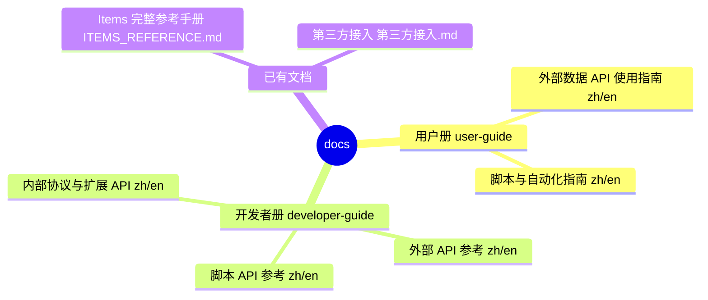

# LyricsMTMR API 文档索引 / API Documentation Index

> 本文档集覆盖仓库内全部 API 面：**外部 HTTP API（第三方数据源）**、**脚本 API（AppleScript / Shell）**、**内部协议与扩展 API**。
> 分两册：普通用户册（配置视角）与开发者册（协议/参考视角），中英双语。
> This index covers every API surface in the repo: external HTTP APIs, scripting APIs, and internal extension APIs, split into user and developer volumes in Chinese and English.

---

## 📚 文档结构 / Document Structure

| 文档 | 中文 | English | 面向读者 |
|:---|:---|:---|:---|
| **外部数据 API 使用指南** | [external-data.zh.md](user-guide/external-data.zh.md) | [external-data.en.md](user-guide/external-data.en.md) | 普通用户：如何配置歌词/股票/天气/快递等组件 |
| **脚本与自动化指南** | [scripting.zh.md](user-guide/scripting.zh.md) | [scripting.en.md](user-guide/scripting.en.md) | 普通用户：AppleScript / Shell 自定义组件 |
| **外部 API 参考** | [external-apis.zh.md](developer-guide/external-apis.zh.md) | [external-apis.en.md](developer-guide/external-apis.en.md) | 开发者：端点、参数、响应、加密与降级策略 |
| **脚本 API 参考** | [scripting-api.zh.md](developer-guide/scripting-api.zh.md) | [scripting-api.en.md](developer-guide/scripting-api.en.md) | 开发者：`appleScript` / `shellScript` 返回协议 |
| **内部协议与扩展 API** | [internal-apis.zh.md](developer-guide/internal-apis.zh.md) | [internal-apis.en.md](developer-guide/internal-apis.en.md) | 开发者：Widget / Provider 扩展、私有桥接层 |
| **Items 完整参考手册** | [ITEMS_REFERENCE.md](ITEMS_REFERENCE.md) | — | 全部组件 type 的配置参考 |
| **第三方接入** | [第三方接入.md](第三方接入.md) | — | 本地 JSON 数据文件接口（expenses.json 等） |

---

## 🔍 快速导航 / Quick Navigation

| 我想… | 打开 |
|:---|:---|
| 配置股票 / 天气 / 快递 / AI 用量 | [用户册 · 外部数据](user-guide/external-data.zh.md) |
| 用脚本显示自定义内容 | [用户册 · 脚本](user-guide/scripting.zh.md) |
| 了解歌词源接口与加密 | [开发者册 · 外部 API](developer-guide/external-apis.zh.md) |
| 搞懂 shellScript 返回协议 | [开发者册 · 脚本 API](developer-guide/scripting-api.zh.md) |
| 新增一个 Widget / 歌词源 | [开发者册 · 内部协议](developer-guide/internal-apis.zh.md) |
| 查看全部组件 type 与 JSON 示例 | [ITEMS_REFERENCE.md](ITEMS_REFERENCE.md) |
| 外部程序写入本地 JSON 数据 | [第三方接入.md](第三方接入.md) |

---

## 📌 约定 / Conventions

- 每篇文档遵循统一模板：**概述（思维导图）→ 架构/流程（流程图）→ 接口清单表 → 详细说明 → 错误处理 → FAQ**。
- 所有示例均为**可复制**的最小配置 / 请求片段。
- 第三方接口标注为「非官方」，仅用于学习；失效时以源码 `MTMR/LyricsIntegration/`、`MTMR/Widgets/` 为准。
- 术语：`item`（组件）/ `widget`（同一概念）；`source`（脚本/图片源）；`provider`（歌词数据源）。
