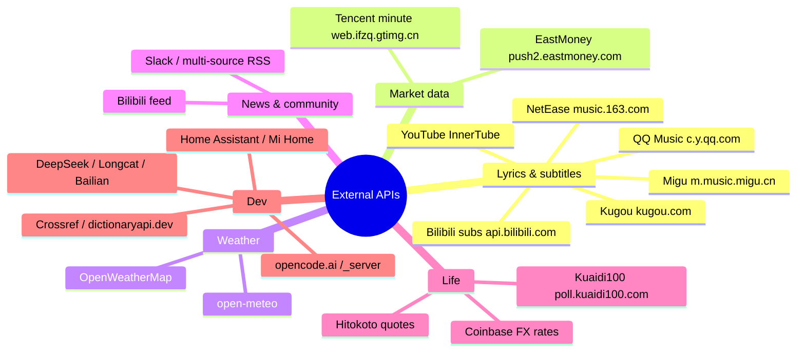
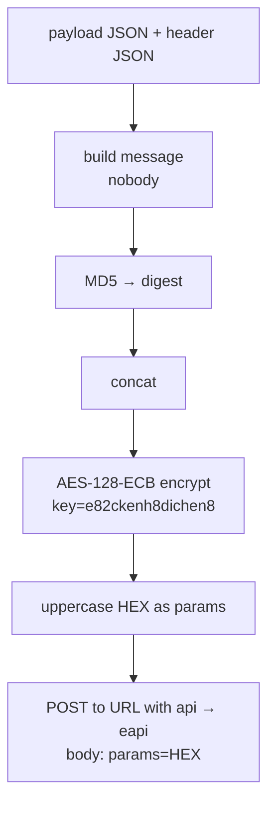
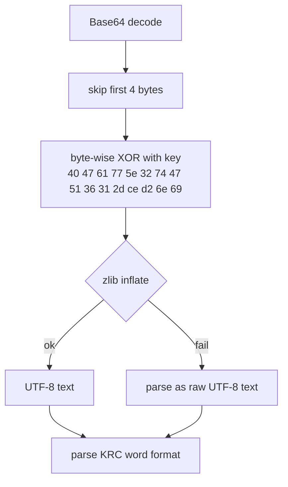

# External API Reference (Developer Guide · English)

> For **developers**: endpoints, request parameters, response structures, and caveats for every external HTTP API used by LyricsMTMR.
> Source: `MTMR/LyricsIntegration/` (lyrics/subtitles) and `MTMR/Widgets/` (all other items).
>
> ⚠️ **Disclaimer**: except OpenWeatherMap, open-meteo, Coinbase, Hitokoto, Crossref and dictionaryapi.dev, all endpoints are **unofficial reverse-engineered interfaces** for learning purposes only; they may break or be rate-limited at any time.

---

## 1. Overview (Mind Map)



---

## 2. Common Conventions

| Item | Convention |
|:---|:---|
| Timeout | lyric sources **10s**; subtitles **15s**; other items 5–20s |
| User-Agent | spoofed per source (Safari / iPhone / Android / official client) |
| Referer | enforced by several sources (NetEase, QQ, Bilibili, Kugou, …) |
| Rate | no official limits; governed by item `refreshInterval`, keep ≥ 5s |
| Encoding | UTF-8; percent-encode URL params |

### Success Signals

| Source | Success indicator |
|:---|:---|
| NetEase search | HTTP 200 + non-empty `result.songs` |
| NetEase eapi | JSON contains `lrc`/`yrc`/`krc` fields |
| QQ search | `code == 0` / `request.code == 0` |
| Kugou search | `status == 1`; KRC endpoints `status == 200` |
| Migu search | JSON with `musics` array (non-JSON = no results) |
| Bilibili | `code == 0` |
| EastMoney | `rc == 0` and non-empty `data` |

---

## 3. Lyric Sources

### 3.1 NetEase Music

Source: `LyricsIntegration/NetEaseProvider.swift`

#### Search

```http
POST http://music.163.com/api/search/pc
Referer: http://music.163.com/
Content-Type: application/x-www-form-urlencoded

s=<keyword>&offset=0&limit=10&type=1
```

- The first response's `Set-Cookie` is replayed as `Cookie` on subsequent requests.
- Response: `result.songs[]` → `id / name / duration / artists[].name / album.name / album.picUrl`.

#### Lyrics (encrypted eapi endpoint)

```http
POST https://interface3.music.163.com/eapi/song/lyric/v1
```

**eapi encryption flow**:



- Key: `e82ckenh8dichen8`; `path` = URL minus the `https://interface3.music.163.com/e` prefix (e.g. `/api/song/lyric/v1`).
- Request cookie carries: `__csrf / appver=8.0.0 / buildver / channel / deviceId / os=android / resolution / requestId / versioncode=140 / MUSIC_U`.
- Body (form): `params=<UPPERCASE_HEX>`.

**fetchLyrics payload** (word-timed lyrics):

```json
{
  "id": "songId",
  "cp": "false", "lv": "-1", "kv": "-1", "tv": "0",
  "rv": "0", "yv": "-1", "ytv": "0", "yrv": "0",
  "csrf_token": "", "header": "<header JSON>"
}
```

- Field priority: `yrc.lyric` (word) → `klyric.lyric` (word KRC) → `lrc.lyric` (line).
- Translation: `tlyric.lyric` (payload `rv: "-1"`); romaji: `romalrc.lyric`.

**YRC format**: `[mm:ss.xx]<start,dur>字<start,dur>词...` (full-width `〈〉` or half-width `<>`).
**KRC format**: `[mm:ss.xx]<start,dur>字...` (supports `<>` and `〈〉`).

### 3.2 QQ Music

Source: `LyricsIntegration/QQMusicProvider.swift`

#### Search (two parallel requests, merged)

```http
GET  https://c.y.qq.com/splcloud/fcgi-bin/smartbox_new.fcg?key=<keyword>
POST https://u.y.qq.com/cgi-bin/musicu.fcg
```

`musicu.fcg` body (JSON-RPC style):

```json
{
  "req_1": {
    "method": "DoSearchForQQMusicDesktop",
    "module": "music.search.SearchCgiService",
    "param": { "num_per_page": 10, "page_num": 1, "query": "keyword", "search_type": 0 }
  }
}
```

- Response: `req_1.data.body.song.list[]` with `id / mid / name / singer[]`; `mid` is the primary key for lyrics & cover.

#### Lyrics

```http
POST https://c.y.qq.com/qqmusic/fcgi-bin/lyric_download.fcg
Referer: https://c.y.qq.com/
Content-Type: application/x-www-form-urlencoded

musicid=<mid>&version=15&miniversion=82&lrctype=4
```

- The response is XML-wrapped QRC text; strip `<!--` / `-->` before parsing.
- **QRC format**: `[mm:ss.xxx,totalMs](start,dur)字...` (also tolerates `<start,dur>` and full-width parens).

#### Cover

```json
{
  "comm": { "ct": 24, "cv": 0 },
  "songinfo": {
    "module": "music.pf_song_detail_svr",
    "method": "get_song_detail_yqq",
    "param": { "song_mid": "<mid>" }
  }
}
```

- Response: `songinfo.data.track_info.album.mid` → `https://y.gtimg.cn/music/photo_new/T002R800x800M000<albumMid>.jpg`.

### 3.3 Kugou Music

Source: `LyricsIntegration/KugouProvider.swift` (UA spoofed as iPhone Safari)

#### Search

```http
GET https://mobileservice.kugou.com/api/v3/search/song?version=9108&plat=0&pagesize=10&page=1&keyword=<keyword>
```

- Response: `status == 1`; `data.info[]` → `hash / songname / singername / album_name / duration`; `accesskey` may be absent (v3 no longer returns it).

#### KRC lookup & download

```http
GET https://krcs.kugou.com/search?ver=1&man=yes&client=mobi&hash=<hash>&accesskey=<key>
GET https://krcs.kugou.com/download?ver=1&client=pc&id=<id>&accesskey=<key>&fmt=krc&charset=utf8
```

- `search` response: `status == 200`, take `candidates[0].id` and `.accesskey`.
- `download` response: `content` is **Base64**-encoded KRC ciphertext.

**KRC decryption**:



- **KRC format**: `[<startMs>,<durationMs>]<wordStart,wordDur,0>词...`; supports `[offset:]`.

### 3.4 Migu Music

Source: `LyricsIntegration/MiguProvider.swift` (macOS Safari UA, Referer `https://m.music.migu.cn/`)

#### Search

```http
GET https://m.music.migu.cn/migu/remoting/scr_search_tag?rows=10&type=2&keyword=<keyword>&pgc=1
```

- Response: `musics[]` → `copyrightId / id / songName / singerName / albumName / lyricUrl`.
- Occasionally returns anti-bot HTML/empty body → treat as "no results" instead of throwing (so one flaky provider cannot poison the whole search).

#### Lyrics

```http
GET https://m.music.migu.cn/migu/remoting/cms_detail_tag?cid=<copyrightId>
```

- Value order: `data.lyricLrc` → `data.lyricTxt` → top-level `lrcUrl` (one more GET for plain LRC).
- Plain **LRC** (line-level, no word timing).

### 3.5 Bilibili Subtitles → Lyrics

Source: `SubtitleProviderPlaceholder.swift` → `BilibiliSubtitleProvider`

```mermaid
flowchart TD
  A[Extract BV id + ?p=N from video URL] --> B["GET x/web-interface/view?bvid=<BV><br/>take cid / pages[N-1].cid"]
  B --> C{Subtitle list}
  C -- primary --> D["GET x/v2/dm/view?type=1&oid=<cid><br/>AI subtitles without login"]
  C -- fallback --> E["GET x/player/v2?bvid=&cid=<br/>requires login cookie"]
  D --> F[Pick lang zh-CN/zh-Hans/zh/ai-zh/en/ja]
  E --> F
  F --> G[GET subtitle_url<br/>body[]: from + content]
  G --> H[Convert to SimpleLyrics lines]
```

- All three endpoints require `Referer: https://www.bilibili.com/`; `subtitle_url` may start with `//` or `http://` — normalize to `https://`.

### 3.6 YouTube Subtitles

Source: `SubtitleProviderPlaceholder.swift` → `YouTubeSubtitleProvider` (three-level fallback)

| Priority | Method | Notes |
|:---:|:---|:---|
| P0 | InnerTube player API (ANDROID client) | `POST https://www.youtube.com/youtubei/v1/player?prettyPrint=false`, `clientName=ANDROID`, `clientVersion=20.10.38`; **not PO-token gated** |
| P1 | In-page JS injection | AppleScript runs JS in the active tab of Chrome/Safari/Edge/Brave/Vivaldi/Arc (Firefox unsupported); uses the logged-in session for gated videos |
| P2 | Legacy server-side scrape | only works where PO token is not enforced |

- InnerTube response: `captions.playerCaptionsTracklistRenderer.captionTracks[]` → `baseUrl / languageCode / name`.
- Preferred languages: `zh-Hans / zh / en / ja`, etc.
- JS injection requires the browser's "Allow JavaScript from Apple Events" setting (Safari: Develop menu).

---

## 4. Market Data APIs

### 4.1 Tencent Minute (default)

Source: `Widgets/StockBarItem.swift`

```http
GET https://web.ifzq.gtimg.cn/appstock/app/minute/query?code=<symbol>
User-Agent: Mozilla/5.0 (Macintosh; Intel Mac OS X 10_15_7)
```

- `symbol`: e.g. `sh600519` / `sz000858`.
- Response path: `data[<symbol>]`:
  - `qt[<symbol>]` array: `[1]=name`, `[3]=price`, `[4]=prevClose`, `[32]=pct%`;
  - `data.data[]`: string array, each `"HHMM price"` (pre-0930 call-auction entries are filtered).

### 4.2 EastMoney (stocks + sectors)

`symbol` → `secid`: `shXXXXXX → 1.XXXXXX`, `szXXXXXX → 0.XXXXXX`, `bkXXXX → 90.BKXXXX`.

```http
GET https://push2.eastmoney.com/api/qt/stock/get?secid=<secid>&fields=f58&ut=fa5fd1943c7b386f172d6893dbfd32bb&fltt=2&invt=2
GET https://push2his.eastmoney.com/api/qt/stock/trends2/get?secid=<secid>&fields1=f1,f2,f3,f4,f5,f6,f7,f8,f9,f10,f11,f12,f13&fields2=f51,f52,f53,f54,f55,f56,f57,f58&ut=fa5fd1943c7b386f172d6893dbfd32bb&ndays=1&iscr=0
```

- `stock/get` returns only `data.f58` (name); `trends2/get` returns `data.prePrice` (prev close) and `data.trends[]` (CSV per entry: `time price` or `YYYYMMDD HHMM price ...`, price is column 3).
- Current price and change % are computed from the last minute point vs `prePrice`.
- `ut` is a public constant, not a personal key.

---

## 5. Weather APIs

### 5.1 OpenWeatherMap

```http
GET https://api.openweathermap.org/data/2.5/weather?lat=<lat>&lon=<lon>&units=<metric|imperial>&appid=<key>
```

- Uses `main.temp` (integer) and `weather[0].icon` (mapped to emoji, e.g. `01d→☀️`).

### 5.2 open-meteo (outfit)

```http
GET https://api.open-meteo.com/v1/forecast?latitude=<lat>&longitude=<lon>&current=temperature_2m,weather_code
```

- Uses `current.temperature_2m` and `current.weather_code` (WMO codes: 0 clear, 1/2 partly cloudy, 3 overcast, 45/48 fog, 51–67 rain, 71–77 snow, 80–82 showers, 95–99 thunderstorm).
- Outfit advice by temperature: <5 down jacket / <13 coat / <20 jacket / <27 t-shirt / ≥27 stay cool.

---

## 6. Other External Endpoints

| Item | Endpoint | Auth | Key response fields |
|:---|:---|:---|:---|
| `bilibiliFeed` | `GET https://api.bilibili.com/x/polymer/web-dynamic/v1/feed/all?type=all&page=1` | Cookie | `data.items[]` (count = unread); `modules.module_author.name`, `modules.module_dynamic.major.archive.title` |
| `slackUnread` | `GET https://slack.com/api/conversations.list?exclude_archived=true&limit=200` | `Authorization: Bearer <bot>` | estimated unread from `channels[]` |
| `rssUnread` | Feedly `GET https://cloud.feedly.com/v3/markers/counts`; Inoreader `GET https://api.inoreader.com/api/0/unread-count`; Miniflux `GET <server>/v1/entries?status=unread&limit=1`; GReader `GET <server>/reader/api/0/unread-count?output=json` | Bearer / `X-Auth-Token` / `GoogleLogin auth=` | unread counts |
| `packageTracker` | `POST https://poll.kuaidi100.com/poll/query.do` | form `customer/key/sign` | `state` (0 transit/1 picked/2 issue/3 delivered/5 delivering/6 returned), `data[0].context` |
| `currency` | `GET https://api.coinbase.com/v2/exchange-rates?currency=<from>` | none | `data.rates[<to>]` |
| `dailyQuote` | `GET https://v1.hitokoto.cn/?c=a&c=b&c=d&c=k` | none | `hitokoto` |
| `deepseekBalance` | `GET https://api.deepseek.com/user/balance` | `Authorization: Bearer <key>` | `balance_infos[]` `total_balance` / `total_amount` (strings) |
| `usage` · Longcat | `GET <base>/v1/dashboard/billing/usage` | Bearer | `total_usage` / `hard_limit_usd` |
| `usage` · Bailian | `GET https://dashscope.aliyuncs.com/api/v1/runners/quota` | Bearer | `data.used` / `data.total` |
| `opencodeGoUsage` | `GET https://opencode.ai/_server?id=<sha256>&args=<urlencoded JSON>` | `Cookie: auth=<iron-session>` | seroval frames, evaluated in JSContext |
| `wordLookup` | `GET https://api.dictionaryapi.dev/api/v2/entries/en/<word>` | none | `[0].meanings[]` |
| `citationGen` | `GET https://api.crossref.org/works/<doi>` | `User-Agent` with contact | `message` metadata |
| `homekitScene` · HA | `POST <ha_url>/api/services/scene/turn_on` | `Authorization: Bearer <token>` | — |
| `homekitScene` · Mi | `POST https://api.io.mi.com/app/home/trigger` | `Authorization: Bearer <token>` | — |
| `apiLatency` | any URL (default Apple test page) | none | latency measurement |

> Kuaidi100 signature: `sign = MD5(param + key + customer).toUpperCase()`; `param` is the JSON string of `{"com","num","phone","from","to","resultv2"}`, `resultv2:"1"` for v2 details.
> opencode.ai `_server`: `id` is the sha256 of `<source file>--<exported name>` in the deployed bundle; the response is seroval protocol frames needing JSContext evaluation; the server refreshes `auth` via `Set-Cookie` on every response — the client must write it back.

---

## 7. Error Handling & Stability

| Scenario | Behavior |
|:---|:---|
| Timeout (10s/15s) | that source fails; concurrent multi-source search continues |
| Non-JSON response (anti-bot) | NetEase/Migu treat as "no results", no throw |
| All sources fail | `LyricsSearchService` returns `.empty`; lyrics item shows a placeholder |
| Item polling throws | `TBPollItem` runs under ObjC exception protection, shows `⚠️`, others unaffected |
| Timers | repeating timers use `tolerance` (≈10%) to reduce CPU |

> For production, add retries with backoff per source and watch for anti-bot updates (the NetEase eapi key and Kugou KRC key are reverse-engineered and may change).

---

## 8. Appendix: Response Samples

**NetEase eapi lyrics** (excerpt):

```json
{
  "lrc": { "lyric": "[00:12.34]First line\n[00:20.10]Second line\n" },
  "yrc": { "lyric": "[00:12.34]<0,500>F<500,400>i<900,600>rst\n" },
  "tlyric": { "lyric": "[00:12.34]第一行\n" }
}
```

**Kugou KRC download**:

```json
{ "status": 200, "content": "S0ZDT...（Base64 ciphertext）" }
```

**EastMoney trends**:

```json
{
  "rc": 0,
  "data": {
    "prePrice": 1700.0,
    "trends": ["20260709 0930 1705.00 1706.00 1704.00 ...", "..."]
  }
}
```

**Bilibili subtitle JSON**:

```json
{ "body": [ { "from": 1.2, "content": "Hello" }, { "from": 3.5, "content": "World" } ] }
```

---

## 9. Related Docs

- [User Guide · External Data APIs](../user-guide/external-data.en.md) — configuration
- [Scripting API Reference](scripting-api.en.md) — local script interfaces
- [Internal APIs & Extensions](internal-apis.en.md) — Provider / Widget extension mechanisms
