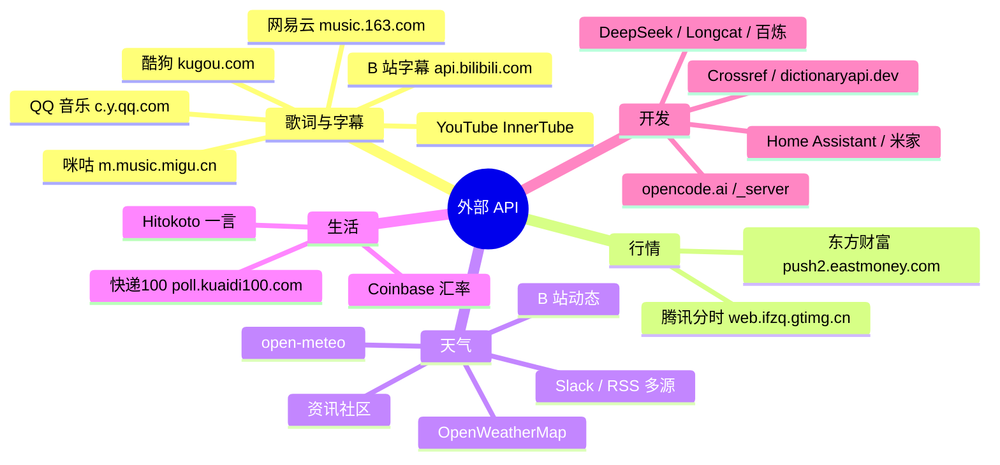
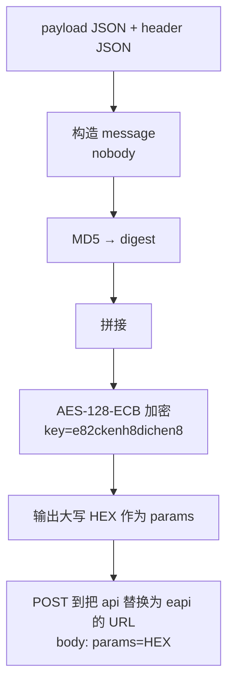
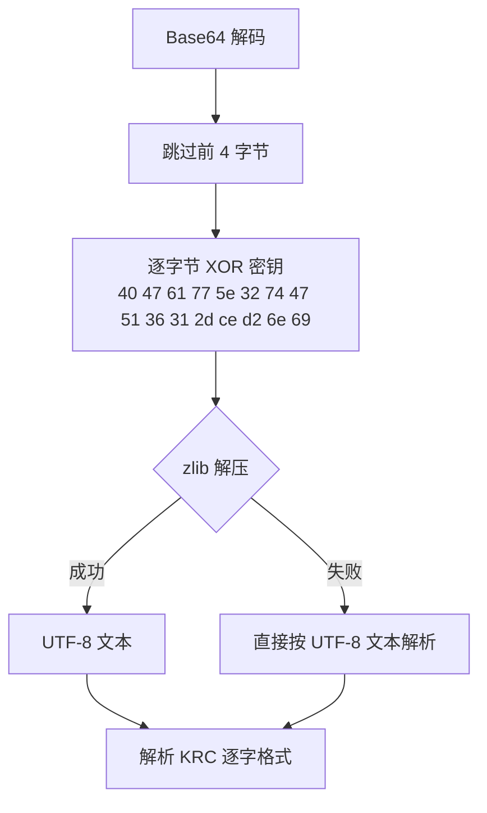

# 外部 API 参考（开发者册 · 中文）

> 面向**开发者**：LyricsMTMR 全部外部 HTTP API 的端点、请求参数、响应结构与注意事项。
> 源码位置：`MTMR/LyricsIntegration/`（歌词/字幕）与 `MTMR/Widgets/`（其余组件）。
>
> ⚠️ **免责声明**：除 OpenWeatherMap、open-meteo、Coinbase、Hitokoto、Crossref、dictionaryapi.dev 外，其余均为**非官方逆向接口**，仅供学习，随时可能失效或被风控。

---

## 一、总览（思维导图）



---

## 二、通用约定

| 项目 | 约定 |
|:---|:---|
| 超时 | 歌词源 `URLSession` 超时 **10s**；字幕源 **15s**；其余组件 5–20s |
| User-Agent | 各源伪装不同（Safari / iPhone / Android / 官方客户端） |
| Referer | 部分源强制校验（网易云、QQ、B 站、酷狗等） |
| 频率 | 无官方限额，受组件 `refreshInterval` 控制；建议不低于 5s |
| 编码 | 统一 UTF-8；URL 参数需百分号编码 |

### 统一的响应成功判断

| 数据源 | 成功标志 |
|:---|:---|
| 网易云搜索 | HTTP 200 + `result.songs` 非空 |
| 网易云 eapi | JSON 含 `lrc`/`yrc`/`krc` 等字段 |
| QQ 搜索 | `code == 0` / `request.code == 0` |
| 酷狗搜索 | `status == 1`；KRC 接口 `status == 200` |
| 咪咕搜索 | JSON 含 `musics` 数组（非 JSON 视为无结果） |
| B 站 | `code == 0` |
| 东方财富 | `rc == 0` 且 `data` 非空 |

---

## 三、歌词源

### 3.1 网易云音乐（NetEase）

源码：`LyricsIntegration/NetEaseProvider.swift`

#### 搜索

```http
POST http://music.163.com/api/search/pc
Referer: http://music.163.com/
Content-Type: application/x-www-form-urlencoded

s=<关键词>&offset=0&limit=10&type=1
```

- 首次响应 `Set-Cookie` 会被回填到后续请求的 `Cookie`。
- 响应：`result.songs[]`，取 `id / name / duration / artists[].name / album.name / album.picUrl`。

#### 歌词（eapi 加密接口）

```http
POST https://interface3.music.163.com/eapi/song/lyric/v1
```

**eapi 加密流程**（逆向要点）：



- 加密 key：`e82ckenh8dichen8`；`path` 为去掉 `https://interface3.music.163.com/e` 前缀的路径（如 `/api/song/lyric/v1`）。
- 请求头 Cookie 需携带：`__csrf / appver=8.0.0 / buildver / channel / deviceId / os=android / resolution / requestId / versioncode=140 / MUSIC_U`。
- 请求体（表单）：`params=<大写HEX>`。

**fetchLyrics payload**（逐字歌词）：

```json
{
  "id": "歌曲ID",
  "cp": "false", "lv": "-1", "kv": "-1", "tv": "0",
  "rv": "0", "yv": "-1", "ytv": "0", "yrv": "0",
  "csrf_token": "", "header": "<header JSON>"
}
```

- 响应字段优先级：`yrc.lyric`（逐字）→ `klyric.lyric`（逐字 KRC）→ `lrc.lyric`（行级）。
- 翻译：`tlyric.lyric`（payload 中 `rv: "-1"`）；罗马音：`romalrc.lyric`。

**YRC 逐字格式**：`[mm:ss.xx]<start,dur>字<start,dur>词...`（支持全角 `〈〉` 与半角 `<>`）。
**KRC 逐字格式**：`[mm:ss.xx]<start,dur>字...`（支持 `<start,dur>` 与 `〈start,dur〉`）。

### 3.2 QQ 音乐

源码：`LyricsIntegration/QQMusicProvider.swift`

#### 搜索（两路并发合并结果）

```http
GET  https://c.y.qq.com/splcloud/fcgi-bin/smartbox_new.fcg?key=<关键词>
POST https://u.y.qq.com/cgi-bin/musicu.fcg
```

`musicu.fcg` 请求体（JSON-RPC 风格）：

```json
{
  "req_1": {
    "method": "DoSearchForQQMusicDesktop",
    "module": "music.search.SearchCgiService",
    "param": { "num_per_page": 10, "page_num": 1, "query": "关键词", "search_type": 0 }
  }
}
```

- 响应取 `req_1.data.body.song.list[]`，字段 `id / mid / name / singer[]`；`mid` 是歌词与封面的主键。

#### 歌词

```http
POST https://c.y.qq.com/qqmusic/fcgi-bin/lyric_download.fcg
Referer: https://c.y.qq.com/
Content-Type: application/x-www-form-urlencoded

musicid=<mid>&version=15&miniversion=82&lrctype=4
```

- 响应是 XML 包裹的 QRC 文本，需先剥掉 `<!--` / `-->` 再解析。
- **QRC 逐字格式**：`[mm:ss.xxx,总毫秒](start,dur)字...`（也兼容 `<start,dur>` 与全角括号）。

#### 封面

```json
{
  "comm": { "ct": 24, "cv": 0 },
  "songinfo": {
    "module": "music.pf_song_detail_svr",
    "method": "get_song_detail_yqq",
    "param": { "song_mid": "<mid>" }
  }
}
```

- 响应：`songinfo.data.track_info.album.mid` → 拼 `https://y.gtimg.cn/music/photo_new/T002R800x800M000<albumMid>.jpg`。

### 3.3 酷狗音乐（Kugou）

源码：`LyricsIntegration/KugouProvider.swift`（UA 伪装为 iPhone Safari）

#### 搜索

```http
GET https://mobileservice.kugou.com/api/v3/search/song?version=9108&plat=0&pagesize=10&page=1&keyword=<关键词>
```

- 响应：`status == 1`，`data.info[]` 取 `hash / songname / singername / album_name / duration`；`accesskey` 可能缺失（v3 接口不再返回）。

#### KRC 检索与下载

```http
GET https://krcs.kugou.com/search?ver=1&man=yes&client=mobi&hash=<hash>&accesskey=<key>
GET https://krcs.kugou.com/download?ver=1&client=pc&id=<id>&accesskey=<key>&fmt=krc&charset=utf8
```

- `search` 响应：`status == 200`，`candidates[0]` 取 `id` 与 `accesskey`。
- `download` 响应：`content` 为 **Base64** 编码的 KRC 密文。

**KRC 解密**：



- **KRC 逐字格式**：`[<起始毫秒>,<总时长>]<词起始,词时长,0>词...`，支持 `[offset:]` 调整。

### 3.4 咪咕音乐（Migu）

源码：`LyricsIntegration/MiguProvider.swift`（UA 为 macOS Safari，Referer `https://m.music.migu.cn/`）

#### 搜索

```http
GET https://m.music.migu.cn/migu/remoting/scr_search_tag?rows=10&type=2&keyword=<关键词>&pgc=1
```

- 响应：`musics[]` 取 `copyrightId / id / songName / singerName / albumName / lyricUrl`。
- 偶发返回反爬 HTML/空体 → 按「无结果」处理，不抛错（避免污染整体搜索）。

#### 歌词

```http
GET https://m.music.migu.cn/migu/remoting/cms_detail_tag?cid=<copyrightId>
```

- 取值顺序：`data.lyricLrc` → `data.lyricTxt` → 顶层 `lrcUrl`（再 GET 一次拿纯 LRC）。
- 格式为普通 **LRC**（行级），无逐字时间轴。

### 3.5 B 站字幕转歌词

源码：`LyricsIntegration/SubtitleProviderPlaceholder.swift` → `BilibiliSubtitleProvider`

```mermaid
flowchart TD
  A[视频 URL 提取 BV id + ?p=N] --> B["GET x/web-interface/view?bvid=<BV><br/>取 cid / pages[N-1].cid"]
  B --> C{字幕列表}
  C -- 优先 --> D["GET x/v2/dm/view?type=1&oid=<cid><br/>免登录返回 AI 字幕"]
  C -- 回退 --> E["GET x/player/v2?bvid=&cid=<br/>需登录 Cookie"]
  D --> F[选语言 zh-CN/zh-Hans/zh/ai-zh/en/ja]
  E --> F
  F --> G[GET subtitle_url<br/>body[]: from + content]
  G --> H[转为 SimpleLyrics 行]
```

- 三个端点都要求 `Referer: https://www.bilibili.com/`；`subtitle_url` 可能是 `//` 或 `http://` 前缀，需规范化为 `https://`。

### 3.6 YouTube 字幕

源码：`SubtitleProviderPlaceholder.swift` → `YouTubeSubtitleProvider`（三级降级）

| 优先级 | 方式 | 说明 |
|:---:|:---|:---|
| P0 | InnerTube player API（ANDROID 客户端） | `POST https://www.youtube.com/youtubei/v1/player?prettyPrint=false`，`clientName=ANDROID`、`clientVersion=20.10.38`；**不受 PO token 限制** |
| P1 | 浏览器内 JS 注入 | 通过 AppleScript 在 Chrome/Safari/Edge/Brave/Vivaldi/Arc 活动标签页执行 JS（Firefox 不支持），利用登录会话，可过登录视频 |
| P2 | 传统服务端抓取 | 仅对未启用 PO token 的视频有效 |

- InnerTube 响应：`captions.playerCaptionsTracklistRenderer.captionTracks[]`，取 `baseUrl / languageCode / name`。
- 首选语言顺序：`zh-Hans / zh / en / ja` 等。
- 浏览器 JS 注入需要浏览器开启「允许 Apple 事件中的 JavaScript」（Safari：开发菜单）。

---

## 四、行情 API

### 4.1 腾讯分时（默认）

源码：`Widgets/StockBarItem.swift`

```http
GET https://web.ifzq.gtimg.cn/appstock/app/minute/query?code=<symbol>
User-Agent: Mozilla/5.0 (Macintosh; Intel Mac OS X 10_15_7)
```

- `symbol`：如 `sh600519` / `sz000858`。
- 响应路径：`data[<symbol>]`：
  - `qt[<symbol>]` 数组：`[1]=名称`、`[3]=现价`、`[4]=昨收`、`[32]=涨跌幅%`；
  - `data.data[]`：字符串数组，每项 `"HHMM 价格"`（集合竞价 < 0930 的条目会被过滤）。

### 4.2 东方财富（个股 + 板块）

`symbol` → `secid` 映射：`shXXXXXX → 1.XXXXXX`、`szXXXXXX → 0.XXXXXX`、`bkXXXX → 90.BKXXXX`。

```http
GET https://push2.eastmoney.com/api/qt/stock/get?secid=<secid>&fields=f58&ut=fa5fd1943c7b386f172d6893dbfd32bb&fltt=2&invt=2
GET https://push2his.eastmoney.com/api/qt/stock/trends2/get?secid=<secid>&fields1=f1,f2,f3,f4,f5,f6,f7,f8,f9,f10,f11,f12,f13&fields2=f51,f52,f53,f54,f55,f56,f57,f58&ut=fa5fd1943c7b386f172d6893dbfd32bb&ndays=1&iscr=0
```

- `stock/get` 只取 `data.f58`（名称）；`trends2/get` 取 `data.prePrice`（昨收）与 `data.trends[]`（每项 CSV：`时间 价格` 或 `YYYYMMDD HHMM 价格 ...`，价格取第 3 列）。
- 现价与涨跌幅由最后一条分时价格与 `prePrice` 自行计算。
- `ut` 为公开常量，非个人密钥。

---

## 五、天气 API

### 5.1 OpenWeatherMap

```http
GET https://api.openweathermap.org/data/2.5/weather?lat=<lat>&lon=<lon>&units=<metric|imperial>&appid=<key>
```

- 取 `main.temp`（整数）与 `weather[0].icon`（映射 Emoji，如 `01d→☀️`）。

### 5.2 open-meteo（天气穿衣）

```http
GET https://api.open-meteo.com/v1/forecast?latitude=<lat>&longitude=<lon>&current=temperature_2m,weather_code
```

- 取 `current.temperature_2m` 与 `current.weather_code`（WMO 天气码，0=晴、1/2=少云、3=阴、45/48=雾、51–67=雨、71–77=雪、80–82=阵雨、95–99=雷暴）。
- 按温度给出穿搭建议：<5 羽绒服 / <13 厚外套 / <20 长袖外套 / <27 短袖 / ≥27 防暑。

---

## 六、其余外部接口一览

| 组件 | 端点 | 鉴权 | 关键响应字段 |
|:---|:---|:---|:---|
| `bilibiliFeed` | `GET https://api.bilibili.com/x/polymer/web-dynamic/v1/feed/all?type=all&page=1` | Cookie | `data.items[]`（数量=未读数）；`modules.module_author.name`、`modules.module_dynamic.major.archive.title` |
| `slackUnread` | `GET https://slack.com/api/conversations.list?exclude_archived=true&limit=200` | `Authorization: Bearer <bot>` | `channels[]` 的 `unread_count` 估算 |
| `rssUnread` | Feedly `GET https://cloud.feedly.com/v3/markers/counts`；Inoreader `GET https://api.inoreader.com/api/0/unread-count`；Miniflux `GET <server>/v1/entries?status=unread&limit=1`；GReader `GET <server>/reader/api/0/unread-count?output=json` | Bearer / `X-Auth-Token` / `GoogleLogin auth=` | 各源 unread 计数 |
| `packageTracker` | `POST https://poll.kuaidi100.com/poll/query.do` | 表单 `customer/key/sign` | `state`（0 在途/1 揽收/2 疑难/3 签收/5 派件/6 退回）、`data[0].context` |
| `currency` | `GET https://api.coinbase.com/v2/exchange-rates?currency=<from>` | 无 | `data.rates[<to>]` |
| `dailyQuote` | `GET https://v1.hitokoto.cn/?c=a&c=b&c=d&c=k` | 无 | `hitokoto` |
| `deepseekBalance` | `GET https://api.deepseek.com/user/balance` | `Authorization: Bearer <key>` | `balance_infos[]` 的 `total_balance` / `total_amount`（字符串） |
| `usage` · Longcat | `GET <base>/v1/dashboard/billing/usage` | Bearer | `total_usage` / `hard_limit_usd` |
| `usage` · 百炼 | `GET https://dashscope.aliyuncs.com/api/v1/runners/quota` | Bearer | `data.used` / `data.total` |
| `opencodeGoUsage` | `GET https://opencode.ai/_server?id=<sha256>&args=<urlencoded JSON>` | `Cookie: auth=<iron-session>` | seroval 帧，JSContext 求值 |
| `wordLookup` | `GET https://api.dictionaryapi.dev/api/v2/entries/en/<word>` | 无 | `[0].meanings[]` |
| `citationGen` | `GET https://api.crossref.org/works/<doi>` | `User-Agent` 需带联系方式 | `message` 引用元数据 |
| `homekitScene` · HA | `POST <ha_url>/api/services/scene/turn_on` | `Authorization: Bearer <token>` | — |
| `homekitScene` · 米家 | `POST https://api.io.mi.com/app/home/trigger` | `Authorization: Bearer <token>` | — |
| `apiLatency` | 任意 URL（默认 Apple 测试页） | 无 | 耗时测量 |

> 快递100 签名：`sign = MD5(param + key + customer).toUpperCase()`，`param` 为 `{"com","num","phone","from","to","resultv2"}` 的 JSON 字符串，`resultv2:"1"` 返回 v2 明细。
> opencode.ai `_server`：`id` 为部署 bundle 中 `<源文件>--<导出名>` 的 sha256 常量；响应为 seroval 协议帧，需 JSContext 求值；服务端每次响应通过 `Set-Cookie` 刷新 `auth`，客户端需回写。

---

## 七、错误处理与稳定性

| 场景 | 组件行为 |
|:---|:---|
| 超时（10s/15s） | 该源视为失败；多源并发时其余源正常 |
| 非 JSON 响应（反爬/风控） | 网易云/咪咕按「无结果」处理，不抛出 |
| 所有源都失败 | `LyricsSearchService` 返回 `.empty`，歌词组件显示占位 |
| 组件轮询抛异常 | `TBPollItem` 以 ObjC 异常保护运行，显示 `⚠️`，不影响其他组件 |
| 定时器 | 重复定时器带 `tolerance`（≈10%）降低 CPU |

> 稳定性建议：生产使用前为每个源加重试与退避；关注各源风控（网易云 eapi key、酷狗 KRC 密钥均为逆向所得，随时可能更新）。

---

## 八、附录：典型响应节选

**网易云 eapi 歌词**（节选）：

```json
{
  "lrc": { "lyric": "[00:12.34]第一行\n[00:20.10]第二行\n" },
  "yrc": { "lyric": "[00:12.34]<0,500>第<500,400>一<900,600>行\n" },
  "tlyric": { "lyric": "[00:12.34]First line\n" }
}
```

**酷狗 KRC 下载**：

```json
{ "status": 200, "content": "S0ZDT...（Base64 密文）" }
```

**东方财富 trends**：

```json
{
  "rc": 0,
  "data": {
    "prePrice": 1700.0,
    "trends": ["20260709 0930 1705.00 1706.00 1704.00 ...", "..."]
  }
}
```

**B 站字幕 JSON**：

```json
{ "body": [ { "from": 1.2, "content": "你好" }, { "from": 3.5, "content": "世界" } ] }
```

---

## 九、相关文档

- [用户册 · 外部数据 API 使用指南](../user-guide/external-data.zh.md) — 配置方法
- [脚本 API 参考](scripting-api.zh.md) — 本地脚本接口
- [内部协议与扩展 API](internal-apis.zh.md) — Provider / Widget 扩展机制
