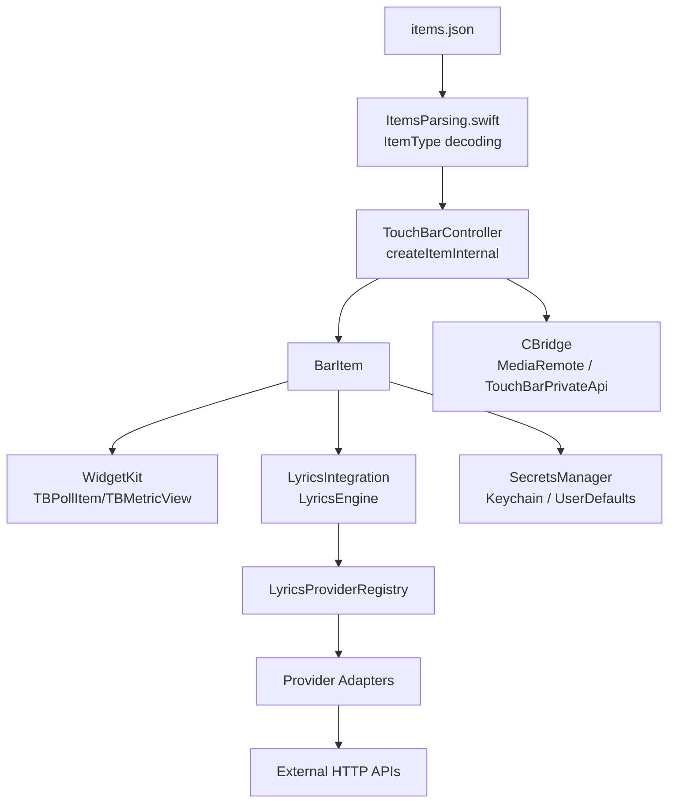
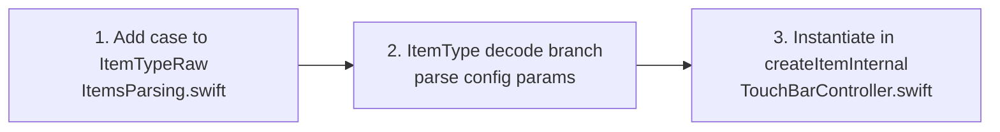
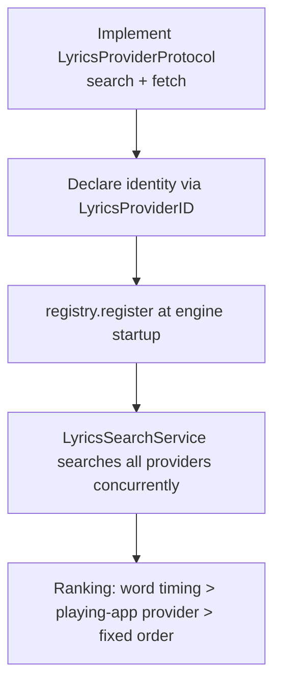

# Internal APIs & Extensions (Developer Guide · English)

> For **developers**: how to add new Widgets, lyrics Providers, or use the private bridge layers.
> Source: `MTMR/Widgets/WidgetProtocol.swift`, `MTMR/Widgets/WidgetKit.swift`, `MTMR/LyricsIntegration/`, `MTMR/CBridge/`, `MTMR/SecretsManager.swift`.

---

## 1. Architecture Overview



---

## 2. Widget Extension Protocols

### 2.1 Protocol Definitions

`Widgets/WidgetProtocol.swift`:

```swift
protocol Widget {
    static var name: String { get }
    static var identifier: String { get }
}

/// Cleanup hook called before an item is discarded (preset switch). Must be idempotent.
protocol BarItemDiscarding {
    func barItemWillDiscard()
}
```

- `BarItemDiscarding` releases timers, notification observers, and lazily created child items. `TouchBarController` calls it on the main thread before dropping an item during preset switches; implementations must tolerate repeated calls.

### 2.2 Polling Base Class `TBPollItem`

`Widgets/WidgetKit.swift`:

```swift
class TBPollItem: NSCustomTouchBarItem {
    let metric = TBMetricView(...)
    init(identifier:refreshInterval:icon:tint:label:width:)
    func compute() {}   // background queue: fetch & parse data
    func apply() {}     // main queue: push results into metric
}
```

- `compute()` runs on a dedicated background queue; exceptions are caught by ObjC exception protection (`MTMRTryOrError`) and shown as `⚠️`;
- `apply()` updates `TBMetricView` (icon/label/value/progress/sparkline) on the main thread;
- Poll period is `max(0.4, refreshInterval)` seconds.

### 2.3 Registering a New Widget (three steps)



Real example — `weatherOutfit`:

```swift
// 1. ItemsParsing.swift → enum ItemTypeRaw
case weatherOutfit

// 2. ItemsParsing.swift → ItemType.init(from:)
case .weatherOutfit:
    let refreshInterval = try container.decodeIfPresent(Double.self, forKey: .refreshInterval) ?? 1800.0
    let lat = try container.decodeIfPresent(Double.self, forKey: .lat) ?? 31.23
    let lon = try container.decodeIfPresent(Double.self, forKey: .lon) ?? 121.47
    self = .weatherOutfit(refreshInterval: refreshInterval, lat: lat, lon: lon)

// 3. TouchBarController.swift → createItemInternal
case let .weatherOutfit(refreshInterval: refreshInterval, lat: lat, lon: lon):
    barItem = WeatherOutfitItem(identifier: identifier, refreshInterval: refreshInterval, lat: lat, lon: lon)
```

### 2.4 Visual Cell `TBMetricView`

A self-drawn compact Touch Bar cell. Public properties:

| Property | Type | Description |
|:---|:---|:---|
| `iconName` / `iconTint` | `String` / `NSColor` | SF Symbol icon |
| `label` / `value` / `subValue` | `String` / `String` / `String?` | three text rows |
| `valueColor` | `NSColor` | value color |
| `progress` / `progressTint` | `CGFloat?` / `NSColor` | bottom progress bar |
| `spark` | `[CGFloat]?` | mini trend line |

---

## 3. Lyrics Provider Extensions

### 3.1 Protocols

`LyricsIntegration/LyricsProviderProtocol.swift`:

```swift
enum LyricsProviderID: String, Codable, CaseIterable {
    case netease, qqMusic, kugou, migu, spotify, subtitle, custom
}

struct LyricsCandidate: Identifiable, Equatable, Codable {
    let id: String            // default "\(provider):\(sourceId)"
    let title, artist, album: String
    let provider: LyricsProviderID
    let sourceId: String      // per-source key: NetEase songId / QQ mid / Kugou hash|accessKey / Migu copyrightId
    let hasWordTiming: Bool
    let coverURL: URL?
}

struct LyricsFetchResult {
    let lyrics: SimpleLyrics
    let translationLyrics: SimpleLyrics?
    let romajiLyrics: SimpleLyrics?
    let coverURL: URL?
    let candidate: LyricsCandidate
}

protocol LyricsProviderProtocol: AnyObject {
    var providerID: LyricsProviderID { get }
    var displayName: String { get }
    var isAvailable: Bool { get }                    // default true
    func search(title: String, artist: String, limit: Int) async throws -> [LyricsCandidate]
    func fetch(for candidate: LyricsCandidate) async throws -> LyricsFetchResult
}

protocol SubtitleProviderProtocol: AnyObject {
    var providerID: LyricsProviderID { get }
    var displayName: String { get }
    func fetchSubtitles(videoURL: URL, browser: BrowserApp?) async throws -> SimpleLyrics
    func canHandle(url: URL) -> Bool
}
```

### 3.2 Registry

`LyricsProviderRegistry` (singleton):

| Method | Description |
|:---|:---|
| `register(_:)` | register a lyric provider (same ID overwrites) |
| `registerSubtitle(_:)` | append a subtitle provider |
| `get(_:)` / `allProviders()` | lookup |
| `availableProviders()` | filter `isAvailable == true` |

Built-in registration at engine startup (`LyricsEngine.swift`):

```swift
registry.register(NetEaseProviderAdapter())
registry.register(QQMusicProviderAdapter())
registry.register(KugouProviderAdapter())
registry.register(MiguProviderAdapter())
registry.registerSubtitle(BilibiliSubtitleProvider())
registry.registerSubtitle(YouTubeSubtitleProvider())
```

### 3.3 Adding a New Provider (Adapter Pattern)



Key points:

- `search` encodes everything needed to fetch in `sourceId` (e.g. Kugou `"hash|accessKey"`);
- `fetch` returns `LyricsFetchResult` and **back-fills** `hasWordTiming` (inferred from non-empty `lines.timetags`);
- `LyricsSearchService` needs no changes — it concurrently calls every registered provider and picks the best result;
- Ranking: ① provider with word-level timing → ② provider matching the playing app (`providerID(forPlayerBundleID:)` matches bundle IDs) → ③ fixed order `netease → qqMusic → kugou → migu → spotify → subtitle → custom`;
- Missing translation/romaji/cover on the winner are "borrowed" from other providers' results.

### 3.4 Playback State & Subtitle Injection

- `MediaRemoteAdapter` listens to `kMRMediaRemoteNowPlayingInfoDidChangeNotification` etc. and gets track info through the C bridge (`LyricsIntegration/MediaRemoteAdapter.swift`).
- `BrowserURLDetector` detects the browser tab currently playing a video.
- `BrowserJSRunner` executes JS in the browser's active tab via AppleScript (`execute active tab ... javascript jsCode`) for logged-in YouTube captions; Safari needs "Allow JavaScript from Apple Events".

---

## 4. Private Bridge Layer (CBridge)

### 4.1 MediaRemote Bridge

`CBridge/MediaRemoteMRBridge.h` exports C functions (provided by `MediaRemoteMRBridge.dylib`, loaded via `dlopen/dlsym`):

| Function | Description |
|:---|:---|
| `bootstrap()` / `loop()` | init and event loop |
| `play()` / `pause_command()` / `toggle_play_pause()` | playback control |
| `next_track()` / `previous_track()` / `stop_command()` | track control |
| `update_player_state()` | refresh playback state |
| `set_time_from_env()` | set playback time from environment |

Swift-side `MediaRemoteAdapter` wraps these via `runCommand(_:)`.

### 4.2 Touch Bar Private API

`CBridge/TouchBarPrivateApi.h` (reverse-engineered, OS-version sensitive — use with care):

| API | Purpose |
|:---|:---|
| `DFRElementSetControlStripPresenceForIdentifier(_:_:)` | show/hide Control Strip elements |
| `NSTouchBarItem addSystemTrayItem/removeSystemTrayItem` | add/remove system tray items |
| `NSTouchBar presentSystemModalTouchBar(...)` | present a system-modal Touch Bar (10.14+; 10.13 FunctionBar variants) |
| `dismissSystemModalTouchBar` / `minimizeSystemModalTouchBar` | dismiss / minimize |

Others: `AMR_ANSIEscapeHelper` (ANSI color parsing), `CBBlueLightClient` (Night Shift), `DeprecatedCarbonAPI` (legacy keycodes), `LaunchAtLoginController` (login item).

---

## 5. SecretsManager (Credential Hub)

`SecretsManager.swift`:

```swift
enum APIService: String, CaseIterable {
    case deepseekAPIKey, openWeatherAPIKey, kuaidi100Key, kuaidi100Customer,
         slackBotToken, githubToken, rssProvider, rssAPIKey,
         mijiaToken, homeAssistantURL, homeAssistantToken,
         sshHost, sshUser, bilibiliCookie,
         opencodeGoCookie, opencodeGoWorkspaceID
}
```

| API | Description |
|:---|:---|
| `retrieve(_ service:)` | read a credential (item JSON first, then the settings hub) |
| `store(_:value:)` | write (Keychain or UserDefaults per `useKeychain`) |
| `hasAnyConfigured` / `configuredServices` | settings UI audit |
| built-in validation | known key-prefix checks; detects hardcoded keys in JSON configs |

> Adding a new third-party service = add one `APIService` case (`displayName` / `defaultsKey` / `isSecret` / format check) and the UI picks it up automatically.

---

## 6. Logging

`AppLog.swift` provides leveled logging: `info / warn / error / debug / appEvent / touchBar / lyrics`. Use `AppLog.lyrics` for the lyrics pipeline and `debug` for item polling errors — both surface in Settings → About/Logs for troubleshooting.

---

## 7. Related Docs

- [External API Reference](external-apis.en.md) — HTTP endpoints behind each provider
- [Scripting API Reference](scripting-api.en.md) — appleScript / shellScript return protocols
- [User Guide · External Data APIs](../user-guide/external-data.en.md) — configuration perspective
