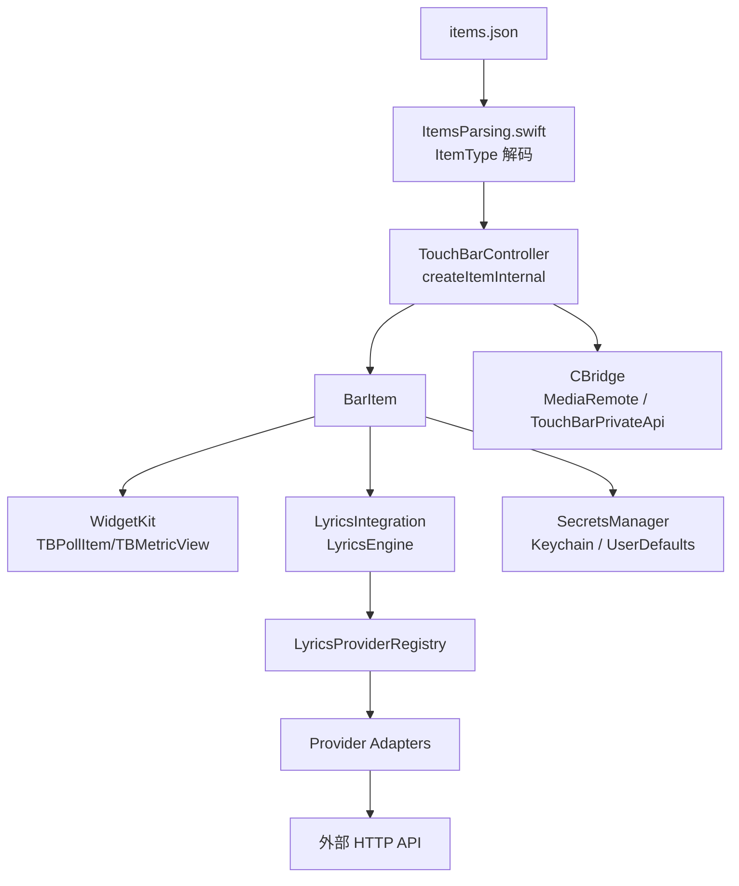
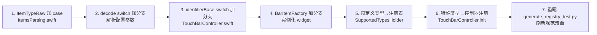
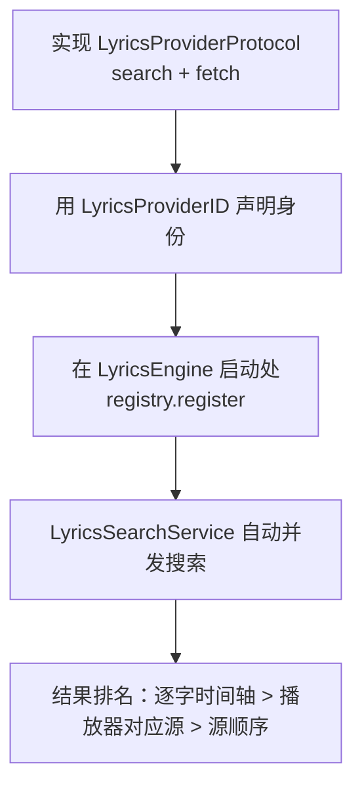

# 内部协议与扩展 API（开发者册 · 中文）

> 面向**开发者**：如何为 LyricsMTMR 新增 Widget、歌词 Provider 或调用私有桥接层。
> 源码位置：`MTMR/Widgets/WidgetProtocol.swift`、`MTMR/Widgets/WidgetKit.swift`、`MTMR/LyricsIntegration/`、`MTMR/CBridge/`、`MTMR/SecretsManager.swift`。

---

## 一、架构总览



---

## 二、Widget 扩展协议

### 2.1 协议定义

`Widgets/WidgetProtocol.swift`：

```swift
protocol Widget {
    static var name: String { get }
    static var identifier: String { get }
}

/// 组件被销毁（切换预设）前的清理钩子，必须幂等。
protocol BarItemDiscarding {
    func barItemWillDiscard()
}
```

- `BarItemDiscarding` 用于释放定时器、通知观察者、懒创建的子组件；`TouchBarController` 在切换预设时于主线程调用，实现必须可重复调用。

### 2.2 轮询基类 `TBPollItem`

`Widgets/WidgetKit.swift`：

```swift
class TBPollItem: NSCustomTouchBarItem {
    let metric = TBMetricView(...)
    init(identifier:refreshInterval:icon:tint:label:width:)
    func compute() {}   // 后台队列执行：抓数据、解析
    func apply() {}     // 主队列执行：把结果写入 metric
}
```

- `compute()` 运行在专用后台队列，异常由 ObjC 异常保护（`MTMRTryOrError`）捕获，出错显示 `⚠️`；
- `apply()` 在主线程更新 `TBMetricView`（图标/标签/数值/进度条/sparkline）；
- 轮询周期 `max(0.4, refreshInterval)` 秒。

### 2.3 注册一个新 Widget（六处注册点 + 对账测试刷新）

新增一个 Widget 类型不是「三步」，而是**六处注册点 + 一步刷新**（第 25 轮 A 卡实证口径）：漏改任意一处，运行时才暴露（解析失败 / 创建失败 / 镜像窗异常）——`RegistryReconciliationTests` 对账测试把这些漏改变成**立即失败**。



六处注册点逐一列出（行号为第 34 轮实测，`LyricsMTMR/MTMR/` 相对路径；#2 decode switch 行号于第 30 轮 A 卡注册表插入 +47 行、第 31 轮 A 卡批量迁移再插入 +120 行、第 32 轮 A 卡第三批迁移再插入 +107 行、第 33 轮 A 卡第四批迁移再插入 +85 行、第 34 轮 A 卡第五批迁移再插入 +88 行后更新，其余行号自第 26 轮实测未变）：

| # | 注册点 | 位置 | 说明 |
|:--|:--|:--|:--|
| 1 | `ItemTypeRaw` 枚举 case | `Core/ItemsParsing.swift:492-591`（`case staticButton` :493 … `case opencodeGoUsage` :590，98 case） | 类型名的字符串真相源（rawValue = JSON `type` 字段） |
| 2 | `ItemType` decode switch | `Core/ItemsParsing.swift:1043-1441`（`switch type {` :1043，`case .appleScriptTitledButton:` :1044 … `case .opencodeGoUsage:` :1435） | `ItemTypeRaw` → `ItemType` 解码分支，解析配置参数；`ItemType` 枚举 case 表在 :293-390（编译器穷尽性保证此 switch 与枚举同步）；命中注册表（`registeredTypeDecoders` :627-1029，试点 3 + 第 31 轮批量迁移 20 + 第 32 轮第三批迁移 20 + 第 33 轮第四批迁移 20 + 第 34 轮第五批迁移 20 = 83 键）的类型由闭包先行解码，switch 分支保留为穷尽性兜底 |
| 3 | `identifierBase` switch | `Core/TouchBarController.swift:24-223`（`case .staticButton` :26 … `case .opencodeGoUsage` :220） | 触摸条 item 标识前缀（`com.lyricsmtmr.<type>.`）；新增 case 漏改此处 → 编译失败（穷尽性） |
| 4 | `BarItemFactory` 创建 switch | `Core/BarItemFactory.swift:52-280`（`createItem` :52，`switch item.type` :54，`case let .staticButton` :55 … `case let .opencodeGoUsage` :276） | 工厂实例化 widget 类；新增 case 漏改此处 → 编译失败（穷尽性） |
| 5 | `SupportedTypesHolder` 预定义注册表 | `Core/ItemsParsing.swift:83-254`（`"escape"` :84 … `"displaySleep"` :244，14 键，字典闭合 :254） | 仅「无 JSON 配置的预定义类型」需要（如系统控制键）；带配置的普通类型**不**登记此处 |
| 6 | 控制器运行时注册 | `Core/TouchBarController.swift:331-368`（`exitTouchbar` :334-341、`close` :343-355；`themeSwitch` :359-368 与枚举重复注册，文档口径不计） | 需要闭包/自定义行为注入的类型（如 exit 按钮触发 dismiss）；`private override init()` :331 |

对账测试会校验：① 枚举全集 98 名 ↔ 规范清单；② 98 条最小 JSON 全量解码 + 逐条 identifierBase 期望值；③ 工厂全量真实构造非 nil；④ 注册表键集精确对账（14 预定义 + `exitTouchbar`/`close`，`themeSwitch` 为唯一重复键）；⑤ 114 路径口径（98 + 14 + 2）。

以 `weatherOutfit` 为例（真实代码）：

```swift
// 1. ItemsParsing.swift:542 → enum ItemTypeRaw（:492-591 内）
case weatherOutfit

// 2. ItemsParsing.swift:1278-1282 → decode switch（:1043-1441 内）
case .weatherOutfit:
    let refreshInterval = try container.decodeIfPresent(Double.self, forKey: .refreshInterval) ?? 1800.0
    let lat = try container.decodeIfPresent(Double.self, forKey: .lat) ?? 31.23
    let lon = try container.decodeIfPresent(Double.self, forKey: .lon) ?? 121.47
    self = .weatherOutfit(refreshInterval: refreshInterval, lat: lat, lon: lon)

// 3. TouchBarController.swift:124-125 → identifierBase switch（:24-223 内）
case .weatherOutfit(refreshInterval: _, lat: _, lon: _):
    return "com.lyricsmtmr.weatherOutfit."

// 4. BarItemFactory.swift:180-181 → createItem switch（:52-280 内）
case let .weatherOutfit(refreshInterval: refreshInterval, lat: lat, lon: lon):
    barItem = WeatherOutfitItem(identifier: identifier, refreshInterval: refreshInterval, lat: lat, lon: lon)
```

#### 2.3.1 六处改完后：重跑生成脚本刷新规范清单

```bash
# 仓库根（脚本自定位到同仓库 LyricsMTMR/MTMR）
python3 generate_registry_test.py
```

- 脚本从 `ItemsParsing.swift`（ItemTypeRaw case 名）与 `TouchBarController.swift`（identifierBase 映射）逐条提取，重新生成 `MTMRTests/RegistryReconciliationTests.swift` 的 `canonicalItems` 规范清单（98 条）+ 注册表专属键（16 个），**生成文件按原样提交**（文件头注释「勿手改」）。
- **`REQUIRED_FIELDS` 表同步**（脚本内，`generate_registry_test.py:53-60`）：脚本持有各类型「最小合法 JSON」。若新类型的 decode 分支有**必填**字段（`decode` 而非 `decodeIfPresent`），必须把对应最小 JSON 写入该表；否则 L2 解码断言按设计失败——这是**有意的失效方向**（漏更新 = 测试红，提示修法须同时更新清单 JSON 与 REQUIRED_FIELDS 表）。
- 脚本内硬编码计数（98 case / 16 键）是防漂移护栏：类型增删时计数变化会让脚本自身 assert 失败，属预期（提示人工确认后同步更新）。
- 刷新后跑对账测试：`xcodebuild test -project LyricsMTMR.xcodeproj -scheme UnitTests`（套件 `RegistryReconciliationTests` 6 用例）。漏改六处注册点任意一处：编译期穷尽性直接拦截（#2/#3/#4 为 exhaustive switch）；注册表漏登（#5/#6）与改名/删除由 L1/L5 断言拦截。

#### 2.3.2 decode 字典驱动注册表（第 30 轮 A 卡试点 + 第 31 轮 A 卡批量迁移 + 第 32 轮 A 卡第三批推进 + 第 33 轮 A 卡第四批推进 + 第 34 轮 A 卡第五批推进，可选路径）

`ItemType.init(from:)` 在走 #2 decode switch 之前先查一个**字典驱动解码注册表**（`ItemsParsing.swift` 内 `ItemType.registeredTypeDecoders`，static let 不可变字典，键=`ItemTypeRaw`，值=参数解析闭包）：命中走闭包，未命中回退 switch。当前已注册 **83 类型**：第 30 轮试点 3（`cpu` / `battery` / `swipe`，覆盖「默认值等价 / 无参 / 必填字段抛错」三种参数形态）+ 第 31 轮批量迁移 20（形态 A「全 decodeIfPresent+默认值」12：`timeButton`/`brightness`/`music`/`pomodoro`/`network`/`upnext`/`lyrics`/`stock`/`usage`/`deepseekBalance`/`networkSpeed`/`uuidGen`；形态 B「无参」6：`volume`/`inputsource`/`nightShift`/`darkMode`/`lyricsTranslate`/`windowSnap`；形态 C「必填字段 decode」2：`appleScriptTitledButton`/`shellScriptTitledButton`）+ 第 32 轮第三批迁移 20（形态 A 14：`dock`/`weather`/`yandexWeather`/`currency`/`playbackProgress`/`quickReply`/`gitStatus`/`apiLatency`/`sshStatus`/`portChecker`/`hashCalc`/`packageTracker`/`foodDelivery`/`weatherOutfit`；形态 B 6：`dnd`/`jsonFormatter`/`timestampConvert`/`httpCodes`/`qrCode`/`readTimer`）+ 第 33 轮第四批迁移 20（形态 A 14：`noiseMeter`/`expenseTracker`/`subscriptionCountdown`/`dailyQuote`/`emailBadge`/`meetingCountdown`/`slackUnread`/`printerStatus`/`standupTimer`/`clipboardHistory`/`wordLookup`/`dockerStatus`/`serverMonitor`/`opencodeGoUsage`；形态 B 6：`regexTester`/`colorConvert`/`regexReference`/`screenLock`/`bluetoothToggle`/`shortcutHints`）+ 第 34 轮第五批迁移 20（形态 A 16：`breathingGuide`/`postureReminder`/`travelCountdown`/`birthdayCountdown`/`holidayCountdown`/`classCountdown`/`ddlList`/`readingProgress`/`noteCapture`/`savingsGoal`/`taxEstimate`/`creditCardDue`/`ciPipeline`/`systemTemp`/`diskIO`/`quickScreenshot`；形态 B 4：`billSplit`/`screenPicker`/`latexSymbols`/`finderTags`），闭包参数解析与 switch 分支逐字节等价。已注册类型在 switch 中的分支**保留**（运行时不可达但维持编译期穷尽性；L2 全量解码断言继续对双路径语义生效）。保留 switch 分支不迁入的类型及理由：`staticButton`（unknown 降级目标语义特殊）、`group`/`expandable`（嵌套递归解码）、`themeSwitch`（SupportedTypesHolder 预注册重复键，运行时经 lookup 先行拦截、ItemType 分支仅测试可达，迁入零收益）、`audioSpectrum`（含 width→barCount 密度派生计算与注释语义）；`base64Tool` 暂留 switch（回退路径测试锚点，待确定换锚方案后再迁）。迁移契约由 `MTMRTests/ItemTypeDecodeRegistryTests.swift`（145 用例，手写测试，勿并入生成文件）钉住：注册表键集恰 83 键 / 逐字段等价（默认值+显式值）/ 未注册类型仍走 switch / 必填缺失降级 unknown。评估与选型理由见仓库根《评估报告_第30轮_注册表混合架构decode迁移评估.md》、《验证报告_第31轮_decode迁移扩大化.md》、《验证报告_第32轮_decode迁移第三批.md》、《验证报告_第33轮_decode迁移第四批.md》与《验证报告_第34轮_decode迁移第五批.md》。新增类型仍按上方六处注册点流程走；是否把参数解析迁入注册表为**可选**——不迁不影响任何功能，迁移面由对账测试 L2 + 等价性单测双重护栏。

### 2.4 视觉基件 `TBMetricView`

自绘的紧凑 Touch Bar 单元格，公开属性：

| 属性 | 类型 | 说明 |
|:---|:---|:---|
| `iconName` / `iconTint` | `String` / `NSColor` | SF Symbol 图标 |
| `label` / `value` / `subValue` | `String` / `String` / `String?` | 三行文本 |
| `valueColor` | `NSColor` | 数值颜色 |
| `progress` / `progressTint` | `CGFloat?` / `NSColor` | 底部进度条 |
| `spark` | `[CGFloat]?` | 迷你趋势线 |

---

## 三、歌词 Provider 扩展

### 3.1 协议

`LyricsIntegration/LyricsProviderProtocol.swift`：

```swift
enum LyricsProviderID: String, Codable, CaseIterable {
    case netease, qqMusic, kugou, migu, spotify, subtitle, custom
}

struct LyricsCandidate: Identifiable, Equatable, Codable {
    let id: String            // 默认 "\(provider):\(sourceId)"
    let title, artist, album: String
    let provider: LyricsProviderID
    let sourceId: String      // 各源主键：网易云 songId / QQ mid / 酷狗 hash|accessKey / 咪咕 copyrightId
    let hasWordTiming: Bool
    let coverURL: URL?
}

struct LyricsFetchResult {
    let lyrics: SimpleLyrics
    let translationLyrics: SimpleLyrics?
    let romajiLyrics: SimpleLyrics?
    let coverURL: URL?
    let candidate: LyricsCandidate
}

protocol LyricsProviderProtocol: AnyObject {
    var providerID: LyricsProviderID { get }
    var displayName: String { get }
    var isAvailable: Bool { get }                    // 默认 true
    func search(title: String, artist: String, limit: Int) async throws -> [LyricsCandidate]
    func fetch(for candidate: LyricsCandidate) async throws -> LyricsFetchResult
}

protocol SubtitleProviderProtocol: AnyObject {
    var providerID: LyricsProviderID { get }
    var displayName: String { get }
    func fetchSubtitles(videoURL: URL, browser: BrowserApp?) async throws -> SimpleLyrics
    func canHandle(url: URL) -> Bool
}
```

### 3.2 注册表

`LyricsProviderRegistry`（单例）：

| 方法 | 说明 |
|:---|:---|
| `register(_:)` | 注册歌词 Provider（同 ID 覆盖） |
| `registerSubtitle(_:)` | 追加字幕 Provider |
| `get(_:)` / `allProviders()` | 查询 |
| `availableProviders()` | 过滤 `isAvailable == true` |

引擎启动时（`LyricsEngine.swift`）注册内置实现：

```swift
registry.register(NetEaseProviderAdapter())
registry.register(QQMusicProviderAdapter())
registry.register(KugouProviderAdapter())
registry.register(MiguProviderAdapter())
registry.registerSubtitle(BilibiliSubtitleProvider())
registry.registerSubtitle(YouTubeSubtitleProvider())
```

### 3.3 新增一个 Provider（Adapter 模式）



要点：

- `search` 的 `sourceId` 编码了取词所需的全部信息（如酷狗 `"hash|accessKey"`）；
- `fetch` 返回 `LyricsFetchResult`，并**回填** `hasWordTiming`（由 `lines.timetags` 非空推断）；
- 不需要改 `LyricsSearchService`，它会自动并发调用所有已注册 Provider 并取最优结果；
- 搜索排名：① 有逐字时间轴的 Provider → ② 正在播放 App 对应的 Provider（`providerID(forPlayerBundleID:)` 按 bundle id 匹配）→ ③ 固定顺序 `netease → qqMusic → kugou → migu → spotify → subtitle → custom`；
- 胜出者缺失翻译/罗马音/封面时，会从其他 Provider 的结果中"借用"。

### 3.4 播放状态与字幕注入

- `MediaRemoteAdapter` 监听 `kMRMediaRemoteNowPlayingInfoDidChangeNotification` 等系统通知，经 C 桥接拿到曲目信息（`LyricsIntegration/MediaRemoteAdapter.swift`）。
- `BrowserURLDetector` 检测正在播放视频的浏览器标签页。
- `BrowserJSRunner` 通过 AppleScript 在浏览器活动标签执行 JS（`execute active tab ... javascript jsCode`），用于 YouTube 登录态字幕；Safari 需开启「允许 Apple 事件中的 JavaScript」。

---

## 四、私有桥接层（CBridge）

### 4.1 MediaRemote 桥接

`CBridge/MediaRemoteMRBridge.h` 导出 C 函数（由 `MediaRemoteMRBridge.dylib` 提供，经 `dlopen/dlsym` 加载）：

| 函数 | 说明 |
|:---|:---|
| `bootstrap()` / `loop()` | 初始化与事件循环 |
| `play()` / `pause_command()` / `toggle_play_pause()` | 播放控制 |
| `next_track()` / `previous_track()` / `stop_command()` | 曲目控制 |
| `update_player_state()` | 主动刷新播放状态 |
| `set_time_from_env()` | 从环境变量设置播放时间 |

Swift 侧 `MediaRemoteAdapter` 以 `runCommand(_:)` 包装调用。

### 4.2 TouchBar 私有 API

`CBridge/TouchBarPrivateApi.h`（逆向 API，随系统版本变化，需谨慎）：

| API | 用途 |
|:---|:---|
| `DFRElementSetControlStripPresenceForIdentifier(_:_:)` | 控制 Control Strip 元素显隐 |
| `NSTouchBarItem addSystemTrayItem/removeSystemTrayItem` | 系统托盘项增删 |
| `NSTouchBar presentSystemModalTouchBar(...)` | 弹出系统模态 Touch Bar（10.14+ / 10.13 为 FunctionBar 变体） |
| `dismissSystemModalTouchBar` / `minimizeSystemModalTouchBar` | 关闭 / 最小化 |

其他：`AMR_ANSIEscapeHelper`（ANSI 颜色解析）、`CBBlueLightClient`（夜览）、`DeprecatedCarbonAPI`（旧键码）、`LaunchAtLoginController`（开机启动）。

---

## 五、SecretsManager（凭据中心）

`SecretsManager.swift`：

```swift
enum APIService: String, CaseIterable {
    case deepseekAPIKey, openWeatherAPIKey, kuaidi100Key, kuaidi100Customer,
         slackBotToken, githubToken, rssProvider, rssAPIKey,
         mijiaToken, homeAssistantURL, homeAssistantToken,
         sshHost, sshUser, bilibiliCookie,
         opencodeGoCookie, opencodeGoWorkspaceID
}
```

| API | 说明 |
|:---|:---|
| `retrieve(_ service:)` | 读取凭据（组件 JSON 配置优先，其次设置中心） |
| `store(_:value:)` | 写入（Keychain 或 UserDefaults，`useKeychain` 开关） |
| `hasAnyConfigured` / `configuredServices` | 设置界面审计 |
| 内置校验 | 已知 Key 格式前缀校验；检测 JSON 配置中的硬编码 Key |

> 新增一个第三方服务 = 给 `APIService` 加一个 case（含 `displayName` / `defaultsKey` / `isSecret` / 格式校验），UI 自动出现。

---

## 六、日志

`AppLog.swift` 提供分级日志：`info / warn / error / debug / appEvent / touchBar / lyrics`。歌词链路建议用 `AppLog.lyrics`，组件轮询异常用 `debug`，便于在「设置 → 关于/日志」中排查。

---

## 七、相关文档

- [外部 API 参考](external-apis.zh.md) — 各 Provider 依赖的 HTTP 接口
- [脚本 API 参考](scripting-api.zh.md) — appleScript / shellScript 返回协议
- [用户册 · 外部数据 API 使用指南](../user-guide/external-data.zh.md) — 配置视角
