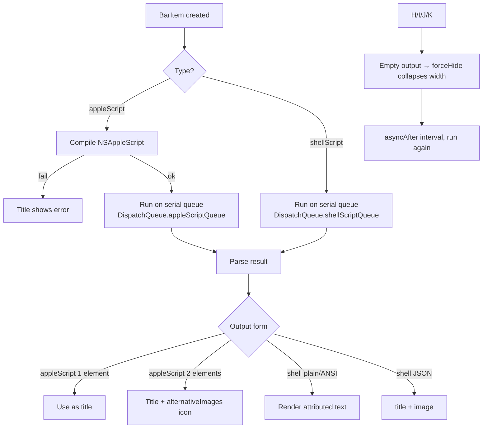
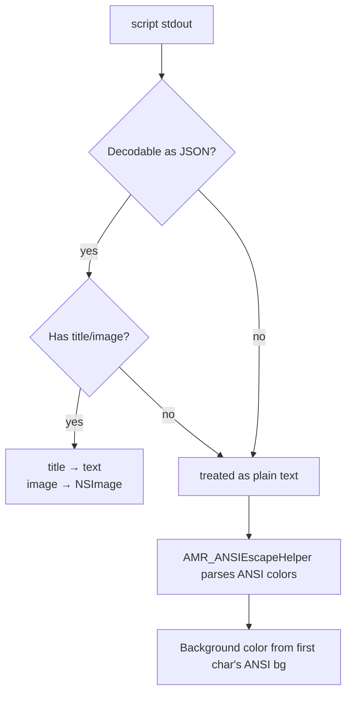

# Scripting API Reference (Developer Guide · English)

> For **developers**: configuration schema, return protocols, and the execution model of the `appleScript` and `shellScript` items.
> Source: `MTMR/AppleScriptTouchBarItem.swift`, `MTMR/ShellScriptTouchBarItem.swift`, `MTMR/ItemsParsing.swift`, `MTMR/Preferences/AppleScriptGenerator.swift`.

---

## 1. Execution Model (Flowchart)



---

## 2. `appleScriptTitledButton`

### Configuration Schema

| Field | Type | Required | Default | Description |
|:---|:---|:---:|:---|:---|
| `type` | `string` | ✅ | — | fixed `"appleScript"` |
| `source` | `Source` | ✅ | — | `inline` or `filePath` |
| `refreshInterval` | `number` | — | `1800` | refresh interval (s) |
| `alternativeImages` | `[string: Source]` | — | `{}` | icon label → image |

**Source struct**:

| Field | Description |
|:---|:---|
| `inline` | inline script/text content |
| `filePath` | path to a file (`.scpt`, image, or Base64 text) |
| `base64` | Base64-encoded data |

Priority: `base64` → `inline` → `filePath` (per the property being consumed).

### Return Protocol

| Return | Handling |
|:---|:---|
| Single value or 1-element list | `title = value` |
| 2-element list | `title = arr[0]`; `arr[1]` looked up in `alternativeImages`; on hit replaces `image`, on miss prints `Cannot find icon with label "..."` |
| Empty string | `forceHideConstraint` collapses width to 0 |
| Compile/execution error | title shows `error` (details printed in DEBUG) |

### Example

```json
{
  "type": "appleScript",
  "source": {
    "inline": "tell application \"System Events\" to return (current date) as string"
  },
  "refreshInterval": 60,
  "alternativeImages": {
    "ok":  { "filePath": "/path/to/ok.png" },
    "warn": { "base64": "iVBORw0KGgo..." }
  }
}
```

---

## 3. `shellScriptTitledButton`

### Configuration Schema

| Field | Type | Required | Default | Description |
|:---|:---|:---:|:---|:---|
| `type` | `string` | ✅ | — | fixed `"shellScript"` |
| `source` | `Source` | ✅ | — | command text (`inline`) or script file (`filePath`) |
| `refreshInterval` | `number` | — | `1800` | refresh interval (s) |

### Return Protocol (in try order)



| Form | Description |
|:---|:---|
| Plain text | used directly as the title |
| ANSI escapes | `\033[32m` etc. foreground/background colors rendered into attributed text |
| JSON | single-line object `{"title": string, "image": Source}`; `image` is `inline` (emoji/text), `filePath`, or `base64` |
| Empty output | `forceHide` hides the item |

### Example

```json
{
  "type": "shellScript",
  "source": {
    "inline": "echo '{\"title\": \"CPU 23%\", \"image\": {\"inline\": \"🖥️\"}}'"
  },
  "refreshInterval": 5
}
```

---

## 4. Execution Details

| Item | Behavior |
|:---|:---|
| Shell | `getenv("SHELL")`, fallback `/bin/bash`; `task.arguments = ["-c", command]` |
| Timeout | processes running past the refresh interval are `terminate()`d (no zombies) |
| Output cleanup | trailing `\n+` removed via regex |
| Error | empty output with non-zero exit → title `error` |
| Queue | global serial queues (`mtmr.shellscript` / `mtmr.applescript`) avoid contention |
| Thread safety | scripts run on background queues; UI updates dispatch to main |

---

## 5. AppleScript Generator

`AppleScriptGenerator` (`Preferences/AppleScriptGenerator.swift`) converts key combos ↔ AppleScript:

| API | Description |
|:---|:---|
| `generateKeyPress(keyCode:modifiers:)` | `tell application "System Events" to key code 0 using {command down}` |
| `generateAppKeyPress(appName:keyCode:modifiers:)` | activate app, then send the key combo |
| `parseKeyCombo(from:)` | parse `key code <n> [using {modifiers}]` → keycode + modifiers |
| `extractBindings(from:)` | scan an items array for all `actionAppleScript` key bindings |

Modifiers: `command` / `option` / `control` / `shift` / `caps lock`, etc. (`KeyModifier`).

---

## 6. Bundled AppleScripts

`MTMR/AppleScripts/` ships examples (Battery, Finder, Music, Spotify, Vox, Weather, PlaySmart, …) as references:

```applescript
-- Battery.scpt idea
tell application "System Events"
    set batteryLevel to do shell script "pmset -g batt | grep -o '[0-9]\\+%' | head -1"
    return batteryLevel
end tell
```

> Note: `.scpt` files are compiled; `filePath` must be absolute.

---

## 7. Best Practices

1. **Prefer JSON output**: `{"title": "...", "image": {...}}` is unambiguous and avoids ANSI compatibility issues.
2. **Self-protect with timeouts**: prefix commands with `timeout 5` or use `&` + `wait` so polling never stalls.
3. **Empty output hides**: keep output non-empty for always-visible items (e.g. `|| echo "—"`).
4. **Emoji icons are easiest**: `image.inline` accepts text, so `🔋`, `🌡️` work directly.
5. **Debug first**: run the script in Terminal before pasting; mind JSON quote escaping (`\"`).

---

## 8. Related Docs

- [User Guide · Scripting & Automation](../user-guide/scripting.en.md) — user perspective
- [External API Reference](external-apis.en.md) — endpoints you can curl in scripts
- [Internal APIs & Extensions](internal-apis.en.md) — item extension mechanisms
