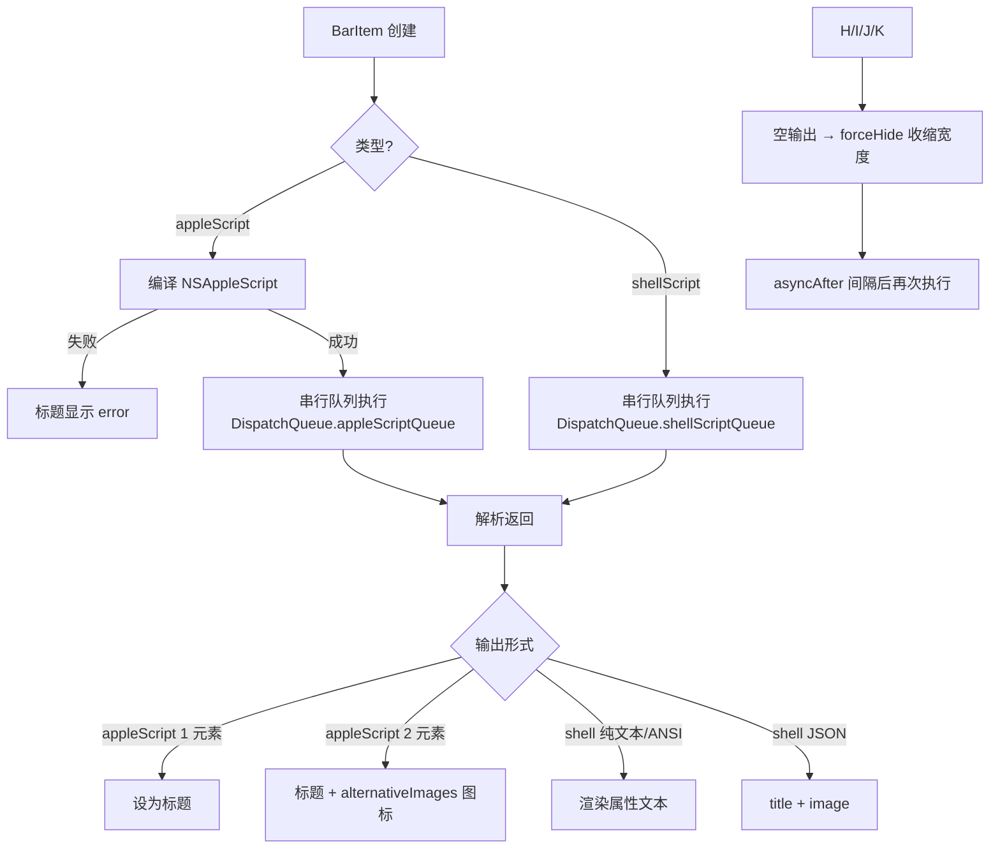
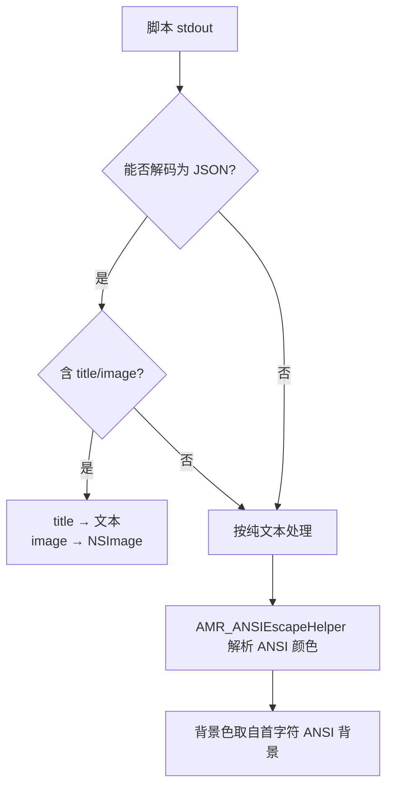

# 脚本 API 参考（开发者册 · 中文）

> 面向**开发者**：`appleScript` 与 `shellScript` 两种组件的配置 Schema、返回协议与执行模型。
> 源码位置：`MTMR/AppleScriptTouchBarItem.swift`、`MTMR/ShellScriptTouchBarItem.swift`、`MTMR/ItemsParsing.swift`、`MTMR/Preferences/AppleScriptGenerator.swift`。

---

## 一、执行模型（流程图）



---

## 二、`appleScriptTitledButton`

### 配置 Schema

| 字段 | 类型 | 必填 | 默认 | 说明 |
|:---|:---|:---:|:---|:---|
| `type` | `string` | ✅ | — | 固定 `"appleScript"` |
| `source` | `Source` | ✅ | — | `inline` / `filePath` 二选一 |
| `refreshInterval` | `number` | — | `1800` | 刷新间隔（秒） |
| `alternativeImages` | `[string: Source]` | — | `{}` | 图标标签 → 图片 |

**Source 结构**：

| 字段 | 说明 |
|:---|:---|
| `inline` | 脚本/文本内容直接内联 |
| `filePath` | 指向文件（脚本 `.scpt`、图片、Base64 文本） |
| `base64` | Base64 编码的数据 |

优先级：`base64` → `inline` → `filePath`（按各自属性取用）。

### 返回协议

| 返回 | 处理 |
|:---|:---|
| 单值或 1 元素列表 | `title = 返回值` |
| 2 元素列表 | `title = arr[0]`；`arr[1]` 作为图标标签查 `alternativeImages`，命中则替换 `image`，未命中打印 `Cannot find icon with label "..."` |
| 空字符串 | `forceHideConstraint` 生效，宽度收缩为 0 |
| 编译/执行错误 | 标题显示 `error`（DEBUG 下打印详情） |

### 示例

```json
{
  "type": "appleScript",
  "source": {
    "inline": "tell application \"System Events\" to return (current date) as string"
  },
  "refreshInterval": 60,
  "alternativeImages": {
    "ok":  { "filePath": "/path/to/ok.png" },
    "warn": { "base64": "iVBORw0KGgo..." }
  }
}
```

---

## 三、`shellScriptTitledButton`

### 配置 Schema

| 字段 | 类型 | 必填 | 默认 | 说明 |
|:---|:---|:---:|:---|:---|
| `type` | `string` | ✅ | — | 固定 `"shellScript"` |
| `source` | `Source` | ✅ | — | 命令文本（`inline`）或脚本文件（`filePath`） |
| `refreshInterval` | `number` | — | `1800` | 刷新间隔（秒） |

### 返回协议（按尝试顺序）



| 形式 | 说明 |
|:---|:---|
| 纯文本 | 直接作为标题 |
| ANSI 转义 | `\033[32m` 等前景/背景色渲染到属性文本 |
| JSON | 单行对象 `{"title": string, "image": Source}`；`image` 为 `inline`（Emoji/文本）/`filePath`/`base64` |
| 空输出 | `forceHide` 隐藏组件 |

### 示例

```json
{
  "type": "shellScript",
  "source": {
    "inline": "echo '{\"title\": \"CPU 23%\", \"image\": {\"inline\": \"🖥️\"}}'"
  },
  "refreshInterval": 5
}
```

---

## 四、执行细节

| 项目 | 行为 |
|:---|:---|
| Shell | 使用 `getenv("SHELL")`，缺省 `/bin/bash`；`task.arguments = ["-c", command]` |
| 超时 | 超过刷新间隔的进程会被 `terminate()` 强制结束（防僵尸） |
| 输出清洗 | 末尾 `\n+` 用正则移除 |
| 错误 | 输出为空且退出码非 0 → 标题 `error` |
| 队列 | 全局串行队列（`mtmr.shellscript` / `mtmr.applescript`），避免并发抢占 |
| 线程安全 | 脚本在后台队列执行，UI 更新回到主队列 |

---

## 五、AppleScript 生成器

`AppleScriptGenerator`（`Preferences/AppleScriptGenerator.swift`）提供按键组合 ↔ AppleScript 互转：

| API | 说明 |
|:---|:---|
| `generateKeyPress(keyCode:modifiers:)` | 生成 `tell application "System Events" to key code 0 using {command down}` |
| `generateAppKeyPress(appName:keyCode:modifiers:)` | 先激活应用再发按键 |
| `parseKeyCombo(from:)` | 从脚本中解析 `key code <n> [using {modifiers}]` → 键码+修饰键 |
| `extractBindings(from:)` | 扫描 items 数组提取所有 `actionAppleScript` 按键绑定 |

修饰键：`command` / `option` / `control` / `shift` / `caps lock` 等（`KeyModifier`）。

---

## 六、内置 AppleScript 脚本

`MTMR/AppleScripts/` 附带示例（Battery、Finder、Music、Spotify、Vox、Weather、PlaySmart 等），可作为编写参考：

```applescript
-- Battery.scpt 思路
tell application "System Events"
    set batteryLevel to do shell script "pmset -g batt | grep -o '[0-9]\\+%' | head -1"
    return batteryLevel
end tell
```

> 注意：`.scpt` 是编译产物，`filePath` 需指向绝对路径。

---

## 七、最佳实践

1. **尽量用 JSON 返回**：`{"title": "...", "image": {...}}` 结构明确，避免 ANSI 兼容性问题。
2. **脚本加超时自保**：命令前加 `timeout 5` 或用 `&` + `wait`，防止拖垮轮询。
3. **空输出即隐藏**：需要"常驻显示"时确保输出非空（如 `|| echo "—"`）。
4. **图标用 Emoji 最省事**：`image.inline` 支持文本，可直接用 `🔋`、`🌡️`。
5. **调试**：先在终端跑通脚本，再贴进 JSON；注意 JSON 内引号转义（`\"`）。

---

## 八、相关文档

- [用户册 · 脚本与自动化指南](../user-guide/scripting.zh.md) — 用户视角配置
- [外部 API 参考](external-apis.zh.md) — 可在脚本里 curl 的接口
- [内部协议与扩展 API](internal-apis.zh.md) — 组件扩展机制
