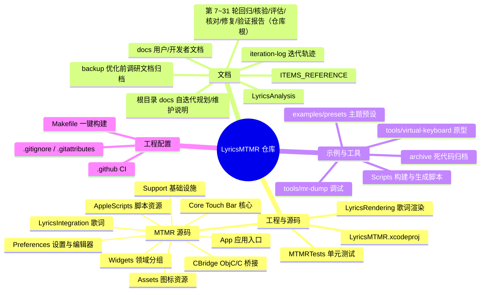
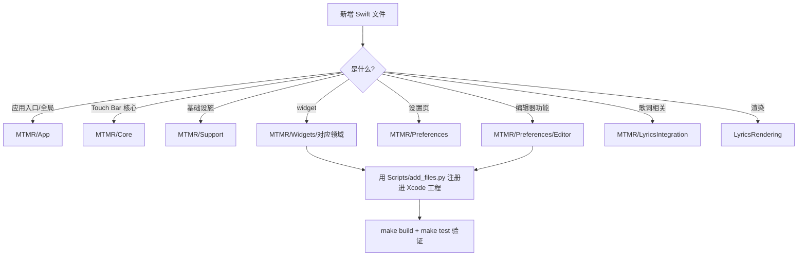

# 仓库文件存放说明 / File Structure Guide

> 本文是仓库整理（`codex/optimize-structure-build`）之后的**文件存放权威索引**。
> 任何新增/移动文件前，先对照本表决定文件归属。

---

## 一、仓库总览（思维导图）



## 二、目录树总览

```
.
├── .github/                          # CI（根目录才会被 GitHub 执行）
│   ├── FUNDING.yml
│   ├── scripts/
│   │   └── verify_sparkle_key.sh     # Sparkle 私钥 base64(96B) 格式校验（publish / signing-check 共用，ITER-18）
│   └── workflows/
│       ├── build-test.yml            # push/PR：构建 + 单元测试（数量以 xcodebuild test 输出为准）
│       ├── publish.yml               # v* tag：通用架构(arm64+x86_64)归档
│       └── signing-check.yml         # PR（仅 paths 命中，ITER-20 收敛）+ 手动：私钥格式 guard 冒烟
├── Makefile                          # make build / test / archive / clean
├── examples/presets/                 # 主题预设示例（theme1-15、items.json、test_lyrics_preset.json）
├── tools/
│   ├── mr-dump/                      # MediaRemote 调试工具（mr_dump + 源码 + 运行脚本）
│   └── virtual-keyboard/             # 虚拟键盘 HTML 原型
├── scripts/                          # 开发巡检脚本（anchor-patrol.py：文档锚点漂移巡检，第 29 轮 B 卡）
├── LyricsMTMR/                       # Xcode 工程根
│   ├── LyricsMTMR.xcodeproj
│   ├── LyricsRendering/              # 歌词渲染模块（KaraokeLabel、LyricsTouchBarItem 等）
│   ├── MTMR/
│   │   ├── App/                      # 应用入口与全局状态（AppDelegate、StatusBarMenuView、AppSettings）
│   │   ├── Core/                     # Touch Bar 核心（TouchBarController、ItemsParsing、各基础 item）
│   │   ├── Support/                  # 基础设施（SecretsManager、KeyPress、CPU、AppLog、扩展等）
│   │   ├── Widgets/                  # 全部注册 widget，按领域分组
│   │   │   ├── Media/                #   媒体播放（Music、进度、频谱、歌词翻译…）
│   │   │   ├── System/               #   系统状态与硬件控制（电池、CPU、亮度、勿扰…）
│   │   │   ├── DevOps/               #   开发运维（Git、Docker、SSH、AI 用量、API 测试…）
│   │   │   ├── Tools/                #   小工具（哈希、UUID、JSON、正则、二维码…）
│   │   │   ├── Productivity/         #   效率专注（番茄钟、笔记、剪贴板、阅读…）
│   │   │   ├── Life/                 #   生活数据（天气、股票、快递、倒计时、订阅…）
│   │   │   └── Layout/               #   布局容器（Group、ExpandableCard、ThemeSwitch）
│   │   ├── Preferences/              # 设置界面
│   │   │   ├── Editor/               #   编辑器（EditorTabView、Schema、DraftManager、预览…）
│   │   │   └── Components/           #   通用表单组件
│   │   ├── LyricsIntegration/        # 歌词搜索/匹配/封面缓存
│   │   ├── CBridge/                  # ObjC/C 桥接（TouchBar 私有 API、MediaRemote…）
│   │   ├── AppleScripts/             # 内置 .scpt 脚本资源
│   │   ├── Assets.xcassets/          # 应用图标与图片资源
│   │   ├── Base.lproj/               # Main.storyboard
│   │   ├── Resources/                # run.pl（MediaRemote 运行时脚本）
│   │   ├── Info.plist / MTMR.entitlements / defaultPreset.json / ChinaCityCodes.json   # 中国天气网城市码表（917983f 起）
│   │   └── MTMRExceptionCatcher.h    # ObjC 异常捕获（被桥接头引用，勿移动）
│   ├── MTMRTests/                    # 单元测试套件（随新增用例增长）
│   ├── Sparkle.framework/            # 本地依赖（e8f2c63 起入库跟踪供 CI 构建，FRAMEWORK_SEARCH_PATHS 引用）
│   ├── Scripts/                      # 开发脚本
│   │   ├── build.sh / test.sh / archive.sh   # 一键构建（Makefile 调用）
│   │   ├── embed-entitlements.sh             # 重新签名脚本
│   │   ├── add_files.py / fix_files.py       # pbxproj 增删文件工具（幂等；add_files 支持 Tests: 前缀一键注册测试文件至单测目标）
│   │   ├── gen_themes.py / gen_functional_themes.py / update_slots.py  # 主题生成
│   │   └── fix_createitem.py                 # 一次性补 createItem 分支
│   ├── Resources/                    # 上游 MTMR README 素材（logo、截图、示例配置）
│   ├── docs/                         # 文档体系（用户册/开发者册/文件结构说明）
│   └── archive/                      # 死代码归档（duplicate-LyricsRendering、dead-functions…）
├── docs/                            # 自迭代规划与维护说明（iteration-plan 置顶待办 / maintenance-notes 年度流程 / backup-note / optimization-plan / memory-rendering-audit / anchor-patrol 锚点巡检用法）
├── backup/                          # 优化前调研文档归档（17 份，存档点 pre-opt-20260812-0114；第8轮收尾新增 优化计划_OPT任务清单.md）
├── iteration-log.md                 # 迭代轨迹（kanban 自迭代链逐轮追加，本文档之外的总轨迹）
├── 回归报告_第7轮_t_eeddbbf0.md             # 第 7 轮回归报告（main 全量构建+单测：60 用例 0 失败）
├── 核验报告_第7轮_维护机制健在性与文档一致性.md # 第 7 轮核验报告（维护机制健在性 + 文档一致性）
├── 核验报告_第8轮_维护机制健在与文档一致性.md # 第 8 轮核验报告（第 2 次年度维护核验）
├── 清理报告_第8轮收尾_r8-cleanup.md         # 第 8 轮收尾清理报告（根目录/backup 去重 + 工作区收尾，含删除哈希清单）
├── 评估报告_第8轮_ITER15镜像窗事件驱动刷新.md # 第 8 轮 ITER-15 可行性评估（只读调研）
├── 内存修复报告_t5e363548_设置窗口复用.md    # 设置窗口内存修复报告（PR #41 合入 main 新增；代码随第 8 轮 28e65b6 已入 main）
├── 回归报告_第9轮_t_d0232788.md              # 第 9 轮子任务 A 回归报告（含内存修复代码全量回归 60 用例 0 失败，47c9f28 合入 main）
├── 核对报告_第9轮_子任务C_内存修复文档代码一致性.md # 第 9 轮子任务 C 核对报告（r9/issue 交付，收口合并后入根）
├── 核验报告_第9轮_维护机制健在与文档一致性.md # 第 9 轮核验报告（第 3 次年度维护核验，r9/review）
├── 清理报告_第10轮卫生_r10-cleanup.md         # 第 10 轮子任务 C 仓库卫生报告（round-9 父卡遗留 worktree/分支清理，r10/cleanup）
├── 核对报告_第10轮_收尾核对.md        # 第 10 轮子任务 B 收尾核对报告（遗留 6 项复核 + D1 注释修正实证，r10/check，第 11 轮补登记）
├── 核验报告_第10轮_维护机制健在与文档一致性.md # 第 10 轮核验报告（第 4 次年度维护核验，r10/review，预登记）
├── 核对报告_第11轮_收尾核对.md        # 第 11 轮子任务 B 收尾核对报告（遗留 6 项复核 + GitHub 状态复核，r11/check，预登记）
├── 核验报告_第11轮_维护机制健在与文档一致性.md # 第 11 轮核验报告（第 5 次年度维护核验，r11/review，预登记）
├── 清理报告_第11轮卫生_r11-cleanup.md         # 第 11 轮子任务 C 仓库卫生报告（round-10 父卡遗留 worktree/分支清理，r11/cleanup）

├── 核对报告_第12轮_收尾核对.md         # 第 12 轮子任务 B 收尾核对报告（GitHub 状态 4/4 + 遗留 6 项分类，r12/check）
├── 回归报告_第12轮.md                        # 第 12 轮子任务 A 全量回归报告（隔代触发：BUILD/TEST SUCCEEDED，60 用例 0 失败，r12/review，预登记）
├── 核验报告_第12轮_维护机制健在与文档一致性.md # 第 12 轮核验报告（第 6 次年度维护核验，r12/review，预登记）
├── 清理报告_第12轮.md         # 第 12 轮子任务 C 仓库卫生报告（round-11 父卡+子卡遗留 worktree/分支清理，r12/cleanup）
├── 验证报告_第13轮_issue40_按软件切换bar.md # 第 13 轮子任务 A 验证报告（issue #40 Per-app bar switching 核验+补齐：4 条验收全满足 + 12 单测 + 文档登记，r13/feature）
├── 文档报告_第13轮_README补全.md  # 第 13 轮子任务 B 文档报告（README 补 MediaRemote 风险说明 + 应用专属主题使用文档 + 漂移核对，r13/docs）

├── 核验报告_第13轮_维护机制健在与文档一致性.md # 第 13 轮核验报告（第 7 次年度维护核验，r13/cleanup，预登记）
├── 清理报告_第13轮_round12遗留清理.md          # 第 13 轮子任务 C 仓库卫生报告（round-12 父卡+子卡遗留 worktree/分支清理，r13/cleanup，预登记）
├── 验证报告_第14轮_currency恢复.md     # 第 14 轮子任务 A 验证报告（currency 汇率 widget 恢复：Coinbase FIXME 解禁 + parseRate/formatTitle 纯函数 + 优雅降级，r14/feature）
├── 核对报告_第14轮_ITEMS_REFERENCE口径.md      # 第 14 轮子任务 B 核对报告（Item 类型口径 80+→113：ItemTypeRaw 97+预定义 14+注册 2，补 8 缺失条目删 pause，r14/docs）

├── 回归报告_第14轮.md                        # 第 14 轮子任务 C 全量回归报告（隔代触发：BUILD/TEST SUCCEEDED，72 用例 0 失败，r14/review）
├── 核验报告_第14轮_维护机制健在与文档一致性.md # 第 14 轮核验报告（第 8 次年度维护核验，r14/review）
├── 清理报告_第14轮_round13遗留清理.md          # 第 14 轮子任务 C 仓库卫生报告（round-13 父卡+子卡遗留 worktree/分支清理，r14/review）
├── 核验报告_第15轮_维护机制健在与文档一致性.md # 第 15 轮核验报告（第 9 次年度维护核验，r15/review）
├── 清理报告_第15轮_round14遗留清理.md          # 第 15 轮子任务 C 仓库卫生报告（round-14 父卡+子卡遗留 worktree/分支清理，r15/review）
├── 验证报告_第15轮_barItemFactory提取.md # 第 15 轮子任务 B 验证报告（TECHNICAL_DEBT 置顶第 4 条落地：createItemInternal 113 case switch 提取至 BarItemFactory + 18 单测 + README TODO 核对，r15/refactor）

├── 验证报告_第16轮_技术债评估与落地.md    # 第 16 轮子任务 B 验证报告（TECHNICAL_DEBT 剩余 3 条评估：① VC 化暂缓/② 枚举解析暂缓/③ 隐藏机制落地——shouldShowItem 纯函数提取 + 异步路径补过滤 + 11 单测，r16/techdebt）

├── 验证报告_第15轮_节假日倒计时widget.md   # 第 15 轮子任务 A 验证报告（新 widget holidayCountdown：复用 aShareHolidays 唯一数据源 + 纯逻辑单测 16 例，r15/feature）
├── 核验报告_第16轮_维护机制健在与文档一致性.md # 第 16 轮核验报告（第 10 次年度维护核验，r16/review）
├── 清理报告_第16轮_round15遗留清理.md          # 第 16 轮子任务 C 仓库卫生报告（round-15 父卡+子卡遗留 worktree/分支清理，r16/review）

├── 验证报告_第16轮_add_files脚本修复.md # 第 16 轮子任务 A 验证报告（add_files.py 锚点修复：结构化段内定位替代硬编码「末尾条目」假设，探针一键注册 4 处条目 + build + 幂等实证，r16/tooling）

├── 核验报告_第17轮_维护机制健在与文档一致性.md # 第 17 轮核验报告（第 11 次年度维护核验，r17/review）
├── 清理报告_第17轮_round16遗留清理.md          # 第 17 轮子任务 C 仓库卫生报告（round-16 父卡+子卡遗留 worktree/分支清理，r17/review）
├── 验证报告_第17轮_add_files测试注册扩展.md # 第 17 轮子任务 A 验证报告（add_files.py 扩展 Tests: 前缀一键注册测试文件：group/phase 落单测目标 LyricsMTMRTests 绝不含 app、UUID 独立前缀 C1FE/C1FF、两阶段校验写盘，r17/tooling）
├── 验证报告_第17轮_隐藏机制正则缓存优化.md # 第 17 轮子任务 B 验证报告（matchAppId 正则编译缓存：MatchAppIdRegexCache 有界线程安全缓存 + 双路径 frontmostAppId 提出循环，行为严格等价，134 用例实证，r17/feature）
├── 验证报告_第18轮_假期名映射健壮化.md   # 第 18 轮子任务 A 验证报告（holidayCountdown 假期名映射跨月/重叠窗口健壮化：窗口特征判定——含 1/1→元旦跨年、含 10/1→国庆、10 月首日中秋、1 月下旬春节，makeWindows 两遍式，142 用例实证，r18/feature）

├── 核验报告_第18轮_维护机制健在与文档一致性.md # 第 18 轮核验报告（第 12 次年度维护核验，r18/review）
├── 清理报告_第18轮_round17遗留清理.md          # 第 18 轮子任务 C 仓库卫生报告（round-17 父卡+子卡遗留 worktree/分支清理，r18/review）

├── 验证报告_第18轮_黑名单隐藏暂停轮询.md # 第 18 轮子任务 B 验证报告（隐藏期间暂停 widget 轮询：TBPollItem/TBMetricPopoverItem 线程安全 pause/resume + TouchBarController dismiss/present 广播，139 用例实证，r18/optimize）

├── 核验报告_第19轮_维护机制健在与文档一致性.md # 第 19 轮核验报告（第 13 次年度维护核验，r19/review）
├── 清理报告_第19轮_round18遗留清理.md          # 第 19 轮子任务 C 仓库卫生报告（round-18 父卡+子卡遗留 worktree/分支清理，r19/review）
├── 验证报告_第19轮_隐藏暂停轮询覆盖缺口补齐.md # 第 19 轮子任务 A 验证报告（TBPollPausable 扩展至自驱动 Timer item：TBPausableTimer/TBPauseGate 共享可暂停定时器封装覆盖 8 个缺口 item + CPUBarItem asyncAfter 链接入，恢复立即刷新，156 用例实证，r19/feature；新增源码 Widgets/TBPausableTimer.swift + 测试 MTMRTests/PausableTimerTests.swift）
├── 核对报告_第19轮_README占位符清理与现状核对.md # 第 19 轮子任务 B 核对报告（README TODO「……」占位符删除 + 12 项现状核对 + holidayCountdown 补登 + v0.27 更新日志条目，r19/docs）
├── 验证报告_第20轮_隐藏零空转统一治理收官.md # 第 20 轮子任务 A 验证报告（剩余 Timer item 盘点分类与纳入：8 项纳入隐藏零空转统一治理——DarkMode/NightShift/Time/Brightness/ClipboardHistory/Music(链+跑马灯双定时器)/PlaybackProgress/AudioSpectrum 全部迁移 TBPausableTimer（新增 mode 参数透传 .common），5 项不纳入（Pomodoro/ReadTimer/StandupTimer/BreathingGuide/LyricsTranslate，用户激活/浮层作用域计时语义），162 用例实证，r20/feature）

├── 核验报告_第20轮_维护机制健在与文档一致性.md # 第 20 轮核验报告（第 14 次年度维护核验，r20/review；修正 maintenance-notes/iteration-plan 行号引用 +3 漂移 4 处）
├── 清理报告_第20轮_round19遗留清理.md          # 第 20 轮子任务 C 仓库卫生报告（round-19 父卡+子卡遗留 worktree/分支清理，r20/review）

├── 验证报告_第20轮_actions强引用环评估.md # 第 20 轮子任务 B 验证报告（CustomButtonTouchBarItem actions 强引用环评估与修复：CPUBarItem/YandexWeatherBarItem 两处 defaultTapAction 方法引用强捕获 self 成环 → [weak self] 闭包，Yandex 另修 scheduler/URLSession 两处同类强捕获，视图/手势链实证无环，157 用例实证，r20/code-quality）

├── 核验报告_第21轮_维护机制健在与文档一致性.md # 第 21 轮核验报告（第 15 次年度维护核验，r21/review；行号引用第 20 轮修正后零新漂移，GitHub 4/4：#1 OPEN/#40 CLOSED/0 PR/origin/main=bc56985 同步）
├── 清理报告_第21轮_round20遗留清理.md          # 第 21 轮子任务 C 仓库卫生报告（round-20 父卡+子卡遗留 worktree/分支清理，r21/review）
├── 验证报告_第21轮_ClipboardHistory事件驱动化.md # 第 21 轮子任务 A 验证报告（ClipboardHistory 事件驱动化评估：NSPasteboard.observe 公开 SDK 不存在（编译/头文件/官方文档三重证伪）+ 四种替代事件机制实测全灭 → changeCount 轮询为唯一机制；落地变更源抽象 ClipboardChangeSource（测试注入假源直驱捕获路径）+ 浮层打开即时对齐 + pollInterval 可注入，隐藏期零丢失不可达如实记录，169 用例实证，r21/feature；新增测试 MTMRTests/ClipboardHistoryTests.swift）
├── 验证报告_第21轮_AudioSpectrum采集链隐藏期治理.md # 第 21 轮子任务 B 验证报告（AudioSpectrum 采集链纳入隐藏暂停：SCK system tap / mic engine 隐藏期零采集、恢复重启采集并立即补刷，SystemAudioTap stopped 取消标记防孤儿流，独立 capturePauseGate 广播幂等，TCC 持久授权零重弹风险实证，166 用例实证，r21/audio）
├── 验证报告_第22轮_NSBackgroundActivityScheduler隐藏期轮询治理.md # 第 22 轮子任务 A 验证报告（NSBackgroundActivityScheduler 类 widget 隐藏期轮询治理：Currency/Weather/Yandex/UpNext 4 widget 纳入隐藏暂停——门控回调路径（调度器保持存活 + pollTick 过 TBPauseGate，invalidate+重建因同 identifier 注册竞态否决），隐藏期零网络请求/零 EventKit 查询、恢复按原节奏继续并立即补刷；顺带修复 Currency/Weather schedule 块强捕获保留环，181 用例实证，r22/feature）

├── 核验报告_第22轮_维护机制健在与文档一致性.md # 第 22 轮核验报告（第 16 次年度维护核验，r22/review；行号引用连续两轮零新漂移，GitHub 4/4：#1 OPEN/#40 CLOSED/0 PR/origin/main=b46116b 同步）
├── 清理报告_第22轮_round21遗留清理.md          # 第 22 轮子任务 C 仓库卫生报告（round-21 父卡+子卡遗留 worktree/分支清理，r22/review）
├── 验证报告_第22轮_天气widget定位服务隐藏期治理.md # 第 22 轮子任务 B 验证报告（WeatherBarItem/YandexWeatherBarItem 定位服务纳入隐藏暂停：隐藏期 stopUpdatingLocation（GPS 关闭、隐私指示灯熄灭）、恢复重启定位+立即补刷天气；locationPauseGate 广播幂等 + locationTrackingEnabled init 期守卫（城市模式/权限拒绝广播 no-op）+ start/stop 定位接缝 internal 单测注入；TCC 持久授权零重弹风险实证（stop/start 不重弹窗）；WeatherBarItem activity 闭包 [weak self] 断永久循环引用（deinit 可达并停定位，配置热重载旧 item 泄漏放大器根治）；TouchBarController 零改动，177 用例实证，r22/location）
├── 核验报告_第23轮_维护机制健在与文档一致性.md # 第 23 轮核验报告（第 17 次年度维护核验，r23/review；行号引用连续三轮零新漂移，GitHub 4/4：#1 OPEN/#40 CLOSED/0 PR/origin/main=8b15f98 同步）
├── 清理报告_第23轮_round22遗留清理.md          # 第 23 轮子任务 C 仓库卫生报告（round-22 父卡+子卡遗留 worktree/分支清理，r23/review）
├── 验证报告_第23轮_全局隐藏态注入与重建覆盖.md # 第 23 轮子任务 A 验证报告（隐藏期重建治理收官：TouchBarVisibilityState 全局隐藏态注册表（present/dismiss 驱动、初始态可见）+ createItems 重建覆盖 guard + init 隐藏态注入——TBPollItem/TBMetricPopoverItem 隐藏期重建零 compute 初始 fetch 跳过、恢复零延迟补刷（runImmediateCycle + _needsInitialRefresh 陈旧补刷丢弃）；Currency/Weather/Yandex/UpNext gate 播种全局态 init fetch 零请求、天气类隐藏期重建 GPS 不亮；广播协议零破坏逐字节等价，192 用例实证，r23/feature；新增测试 MTMRTests/GlobalHiddenStateTests.swift）
├── 验证报告_第23轮_WeatherTabView定位生命周期治理.md # 第 23 轮子任务 B 验证报告（WeatherTabView 定位添加城市生命周期治理：locateAndAddCity resolve/超时/视图消失三路径停 manager——提取 WeatherLocationSession 会话封装（LocationProviding/GeocodingProviding 双抽象缝，假源+MKPlacemark 假 geocoder 零硬件零网络），resolve 当拍停定位、超时 stop、stop 幂等+丢弃在途 geocode；onDisappear 在本架构不可靠（关窗=orderOut 隐藏复用/切页=ZStack 常驻）改用 SettingsWindowState.isVisible+activeTab 等价生命周期；stopUpdatingLocation 每会话恰一次契约 + deinit 兜底；权限拒绝路径保持原超时文案、requestLocation+startUpdatingLocation 并存语义不破，195 用例实证，r23/location-fix；新增源码 MTMR/Preferences/WeatherLocationSession.swift + 测试 MTMRTests/WeatherLocationSessionTests.swift）
├── 核验报告_第24轮_维护机制健在与文档一致性.md # 第 24 轮核验报告（第 18 次年度维护核验，r24/review；行号引用连续四轮零新漂移，114 口径行号新漂移 +18 已更新（:1145/:1156→:1163/:1174，round23-A 合入所致语义零漂移），GitHub 4/4：#1 OPEN/#40 CLOSED/0 PR/origin/main=134d3ce 同步）
├── 清理报告_第24轮_round23遗留清理.md          # 第 24 轮子任务 C 仓库卫生报告（round-23 父卡+子卡遗留 worktree/分支清理，r23 全清 4 worktree+4 分支，r24/review）
├── 验证报告_第24轮_隐藏期零空转治理收官审计.md # 第 24 轮子任务 A 验证报告（隐藏期零空转收官审计：全库活跃源覆盖矩阵约 60 源逐源判定「已纳入/合理不纳入（证据）/遗漏（修复）」，发现并修复 5 项真遗漏——NoiseMeterItem 麦克风采集链（AVAudioEngine tap 隐藏期隐私灯常亮，micPauseGate+startEngine/stopEngine 拆分）、ShellScript/AppleScriptTouchBarItem 脚本自循环（pauseGate+链终结+恢复拉起）、LyricsTouchBarItem marquee 60fps 滚动（marqueePauseGate+handleTextScroll/startMarquee 双 guard）、NetworkBarItem netstat 常驻进程（pollGate+停/重启进程）；遗留挂账「NSBackgroundActivityScheduler 隐藏期零网络」实证收口（pollTick 门控+全部旁路入口独立 guard，零网络/零 EventKit 查询成立，关闭挂账）；第 20 轮「不纳入 5 项/排除 1 项」决策复核全部成立；TouchBarController 零改动，208 用例实证（201 基线+7 新增，两轮独立全量），r24/feature）
├── 核对报告_第24轮_README更新日志与现状核对.md # 第 24 轮子任务 B 核对报告（README 更新日志补登 v0.28：第 20~23 轮功能/优化条目——隐藏零空转收官（8 常驻定时器 + 4 后台调度组件）/采集链与定位暂停（隐私保护）/全局隐藏态注入/剪贴板浮层即时对齐/天气定位添加城市生命周期/强引用环修复，12 项现状核对 + 条目→轮次→iteration-log 出处对照表；版本号建议升 0.28 不擅改，r24/docs）
├── 核验报告_第25轮_维护机制健在与文档一致性.md # 第 25 轮核验报告（第 19 次年度维护核验，r25/review；行号引用连续五轮零新漂移，114 口径 :1163/:1174 更新后首轮复查零新漂移（第 25 轮 A 卡未合并无触碰源），第 24 轮 A/B 卡落地 5 项遗漏修复全部在位（micPauseGate/marqueePauseGate/pollGate/脚本 pauseGate×2），GitHub 4/4：#1 OPEN/#40 CLOSED/0 PR/origin/main=82d2dc1 同步，本轮零新增发现）
├── 清理报告_第25轮_round24遗留清理.md          # 第 25 轮子任务 C 仓库卫生报告（round-24 父卡+子卡遗留 worktree/分支清理，r24 全清 4 worktree+4 分支，r25/review）
├── 验证报告_第25轮_注册表混合架构对账测试.md # 第 25 轮子任务 A 验证报告（注册表混合架构对账测试落地：测试侧唯一基准「规范清单」98 条（generate_registry_test.py 从 ItemTypeRaw/identifierBase 源码提取生成）+ 16 注册表专属键，五层断言 L1~L5——ItemTypeRaw 枚举全集（新增 CaseIterable）/最小 JSON 全量解码 + 逐条 identifierBase 期望值/工厂全量真实构造/注册表键集精确对账（含控制器 exitTouchbar/close）/114 路径口径；生产最小增量 2 处（CaseIterable + registeredTypeNames 只读快照）零行为变更；覆盖边界诚实声明（switch 不可反射 → 编译期穷尽性 + 运行时行为取证双保险）；对账发现：源码四层一致零漂移，夹具自身 1 处修正（sleep/displaySleep 预设标题 ☕️）即机制生效证据；214 用例实证（208 基线+6 新增）0 失败，r25/registry；新增测试 MTMRTests/RegistryReconciliationTests.swift）
├── 考古报告_第25轮_版本体系考古.md         # 第 25 轮子任务 B 考古报告（Releases API 全量仅 2 枚 v1.0.0/v0.8 + git tag 3 枚 + Info.plist 264 提交全量扫描版本号仅 0.27/452→0.28/453 两状态；v0.9~v0.26 缺失段结论=从未以 Release/tag/Info.plist 存在过（编号空洞，fork 继承上游 MTMR v0.27.0 所致两编号体系脱节）；README 方案甲补「版本史说明」段，r25/version-history）
├── 验证报告_第26轮_维护机制健在与文档一致性.md # 第 26 轮验证报告（第 20 次年度维护核验，r26/review；行号引用连续六轮零新漂移，114 口径 :1163/:1174 第 25 轮 A 卡合并后首轮复查零新漂移（55f8a24 改动清单不含 TouchBarController.swift），第 25 轮 A/B 卡落地 5 项源码实证（CaseIterable/registeredTypeNames/6 用例/generate_registry_test.py/README 版本史说明），GitHub 4/4：#1 OPEN/#40 CLOSED/0 PR/origin/main=d5b1248 同步，本轮零新增发现）
├── 清理报告_第26轮_round25遗留清理.md          # 第 26 轮子任务 C 仓库卫生报告（round-25 父卡+子卡遗留 worktree/分支清理，r25 全清 4 worktree+4 分支，r26/review）
├── 验证报告_第26轮_时序敏感测试健壮化.md # 第 26 轮子任务 A 验证报告（全量回归 flaky 7 用例根因修复：**根因非负载时序而是真实 app 级共享状态污染**——TouchBarController.shared 单例（测试宿主内）注册 NSWorkspace 三观察者，任意 app 生命周期事件 → updateActiveApp() → 空 bar（TEST_HOST 不加载 preset）→ dismissTouchBar() → TouchBarVisibilityState 全局隐藏态永久置位 → round-23 init 播种令后续创建 widget 全部暂停（Weather/Yandex 定位不启/UpNext init fetch 拦截/TBPollItem 首 cycle 零调度，同步断言 0≠1 签名）；修复=两测试文件 setUp 复位全局态（与 GlobalHiddenStateTests 同模式，生产零改动）+ 时序断言健壮化（固定 sleep→waitForFrozenValue 冻结证明/直接探针 currentInterval==0/firstDelay 紧时序→间隔粒度双调度证明（0.3s 窗无第二跳+增量上界）/dealloc→waitUntil weak nil）；5 轮全量实证 214 用例 0 失败（干净 derivedDataPath 验收 + 负载 23.5/13.8 两轮复跑，修复前基线同环境 FAILED 22 断言作对照），r26/test-robustness）
├── 核对报告_第26轮_注册表对账机制流程文档化.md # 第 26 轮子任务 B 核对报告（注册表对账机制流程文档化：internal-apis.zh/en §2.3 三步→六处注册点+重跑脚本（ItemTypeRaw :492-591 / decode :596-994 / identifierBase :24-223 / BarItemFactory :52-280 / SupportedTypesHolder :83-254 / 控制器 :331-368，第 26 轮实测）+ ITEMS_REFERENCE 指引段（114 口径锚点 :1163/:1174 在位）+ generate_registry_test.py ROOT 自定位修复（原硬编码 round25-A worktree）+ REQUIRED_FIELDS 同步说明，重跑 diff=0 零 Swift 改动实证 + TECHNICAL_DEBT 两条前置条件状态更新，r26/registry-docs）
├── 核验报告_第27轮_维护机制健在与文档一致性.md # 第 27 轮核验报告（第 21 次年度维护核验，r27/review；行号引用连续七轮零新漂移，114 口径 :1163/:1174 第 26 轮合并后第二轮复查零新漂移（三卡改动清单均不含 TouchBarController.swift），第 26 轮 A/B 卡落地源码实证（PausableTimerTests/PollingPauseTests setUp 复位 + internal-apis zh/en §2.3 六处注册点 + ITEMS_REFERENCE 指引段 :1694 + generate_registry_test.py ROOT 自定位 :21 重跑 BYTE-IDENTICAL diff=0），GitHub 4/4：#1 OPEN/#40 CLOSED/0 PR/origin/main=2825b99 同步（第 26 轮收口 push 由第 27 轮父任务补推实测确认），新增发现 1 项：第 26 轮父记录 C 卡报告名「核验报告」与实际交付「验证报告_第26轮_维护机制健在与文档一致性.md」前缀不一致（不改历史，本轮恢复「核验」惯例命名））
├── 清理报告_第27轮_round26遗留清理.md          # 第 27 轮子任务 C 仓库卫生报告（round-26 父卡+子卡遗留 worktree/分支清理，r26 全清 4 worktree+4 分支，r27/review）
├── 验证报告_第27轮_updateActiveApp全局隐藏态治理.md # 第 27 轮子任务 A 验证报告（第 26 轮登记遗留 ② 评估与落地：updateActiveApp 空 bar 翻转全局隐藏态治理——评估结论落地（生产语义：dismiss 的 UI 动作在空配置下全合理，越界的是无条件 setBarHidden(true) 把「空 bar 从未上屏」记录成「用户隐藏了有内容的 bar」，且该状态是 round-23 后 widget init 播种暂停唯一来源；测试宿主污染链条（事件→翻转→后续 widget 全暂停）源头消失，round-26 两文件 setUp 复位保留为双保险）；修复=TouchBarController.swift dismissTouchBar :763-781 仅 touchBarContainsAnyItems() 为真时翻转全局隐藏态+minimize（原两 if 合并语义不变）+ internal 化供单测，有内容路径（黑名单/exitTouchbar）逐字节等价，新不变量 isBarHidden==true ⇐ 有内容的 bar 被 dismiss；新增 GlobalHiddenStateTests round-27 段 4 用例（空bar不翻转×3 + 注入内容必翻转×1）；218 用例实证（214 基线+新增 4）0 失败，金丝雀 StockMarketHoursTests 三锚点 + WidgetLeakTests 8 全绿，r27/activeapp-hidden）
├── 验证报告_第27轮_失焦在途定位语义.md # 第 27 轮子任务 B 验证报告（失焦取消在途定位区分 close-hide/resignKey 评估与落地：**结论=需要区分并落地**——静默取消无反馈、切走再切回应继续（1~6.5s 用户主动有界操作）、隐私指示灯为系统可见反馈不违反隐藏期零活动治理（该治理针对持续后台源）；SettingsWindowState 双旗标——isVisible（key 等价动画暂停，OPT-14 语义零改动）+ 新增 isOnScreen（真实在屏，resignKey 不改变）——控制器 6 处直写收敛为 SettingsWindowVisibilityTracker 可单测状态机（+NSApplication didHide/didUnhide 观察者，Cmd+H 无 delegate 回调；unhide 恢复隐藏前状态）；WeatherTabView 钩子改 isOnScreen + WeatherLocationSession.shouldStopForViewState 纯策略统一双钩子；边界：Space 切换/被覆盖继续（ordered-in 语义非 occlusion），Cmd+H/关闭/最小化仍取消；224 用例实证（214 基线+10 新增），r27/resignkey-location）
├── 核验报告_第28轮_维护机制健在与文档一致性.md # 第 28 轮核验报告（第 22 次年度维护核验，r28/review；行号引用连续八轮零新漂移（maintenance-notes/iteration-plan 5 处引用 + ITER-14 :391），**114 口径 :1163/:1174 第 27 轮合并后首轮复查发现 +11 新漂移（→ :1174/:1185，round-27 A 卡 cf6d36e 合入 TouchBarController +11 行所致，内容在位语义零漂移，口径已更新 + ITEMS_REFERENCE :1709 同步）**，第 27 轮 A/B 卡落地源码实证（GlobalHiddenStateTests round-27 段 4 用例 / SettingsWindowVisibilityTracker + shouldStopForViewState + WeatherLocationSessionTests Round 27 节 10 用例），GitHub 4/4：#1 OPEN/#40 CLOSED/0 PR/origin/main=2905892 同步，新增发现 1 项（114 口径行号 +11 漂移））
├── 清理报告_第28轮_round27遗留清理.md          # 第 28 轮子任务 C 仓库卫生报告（round-27 父卡+子卡遗留 worktree/分支清理，r27 全清 4 worktree+4 分支，r28/review）
├── 验证报告_第28轮_闲置GC策略可测化.md # 第 28 轮子任务 A 验证报告（遗留④前半句闭环：内存修复闲置 GC 决策逻辑提取为可单测纯策略——提取边界声明（可提取=释放决策矩阵+调优常量；留在接线层=GCD 调度/AppKit 可见性读取/强引用副作用/系统通知/openSettings 开窗即 cancel 不变量）；新增 SettingsWindowGCStrategy 纯策略（SettingsWindowGCStrategy.swift：idleReleaseThreshold=3600 + shouldRelease 决策矩阵——visible→永不释放（守卫优先）/隐藏+内存压力→立即释放（短路）/否则 idleElapsed>=阈值→释放），AppDelegate 接线层仅调用策略（settingsWindowIdleGCSeconds 改向后兼容别名直接引用策略常量；定时器路径经策略——可达状态空间逐字节等价（fire ⇒ 窗口必隐藏 ⇒ 策略恒 true），不可达状态差异如实登记为守卫加固；压力路径 `window?.isVisible != true` 改策略调用逐输入同值）；新增 SettingsWindowGCStrategyTests 9 用例决策点全覆盖（未到阈值不释放/恰阈值释放≥边界/超阈值/压力立即释放/压力短路无视闲置时长/窗口在屏守卫×压力/×闲置/全组合遍历/调优常量回归钉）；237 用例实证（228 基线+新增 9）0 失败，金丝雀 StockMarketHoursTests 三锚点 + WidgetLeakTests 8 全绿，r28/gc-strategy）
├── 核对报告_第28轮_README更新日志补登v0.29.md # 第 28 轮子任务 B 核对报告（README 更新日志补登 v0.29：第 24~27 轮 8 项条目——隐藏期零空转收官审计（5 项真遗漏修复：NoiseMeter 采集链/脚本自循环×2/marquee 60fps/netstat 常驻进程 + 后台调度零网络实证收口）、注册表混合架构对账测试、版本体系考古、时序敏感测试健壮化、注册表对账机制流程文档化、空 bar 不翻转全局隐藏态、失焦在途定位区分 close-hide/resignKey、工程版本号对齐（Info.plist 0.27/452→0.28/453），全部可追溯 iteration-log 实证出处；12 项现状核对 grep 实测刷新；版本决策=新增 v0.29 条目并建议（不擅改）收口时升 Info.plist 至 0.29；新增发现 1 项：114 口径锚点漂移 +11（:1163/:1174→:1174/:1185，round27-A cf6d36e 合入所致，ITEMS_REFERENCE.md:1709 陈旧，建议更新不擅改）；v0.28 条目降历史段 + 版本史说明补 v0.29 映射，r28/changelog）
├── 核验报告_第29轮_维护机制健在与文档一致性.md # 第 29 轮核验报告（第 23 次年度维护核验，r29/review；行号引用连续九轮零新漂移（maintenance-notes/iteration-plan 4 处引用 + ITER-14 :391），114 口径 :1174/:1185 第 28 轮合并后首轮复查零新漂移（三卡改动清单均不含 TouchBarController.swift，提交史结构论证）+ ITEMS_REFERENCE :1709 锚点同步在位，第 28 轮 A/B 卡落地源码实证（SettingsWindowGCStrategy.swift :46 纯策略/AppDelegate 接线 :172 别名+:190/:210 调用/SettingsWindowGCStrategyTests 9 用例/README v0.29 条目 :154/Info.plist 0.29/454 对齐），GitHub 4/4：#1 OPEN/#40 CLOSED/0 PR/origin/main=a66ecaf 同步，新增发现 0 项）
├── 清理报告_第29轮_round28遗留清理.md          # 第 29 轮子任务 C 仓库卫生报告（round-28 父卡+子卡遗留 worktree/分支清理，r28 全清 4 worktree+4 分支，r29/review）
├── 验证报告_第29轮_恢复补刷即时性审计与补齐.md # 第 29 轮子任务 A 验证报告（隐藏→可见恢复侧统一治理（镜像隐藏期治理系列）：全量接入点审计——grep 实证 25 文件 111 处 TBPauseGate/TBPausableTimer/pauseGate/pollGate 引用，24 接入点逐一分类（恢复立即补刷 20 类上界 0 / 恢复经重建覆盖 1 类 netstat 首块 ≤1s / 事件驱动重建合理等待 2 类 marquee ≤0.25s+弹层作用域 / **恢复等待下 tick 4 处本轮修复**）；核心缺口=TBPollItem/TBMetricPopoverItem 两基类恢复分支（第 23 轮仅隐藏期创建走立即 catch-up，可见期创建后隐藏再恢复一律 scheduleNextCycle，首刷延迟上界=完整轮询周期，35 个 widget 受影响）；修复=恢复一律立即周期（runImmediateCycle 去 _needsInitialRefresh 依赖、flag 冗余删除、第 23 轮播种语义被统一恢复补刷吸收——「恢复=立即补刷一次+按原节奏继续」；线程安全/幂等/暂停语义护栏全保留）+ marquee 两处 immediateFireOnResume:false→true（0 空窗）；新增 GlobalHiddenStateTests Round 29 节 3 用例（可见创建恢复 0.6s 窗立即补刷=缺口回归钉/镜像 B 基类/恰好一次+幂等+快速 pause/resume 丢陈旧 hop）；240 用例实证（237 基线+新增 3）0 失败，金丝雀 StockMarketHoursTests 三锚点 + WidgetLeakTests 8 全绿，r29/resume-refresh）
├── 核对报告_第29轮_文档锚点漂移巡检脚本.md # 第 29 轮子任务 B 核对报告（工程规范：文档锚点漂移巡检脚本落地——scripts/anchor-patrol.py 88 项锚点数据驱动清单（114 口径/6 注册点/金丝雀/ITER-14 待办/maintenance-notes 流程段 live 73 项 + iteration-plan 审查证据表 record 15 项），两级语义（live 漂移 ERROR 修文档 / record 位移 WARN 登记不改历史，known 再漂移 ERROR 防第三次漂移），全量实证 PASS 73 / WARN 10 / INFO 5 / ERROR 0 退出码 0，报告登记 84 行无重复；用法文档 docs/anchor-patrol.md，r29/anchor-scan）
├── 评估报告_第30轮_注册表混合架构decode迁移评估.md # 第 30 轮子任务 A 评估报告（TECHDEBT ② 续篇：前置条件兑现后正式决策点——评估结论=支持落地试点（混合架构可行：两级解码机制已在预定义类型运行多年/闭包可逐字节等价提取/对账测试 L2 为迁移等价性机器护栏；收益诚实声明=能力铺垫非即时减负，维持「不宜整体推翻、逐步迁入」）；试点选型 cpu/battery/swipe 覆盖「默认值等价/无参/必填抛错」三形态；落地=ItemType.registeredTypeDecoders 字典驱动解码注册表（ItemsParsing.swift，switch 分支保留不损穷尽性）+ ItemTypeDecodeRegistryTests 7 用例迁移契约；247 用例实证（240 基线+新增 7）0 失败，金丝雀三锚点 + WidgetLeakTests 8 全绿，r30/registry-decode）
├── 核对报告_第30轮_README更新日志补登v0.30.md # 第 30 轮子任务 B 核对报告（README 更新日志补登 v0.30：第 28~29 轮变更条目——恢复补刷即时性审计与补齐（两基类恢复立即补刷 + marquee 0 空窗）/闲置 GC 策略可测化（纯策略 + 9 单测）/锚点巡检脚本落地/年度维护核验第 22/23 次 + 版本决策建议 0.30/455 + 114 口径锚点核对（README 内引用 3 处 + 机器断言 5 项全 PASS）+ anchor-patrol 8 ERROR 漂移发现（StockBarItem +2 第三例合并后未复查，登记不擅改），r30/changelog）
├── 核验报告_第30轮_维护机制健在与文档一致性.md # 第 30 轮核验报告（第 24 次年度维护核验，r30/review；锚点巡检收口复跑接入——首跑捕获 8 ERROR 新增漂移（round-29 A 卡 +2 行位移）处置闭环，复跑 PASS 72/WARN 11/INFO 5/ERROR 0 退出码 0；ITER-14 待办区引用同步 :393；GitHub 4/4；114 口径 :1174/:1185 复查零新漂移）
├── 清理报告_第30轮_round29遗留清理.md          # 第 30 轮子任务 C 仓库卫生报告（round-29 父卡+子卡遗留 worktree/分支清理，r29 全清 4 worktree+4 分支，r30/review）
├── 验证报告_第31轮_decode迁移扩大化.md # 第 31 轮子任务 A 验证报告（注册表混合架构 decode 迁移试点后批量扩大化（TECHDEBT ② 续篇二）：适配性分类全量 98 分支——迁入注册表 23（试点 3 + 本轮 20：形态 A「全 decodeIfPresent+默认值」12 timeButton/brightness/music/pomodoro/network/upnext/lyrics/stock/usage/deepseekBalance/networkSpeed/uuidGen / 形态 B「无参」6 volume/inputsource/nightShift/darkMode/lyricsTranslate/windowSnap / 形态 C「必填字段」2 appleScriptTitledButton/shellScriptTitledButton）/ 保留 switch 5 类及理由（staticButton=unknown 降级目标语义特殊、group+expandable=嵌套递归、themeSwitch=预注册重复键迁入零收益、audioSpectrum=派生计算逻辑）/ 可迁未迁 70 后续按需；注册表键集 3→23、契约测试 7→41 用例（键集断言扩到实际键集）、RegistryReconciliationTests 6 用例与 generate_registry_test.py 生成文件零改动（byte-identical 实证）；文档五处同步（internal-apis zh/en §2.3 行号 :763-1161 + §2.3.2、ITEMS_REFERENCE :1701/:1709、TECHNICAL_DEBT 第 2 条、anchor-patrol REG-2 范围锚点）+ 锚点巡检复跑 PASS 72/ERROR 0；281 用例实证（247 基线+新增 34）0 失败，r31/decode-batch）

└── .gitignore / .gitattributes / README.md
```

## 三、各目录职责对照表

| 目录 | 放什么 | 不许放什么 |
|------|--------|-----------|
| `LyricsMTMR/MTMR/App/` | AppDelegate、菜单栏、全局设置 | widget、工具类 |
| `LyricsMTMR/MTMR/Core/` | Touch Bar 基础设施与基础 item | 具体领域 widget |
| `LyricsMTMR/MTMR/Support/` | 与 UI 无关的基础设施/扩展 | 业务功能 |
| `LyricsMTMR/MTMR/Widgets/<领域>/` | 新 widget 按 Media/System/DevOps/Tools/Productivity/Life/Layout 归类 | 非 widget 的通用代码 |
| `LyricsMTMR/MTMR/Preferences/Editor/` | 编辑器相关（编辑、Schema、草稿、预览、模拟器） | 设置 Tab 页 |
| `LyricsMTMR/MTMR/Preferences/` 根 | 设置 Tab 页与设置逻辑 | 编辑器组件 |
| `LyricsMTMR/Scripts/` | 构建/生成/工程工具脚本 | 运行时资源 |
| `LyricsMTMR/docs/` | 文档（zh/en） | 代码 |
| `examples/presets/` | 主题/配置示例 | 用户私有数据 |
| `tools/` | 调试工具与原型 | 参与编译的代码 |
| `LyricsMTMR/archive/` | 死代码、孤儿资源、废弃脚本 | 活跃代码 |

## 四、新增文件去哪（流程）



## 五、不可移动 / 仓库外文件（重要）

| 路径 | 原因 |
|------|------|
| `~/Library/Application Support/LyricsMTMR/` | **运行时数据目录**（items.json、expenses.json、classes.json、封面缓存等），在仓库外，由 App 读写 |
| `LyricsMTMR/MTMR/MTMRExceptionCatcher.h` | 被 `CBridge/TouchBarPrivateApi-Bridging.h` 的 `#import "../MTMRExceptionCatcher.h"` 引用，且 `MTMRTryOrError` 在 3 处 Swift 中使用 |
| `LyricsMTMR/MTMR/CBridge/MediaRemoteMRBridge.m` | 构建阶段脚本按 `${SRCROOT}/MTMR/CBridge` 编译 |
| `LyricsMTMR/MTMR/Resources/run.pl` | 构建阶段脚本拷贝进 app Bundle，运行时由 `MediaRemoteAdapter` 从 `Bundle.main` 读取 |
| `LyricsMTMR/MTMR/Info.plist`、`defaultPreset.json` | `INFOPLIST_FILE` / Copy Bundle Resources 引用 |
| `LyricsMTMR/MTMR/Assets.xcassets`、`AppleScripts/`、`Base.lproj/` | 资源拷贝阶段引用 |
| `LyricsMTMR/Sparkle.framework` | 本地依赖（e8f2c63 起入库跟踪供 CI 构建，非 gitignore；勿删），`FRAMEWORK_SEARCH_PATHS` 引用 |
| `.secrets.env` | 本地密钥文件（gitignored，不入库） |

## 六、构建与产物

| 命令 | 作用 | 产物 |
|------|------|------|
| `make build` | Debug 构建 | `LyricsMTMR/.build/DerivedData/Build/Products/Debug/LyricsMTMR.app` |
| `make test` | 单元测试 | xcresult 日志 |
| `make archive` | Release 通用架构归档 | `LyricsMTMR/Release/LyricsMTMR.xcarchive`（x86_64 + arm64） |
| `make clean` | 清理产物 | — |

> `.build/`、`Release/`、`build/` 均已被 `.gitignore` 忽略，不会污染仓库。
> 旧的上游 `MTMR` 工程名（`MTMR.xcodeproj`）已不存在，构建统一使用 `LyricsMTMR.xcodeproj`。

## 七、整理记录（3 个 commit）

| Commit | 内容 |
|--------|------|
| `398f1cb` chore | 预设/工具/文档/脚本分类存放，清理垃圾与构建产物 |
| `a545a77` refactor | 源码目录分层（App/Core/Support、Editor、Widgets 领域分组） |
| `452139b` build | CI 修复、entitlements 统一、一键构建脚本（Makefile） |
