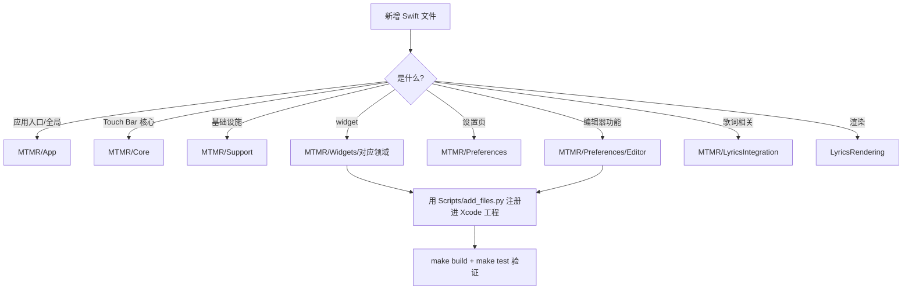

# 仓库文件存放说明 / File Structure Guide

> 本文是仓库整理（`codex/optimize-structure-build`）之后的**文件存放权威索引**。
> 任何新增/移动文件前，先对照本表决定文件归属。

---

## 一、仓库总览（思维导图）


## 二、目录树总览

```
.
├── .github/                          # CI（根目录才会被 GitHub 执行）
│   ├── FUNDING.yml
│   ├── scripts/
│   │   └── verify_sparkle_key.sh     # Sparkle 私钥 base64(96B) 格式校验（publish / signing-check 共用，ITER-18）
│   └── workflows/
│       ├── build-test.yml            # push/PR：构建 + 单元测试（数量以 xcodebuild test 输出为准）
│       ├── publish.yml               # v* tag：通用架构(arm64+x86_64)归档
│       └── signing-check.yml         # PR（仅 paths 命中，ITER-20 收敛）+ 手动：私钥格式 guard 冒烟
├── Makefile                          # make build / test / archive / clean
├── examples/presets/                 # 主题预设示例（theme1-15、items.json、test_lyrics_preset.json）
├── tools/
│   ├── mr-dump/                      # MediaRemote 调试工具（mr_dump + 源码 + 运行脚本）
│   └── virtual-keyboard/             # 虚拟键盘 HTML 原型
├── LyricsMTMR/                       # Xcode 工程根
│   ├── LyricsMTMR.xcodeproj
│   ├── LyricsRendering/              # 歌词渲染模块（KaraokeLabel、LyricsTouchBarItem 等）
│   ├── MTMR/
│   │   ├── App/                      # 应用入口与全局状态（AppDelegate、StatusBarMenuView、AppSettings）
│   │   ├── Core/                     # Touch Bar 核心（TouchBarController、ItemsParsing、各基础 item）
│   │   ├── Support/                  # 基础设施（SecretsManager、KeyPress、CPU、AppLog、扩展等）
│   │   ├── Widgets/                  # 全部注册 widget，按领域分组
│   │   │   ├── Media/                #   媒体播放（Music、进度、频谱、歌词翻译…）
│   │   │   ├── System/               #   系统状态与硬件控制（电池、CPU、亮度、勿扰…）
│   │   │   ├── DevOps/               #   开发运维（Git、Docker、SSH、AI 用量、API 测试…）
│   │   │   ├── Tools/                #   小工具（哈希、UUID、JSON、正则、二维码…）
│   │   │   ├── Productivity/         #   效率专注（番茄钟、笔记、剪贴板、阅读…）
│   │   │   ├── Life/                 #   生活数据（天气、股票、快递、倒计时、订阅…）
│   │   │   └── Layout/               #   布局容器（Group、ExpandableCard、ThemeSwitch）
│   │   ├── Preferences/              # 设置界面
│   │   │   ├── Editor/               #   编辑器（EditorTabView、Schema、DraftManager、预览…）
│   │   │   └── Components/           #   通用表单组件
│   │   ├── LyricsIntegration/        # 歌词搜索/匹配/封面缓存
│   │   ├── CBridge/                  # ObjC/C 桥接（TouchBar 私有 API、MediaRemote…）
│   │   ├── AppleScripts/             # 内置 .scpt 脚本资源
│   │   ├── Assets.xcassets/          # 应用图标与图片资源
│   │   ├── Base.lproj/               # Main.storyboard
│   │   ├── Resources/                # run.pl（MediaRemote 运行时脚本）
│   │   ├── Info.plist / MTMR.entitlements / defaultPreset.json / ChinaCityCodes.json   # 中国天气网城市码表（917983f 起）
│   │   └── MTMRExceptionCatcher.h    # ObjC 异常捕获（被桥接头引用，勿移动）
│   ├── MTMRTests/                    # 单元测试套件（随新增用例增长）
│   ├── Sparkle.framework/            # 本地依赖（e8f2c63 起入库跟踪供 CI 构建，FRAMEWORK_SEARCH_PATHS 引用）
│   ├── Scripts/                      # 开发脚本
│   │   ├── build.sh / test.sh / archive.sh   # 一键构建（Makefile 调用）
│   │   ├── embed-entitlements.sh             # 重新签名脚本
│   │   ├── add_files.py / fix_files.py       # pbxproj 增删文件工具（幂等）
│   │   ├── gen_themes.py / gen_functional_themes.py / update_slots.py  # 主题生成
│   │   └── fix_createitem.py                 # 一次性补 createItem 分支
│   ├── Resources/                    # 上游 MTMR README 素材（logo、截图、示例配置）
│   ├── docs/                         # 文档体系（用户册/开发者册/文件结构说明）
│   └── archive/                      # 死代码归档（duplicate-LyricsRendering、dead-functions…）
├── docs/                            # 自迭代规划与维护说明（iteration-plan 置顶待办 / maintenance-notes 年度流程 / backup-note / optimization-plan / memory-rendering-audit）
├── backup/                          # 优化前调研文档归档（17 份，存档点 pre-opt-20260812-0114；第8轮收尾新增 优化计划_OPT任务清单.md）
├── iteration-log.md                 # 迭代轨迹（kanban 自迭代链逐轮追加，本文档之外的总轨迹）
├── 回归报告_第7轮_t_eeddbbf0.md             # 第 7 轮回归报告（main 全量构建+单测：60 用例 0 失败）
├── 核验报告_第7轮_维护机制健在性与文档一致性.md # 第 7 轮核验报告（维护机制健在性 + 文档一致性）
├── 核验报告_第8轮_维护机制健在与文档一致性.md # 第 8 轮核验报告（第 2 次年度维护核验）
├── 清理报告_第8轮收尾_r8-cleanup.md         # 第 8 轮收尾清理报告（根目录/backup 去重 + 工作区收尾，含删除哈希清单）
├── 评估报告_第8轮_ITER15镜像窗事件驱动刷新.md # 第 8 轮 ITER-15 可行性评估（只读调研）
├── 内存修复报告_t5e363548_设置窗口复用.md    # 设置窗口内存修复报告（PR #41 合入 main 新增；代码随第 8 轮 28e65b6 已入 main）
├── 回归报告_第9轮_t_d0232788.md              # 第 9 轮子任务 A 回归报告（含内存修复代码全量回归 60 用例 0 失败，47c9f28 合入 main）
├── 核对报告_第9轮_子任务C_内存修复文档代码一致性.md # 第 9 轮子任务 C 核对报告（r9/issue 交付，收口合并后入根）
├── 核验报告_第9轮_维护机制健在与文档一致性.md # 第 9 轮核验报告（第 3 次年度维护核验，r9/review）
├── 清理报告_第10轮卫生_r10-cleanup.md         # 第 10 轮子任务 C 仓库卫生报告（round-9 父卡遗留 worktree/分支清理，r10/cleanup）
├── 核对报告_第10轮_收尾核对.md        # 第 10 轮子任务 B 收尾核对报告（遗留 6 项复核 + D1 注释修正实证，r10/check，第 11 轮补登记）
├── 核验报告_第10轮_维护机制健在与文档一致性.md # 第 10 轮核验报告（第 4 次年度维护核验，r10/review，预登记）
├── 核对报告_第11轮_收尾核对.md        # 第 11 轮子任务 B 收尾核对报告（遗留 6 项复核 + GitHub 状态复核，r11/check，预登记）
├── 核验报告_第11轮_维护机制健在与文档一致性.md # 第 11 轮核验报告（第 5 次年度维护核验，r11/review，预登记）
├── 清理报告_第11轮卫生_r11-cleanup.md         # 第 11 轮子任务 C 仓库卫生报告（round-10 父卡遗留 worktree/分支清理，r11/cleanup）

├── 核对报告_第12轮_收尾核对.md         # 第 12 轮子任务 B 收尾核对报告（GitHub 状态 4/4 + 遗留 6 项分类，r12/check）
├── 回归报告_第12轮.md                        # 第 12 轮子任务 A 全量回归报告（隔代触发：BUILD/TEST SUCCEEDED，60 用例 0 失败，r12/review，预登记）
├── 核验报告_第12轮_维护机制健在与文档一致性.md # 第 12 轮核验报告（第 6 次年度维护核验，r12/review，预登记）
├── 清理报告_第12轮.md         # 第 12 轮子任务 C 仓库卫生报告（round-11 父卡+子卡遗留 worktree/分支清理，r12/cleanup）
├── 验证报告_第13轮_issue40_按软件切换bar.md # 第 13 轮子任务 A 验证报告（issue #40 Per-app bar switching 核验+补齐：4 条验收全满足 + 12 单测 + 文档登记，r13/feature）
├── 文档报告_第13轮_README补全.md  # 第 13 轮子任务 B 文档报告（README 补 MediaRemote 风险说明 + 应用专属主题使用文档 + 漂移核对，r13/docs）

├── 核验报告_第13轮_维护机制健在与文档一致性.md # 第 13 轮核验报告（第 7 次年度维护核验，r13/cleanup，预登记）
├── 清理报告_第13轮_round12遗留清理.md          # 第 13 轮子任务 C 仓库卫生报告（round-12 父卡+子卡遗留 worktree/分支清理，r13/cleanup，预登记）
├── 核验报告_第13轮_issue40_按软件切换bar.md    # 第 13 轮子任务 A 实现核验报告（issue #40 Per-app bar switching 验收核验+补齐，r13/feature，预登记）
├── 文档报告_第13轮_README补全.md               # 第 13 轮子任务 B 文档报告（README 补 MediaRemote 风险说明 + 应用专属主题说明，r13/docs，预登记）

└── .gitignore / .gitattributes / README.md
```

## 三、各目录职责对照表

| 目录 | 放什么 | 不许放什么 |
|------|--------|-----------|
| `LyricsMTMR/MTMR/App/` | AppDelegate、菜单栏、全局设置 | widget、工具类 |
| `LyricsMTMR/MTMR/Core/` | Touch Bar 基础设施与基础 item | 具体领域 widget |
| `LyricsMTMR/MTMR/Support/` | 与 UI 无关的基础设施/扩展 | 业务功能 |
| `LyricsMTMR/MTMR/Widgets/<领域>/` | 新 widget 按 Media/System/DevOps/Tools/Productivity/Life/Layout 归类 | 非 widget 的通用代码 |
| `LyricsMTMR/MTMR/Preferences/Editor/` | 编辑器相关（编辑、Schema、草稿、预览、模拟器） | 设置 Tab 页 |
| `LyricsMTMR/MTMR/Preferences/` 根 | 设置 Tab 页与设置逻辑 | 编辑器组件 |
| `LyricsMTMR/Scripts/` | 构建/生成/工程工具脚本 | 运行时资源 |
| `LyricsMTMR/docs/` | 文档（zh/en） | 代码 |
| `examples/presets/` | 主题/配置示例 | 用户私有数据 |
| `tools/` | 调试工具与原型 | 参与编译的代码 |
| `LyricsMTMR/archive/` | 死代码、孤儿资源、废弃脚本 | 活跃代码 |

## 四、新增文件去哪（流程）



## 五、不可移动 / 仓库外文件（重要）

| 路径 | 原因 |
|------|------|
| `~/Library/Application Support/LyricsMTMR/` | **运行时数据目录**（items.json、expenses.json、classes.json、封面缓存等），在仓库外，由 App 读写 |
| `LyricsMTMR/MTMR/MTMRExceptionCatcher.h` | 被 `CBridge/TouchBarPrivateApi-Bridging.h` 的 `#import "../MTMRExceptionCatcher.h"` 引用，且 `MTMRTryOrError` 在 3 处 Swift 中使用 |
| `LyricsMTMR/MTMR/CBridge/MediaRemoteMRBridge.m` | 构建阶段脚本按 `${SRCROOT}/MTMR/CBridge` 编译 |
| `LyricsMTMR/MTMR/Resources/run.pl` | 构建阶段脚本拷贝进 app Bundle，运行时由 `MediaRemoteAdapter` 从 `Bundle.main` 读取 |
| `LyricsMTMR/MTMR/Info.plist`、`defaultPreset.json` | `INFOPLIST_FILE` / Copy Bundle Resources 引用 |
| `LyricsMTMR/MTMR/Assets.xcassets`、`AppleScripts/`、`Base.lproj/` | 资源拷贝阶段引用 |
| `LyricsMTMR/Sparkle.framework` | 本地依赖（e8f2c63 起入库跟踪供 CI 构建，非 gitignore；勿删），`FRAMEWORK_SEARCH_PATHS` 引用 |
| `.secrets.env` | 本地密钥文件（gitignored，不入库） |

## 六、构建与产物

| 命令 | 作用 | 产物 |
|------|------|------|
| `make build` | Debug 构建 | `LyricsMTMR/.build/DerivedData/Build/Products/Debug/LyricsMTMR.app` |
| `make test` | 单元测试 | xcresult 日志 |
| `make archive` | Release 通用架构归档 | `LyricsMTMR/Release/LyricsMTMR.xcarchive`（x86_64 + arm64） |
| `make clean` | 清理产物 | — |

> `.build/`、`Release/`、`build/` 均已被 `.gitignore` 忽略，不会污染仓库。
> 旧的上游 `MTMR` 工程名（`MTMR.xcodeproj`）已不存在，构建统一使用 `LyricsMTMR.xcodeproj`。

## 七、整理记录（3 个 commit）

| Commit | 内容 |
|--------|------|
| `398f1cb` chore | 预设/工具/文档/脚本分类存放，清理垃圾与构建产物 |
| `a545a77` refactor | 源码目录分层（App/Core/Support、Editor、Widgets 领域分组） |
| `452139b` build | CI 修复、entitlements 统一、一键构建脚本（Makefile） |
