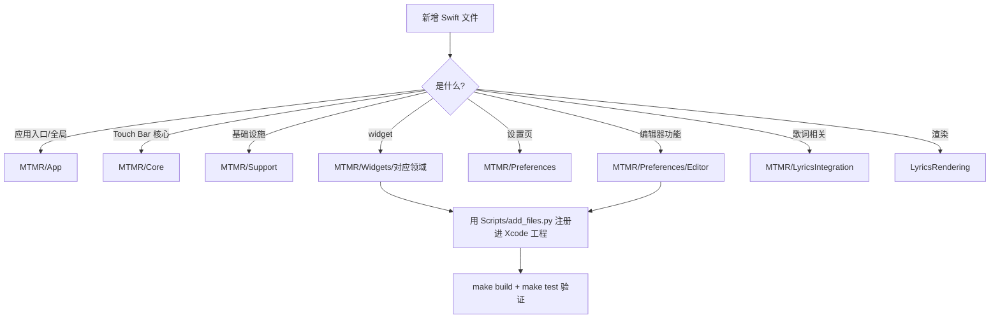

# 仓库文件存放说明 / File Structure Guide

> 本文是仓库整理（`codex/optimize-structure-build`）之后的**文件存放权威索引**。
> 任何新增/移动文件前，先对照本表决定文件归属。

---

## 一、仓库总览（思维导图）


## 二、目录树总览

```
.
├── .github/                          # CI（根目录才会被 GitHub 执行）
│   ├── FUNDING.yml
│   ├── scripts/
│   │   └── verify_sparkle_key.sh     # Sparkle 私钥 base64(96B) 格式校验（publish / signing-check 共用，ITER-18）
│   └── workflows/
│       ├── build-test.yml            # push/PR：构建 + 单元测试（数量以 xcodebuild test 输出为准）
│       ├── publish.yml               # v* tag：通用架构(arm64+x86_64)归档
│       └── signing-check.yml         # PR（仅 paths 命中，ITER-20 收敛）+ 手动：私钥格式 guard 冒烟
├── Makefile                          # make build / test / archive / clean
├── examples/presets/                 # 主题预设示例（theme1-15、items.json、test_lyrics_preset.json）
├── tools/
│   ├── mr-dump/                      # MediaRemote 调试工具（mr_dump + 源码 + 运行脚本）
│   └── virtual-keyboard/             # 虚拟键盘 HTML 原型
├── scripts/                          # 开发巡检脚本（anchor-patrol.py：文档锚点漂移巡检，第 29 轮 B 卡）
├── LyricsMTMR/                       # Xcode 工程根
│   ├── LyricsMTMR.xcodeproj
│   ├── LyricsRendering/              # 歌词渲染模块（KaraokeLabel、LyricsTouchBarItem 等）
│   ├── MTMR/
│   │   ├── App/                      # 应用入口与全局状态（AppDelegate、StatusBarMenuView、AppSettings）
│   │   ├── Core/                     # Touch Bar 核心（TouchBarController、ItemsParsing、各基础 item）
│   │   ├── Support/                  # 基础设施（SecretsManager、KeyPress、CPU、AppLog、扩展等）
│   │   ├── Widgets/                  # 全部注册 widget，按领域分组
│   │   │   ├── Media/                #   媒体播放（Music、进度、频谱、歌词翻译…）
│   │   │   ├── System/               #   系统状态与硬件控制（电池、CPU、亮度、勿扰…）
│   │   │   ├── DevOps/               #   开发运维（Git、Docker、SSH、AI 用量、API 测试…）
│   │   │   ├── Tools/                #   小工具（哈希、UUID、JSON、正则、二维码…）
│   │   │   ├── Productivity/         #   效率专注（番茄钟、笔记、剪贴板、阅读…）
│   │   │   ├── Life/                 #   生活数据（天气、股票、快递、倒计时、订阅…）
│   │   │   └── Layout/               #   布局容器（Group、ExpandableCard、ThemeSwitch）
│   │   ├── Preferences/              # 设置界面
│   │   │   ├── Editor/               #   编辑器（EditorTabView、Schema、DraftManager、预览…）
│   │   │   └── Components/           #   通用表单组件
│   │   ├── LyricsIntegration/        # 歌词搜索/匹配/封面缓存
│   │   ├── CBridge/                  # ObjC/C 桥接（TouchBar 私有 API、MediaRemote…）
│   │   ├── AppleScripts/             # 内置 .scpt 脚本资源
│   │   ├── Assets.xcassets/          # 应用图标与图片资源
│   │   ├── Base.lproj/               # Main.storyboard
│   │   ├── Resources/                # run.pl（MediaRemote 运行时脚本）
│   │   ├── Info.plist / MTMR.entitlements / defaultPreset.json / ChinaCityCodes.json   # 中国天气网城市码表（917983f 起）
│   │   └── MTMRExceptionCatcher.h    # ObjC 异常捕获（被桥接头引用，勿移动）
│   ├── MTMRTests/                    # 单元测试套件（随新增用例增长）
│   ├── Sparkle.framework/            # 本地依赖（e8f2c63 起入库跟踪供 CI 构建，FRAMEWORK_SEARCH_PATHS 引用）
│   ├── Scripts/                      # 开发脚本
│   │   ├── build.sh / test.sh / archive.sh   # 一键构建（Makefile 调用）
│   │   ├── embed-entitlements.sh             # 重新签名脚本
│   │   ├── add_files.py / fix_files.py       # pbxproj 增删文件工具（幂等；add_files 支持 Tests: 前缀一键注册测试文件至单测目标）
│   │   ├── gen_themes.py / gen_functional_themes.py / update_slots.py  # 主题生成
│   │   └── fix_createitem.py                 # 一次性补 createItem 分支
│   ├── Resources/                    # 上游 MTMR README 素材（logo、截图、示例配置）
│   ├── docs/                         # 文档体系（用户册/开发者册/文件结构说明）
│   └── archive/                      # 死代码归档（duplicate-LyricsRendering、dead-functions…）
├── docs/                            # 自迭代规划与维护说明（iteration-plan 置顶待办 / maintenance-notes 年度流程 / backup-note / optimization-plan / memory-rendering-audit / anchor-patrol 锚点巡检用法）
├── backup/                          # 优化前调研文档归档（17 份，存档点 pre-opt-20260812-0114；第8轮收尾新增 优化计划_OPT任务清单.md）
├── iteration-log.md                 # 迭代轨迹（kanban 自迭代链逐轮追加，本文档之外的总轨迹）
├── logs/第07轮/回归报告_第7轮_t_eeddbbf0.md             # 第 7 轮回归报告（main 全量构建+单测：60 用例 0 失败）
├── logs/第07轮/核验报告_第7轮_维护机制健在性与文档一致性.md # 第 7 轮核验报告（维护机制健在性 + 文档一致性）
├── logs/第08轮/核验报告_第8轮_维护机制健在与文档一致性.md # 第 8 轮核验报告（第 2 次年度维护核验）
├── logs/第08轮/清理报告_第8轮收尾_r8-cleanup.md         # 第 8 轮收尾清理报告（根目录/backup 去重 + 工作区收尾，含删除哈希清单）
├── logs/第08轮/评估报告_第8轮_ITER15镜像窗事件驱动刷新.md # 第 8 轮 ITER-15 可行性评估（只读调研）
├── logs/专题/内存修复报告_t5e363548_设置窗口复用.md    # 设置窗口内存修复报告（PR #41 合入 main 新增；代码随第 8 轮 28e65b6 已入 main）
├── logs/第09轮/回归报告_第9轮_t_d0232788.md              # 第 9 轮子任务 A 回归报告（含内存修复代码全量回归 60 用例 0 失败，47c9f28 合入 main）
├── logs/第09轮/核对报告_第9轮_子任务C_内存修复文档代码一致性.md # 第 9 轮子任务 C 核对报告（r9/issue 交付，收口合并后入根）
├── logs/第09轮/核验报告_第9轮_维护机制健在与文档一致性.md # 第 9 轮核验报告（第 3 次年度维护核验，r9/review）
├── logs/第10轮/清理报告_第10轮卫生_r10-cleanup.md         # 第 10 轮子任务 C 仓库卫生报告（round-9 父卡遗留 worktree/分支清理，r10/cleanup）
├── logs/第10轮/核对报告_第10轮_收尾核对.md        # 第 10 轮子任务 B 收尾核对报告（遗留 6 项复核 + D1 注释修正实证，r10/check，第 11 轮补登记）
├── logs/第10轮/核验报告_第10轮_维护机制健在与文档一致性.md # 第 10 轮核验报告（第 4 次年度维护核验，r10/review，预登记）
├── logs/第11轮/核对报告_第11轮_收尾核对.md        # 第 11 轮子任务 B 收尾核对报告（遗留 6 项复核 + GitHub 状态复核，r11/check，预登记）
├── logs/第11轮/核验报告_第11轮_维护机制健在与文档一致性.md # 第 11 轮核验报告（第 5 次年度维护核验，r11/review，预登记）
├── logs/第11轮/清理报告_第11轮卫生_r11-cleanup.md         # 第 11 轮子任务 C 仓库卫生报告（round-10 父卡遗留 worktree/分支清理，r11/cleanup）

├── logs/第12轮/核对报告_第12轮_收尾核对.md         # 第 12 轮子任务 B 收尾核对报告（GitHub 状态 4/4 + 遗留 6 项分类，r12/check）
├── logs/第12轮/回归报告_第12轮.md                        # 第 12 轮子任务 A 全量回归报告（隔代触发：BUILD/TEST SUCCEEDED，60 用例 0 失败，r12/review，预登记）
├── logs/第12轮/核验报告_第12轮_维护机制健在与文档一致性.md # 第 12 轮核验报告（第 6 次年度维护核验，r12/review，预登记）
├── logs/第12轮/清理报告_第12轮.md         # 第 12 轮子任务 C 仓库卫生报告（round-11 父卡+子卡遗留 worktree/分支清理，r12/cleanup）
├── logs/第13轮/验证报告_第13轮_issue40_按软件切换bar.md # 第 13 轮子任务 A 验证报告（issue #40 Per-app bar switching 核验+补齐：4 条验收全满足 + 12 单测 + 文档登记，r13/feature）
├── logs/第13轮/文档报告_第13轮_README补全.md  # 第 13 轮子任务 B 文档报告（README 补 MediaRemote 风险说明 + 应用专属主题使用文档 + 漂移核对，r13/docs）

├── logs/第13轮/核验报告_第13轮_维护机制健在与文档一致性.md # 第 13 轮核验报告（第 7 次年度维护核验，r13/cleanup，预登记）
├── logs/第13轮/清理报告_第13轮_round12遗留清理.md          # 第 13 轮子任务 C 仓库卫生报告（round-12 父卡+子卡遗留 worktree/分支清理，r13/cleanup，预登记）
├── logs/第14轮/验证报告_第14轮_currency恢复.md     # 第 14 轮子任务 A 验证报告（currency 汇率 widget 恢复：Coinbase FIXME 解禁 + parseRate/formatTitle 纯函数 + 优雅降级，r14/feature）
├── logs/第14轮/核对报告_第14轮_ITEMS_REFERENCE口径.md      # 第 14 轮子任务 B 核对报告（Item 类型口径 80+→113：ItemTypeRaw 97+预定义 14+注册 2，补 8 缺失条目删 pause，r14/docs）

├── logs/第14轮/回归报告_第14轮.md                        # 第 14 轮子任务 C 全量回归报告（隔代触发：BUILD/TEST SUCCEEDED，72 用例 0 失败，r14/review）
├── logs/第14轮/核验报告_第14轮_维护机制健在与文档一致性.md # 第 14 轮核验报告（第 8 次年度维护核验，r14/review）
├── logs/第14轮/清理报告_第14轮_round13遗留清理.md          # 第 14 轮子任务 C 仓库卫生报告（round-13 父卡+子卡遗留 worktree/分支清理，r14/review）
├── logs/第15轮/核验报告_第15轮_维护机制健在与文档一致性.md # 第 15 轮核验报告（第 9 次年度维护核验，r15/review）
├── logs/第15轮/清理报告_第15轮_round14遗留清理.md          # 第 15 轮子任务 C 仓库卫生报告（round-14 父卡+子卡遗留 worktree/分支清理，r15/review）
├── logs/第15轮/验证报告_第15轮_barItemFactory提取.md # 第 15 轮子任务 B 验证报告（TECHNICAL_DEBT 置顶第 4 条落地：createItemInternal 113 case switch 提取至 BarItemFactory + 18 单测 + README TODO 核对，r15/refactor）

├── logs/第16轮/验证报告_第16轮_技术债评估与落地.md    # 第 16 轮子任务 B 验证报告（TECHNICAL_DEBT 剩余 3 条评估：① VC 化暂缓/② 枚举解析暂缓/③ 隐藏机制落地——shouldShowItem 纯函数提取 + 异步路径补过滤 + 11 单测，r16/techdebt）

├── logs/第15轮/验证报告_第15轮_节假日倒计时widget.md   # 第 15 轮子任务 A 验证报告（新 widget holidayCountdown：复用 aShareHolidays 唯一数据源 + 纯逻辑单测 16 例，r15/feature）
├── logs/第16轮/核验报告_第16轮_维护机制健在与文档一致性.md # 第 16 轮核验报告（第 10 次年度维护核验，r16/review）
├── logs/第16轮/清理报告_第16轮_round15遗留清理.md          # 第 16 轮子任务 C 仓库卫生报告（round-15 父卡+子卡遗留 worktree/分支清理，r16/review）

├── logs/第16轮/验证报告_第16轮_add_files脚本修复.md # 第 16 轮子任务 A 验证报告（add_files.py 锚点修复：结构化段内定位替代硬编码「末尾条目」假设，探针一键注册 4 处条目 + build + 幂等实证，r16/tooling）

├── logs/第17轮/核验报告_第17轮_维护机制健在与文档一致性.md # 第 17 轮核验报告（第 11 次年度维护核验，r17/review）
├── logs/第17轮/清理报告_第17轮_round16遗留清理.md          # 第 17 轮子任务 C 仓库卫生报告（round-16 父卡+子卡遗留 worktree/分支清理，r17/review）
├── logs/第17轮/验证报告_第17轮_add_files测试注册扩展.md # 第 17 轮子任务 A 验证报告（add_files.py 扩展 Tests: 前缀一键注册测试文件：group/phase 落单测目标 LyricsMTMRTests 绝不含 app、UUID 独立前缀 C1FE/C1FF、两阶段校验写盘，r17/tooling）
├── logs/第17轮/验证报告_第17轮_隐藏机制正则缓存优化.md # 第 17 轮子任务 B 验证报告（matchAppId 正则编译缓存：MatchAppIdRegexCache 有界线程安全缓存 + 双路径 frontmostAppId 提出循环，行为严格等价，134 用例实证，r17/feature）
├── logs/第18轮/验证报告_第18轮_假期名映射健壮化.md   # 第 18 轮子任务 A 验证报告（holidayCountdown 假期名映射跨月/重叠窗口健壮化：窗口特征判定——含 1/1→元旦跨年、含 10/1→国庆、10 月首日中秋、1 月下旬春节，makeWindows 两遍式，142 用例实证，r18/feature）

├── logs/第18轮/核验报告_第18轮_维护机制健在与文档一致性.md # 第 18 轮核验报告（第 12 次年度维护核验，r18/review）
├── logs/第18轮/清理报告_第18轮_round17遗留清理.md          # 第 18 轮子任务 C 仓库卫生报告（round-17 父卡+子卡遗留 worktree/分支清理，r18/review）

├── logs/第18轮/验证报告_第18轮_黑名单隐藏暂停轮询.md # 第 18 轮子任务 B 验证报告（隐藏期间暂停 widget 轮询：TBPollItem/TBMetricPopoverItem 线程安全 pause/resume + TouchBarController dismiss/present 广播，139 用例实证，r18/optimize）

├── logs/第19轮/核验报告_第19轮_维护机制健在与文档一致性.md # 第 19 轮核验报告（第 13 次年度维护核验，r19/review）
├── logs/第19轮/清理报告_第19轮_round18遗留清理.md          # 第 19 轮子任务 C 仓库卫生报告（round-18 父卡+子卡遗留 worktree/分支清理，r19/review）
├── logs/第19轮/验证报告_第19轮_隐藏暂停轮询覆盖缺口补齐.md # 第 19 轮子任务 A 验证报告（TBPollPausable 扩展至自驱动 Timer item：TBPausableTimer/TBPauseGate 共享可暂停定时器封装覆盖 8 个缺口 item + CPUBarItem asyncAfter 链接入，恢复立即刷新，156 用例实证，r19/feature；新增源码 Widgets/TBPausableTimer.swift + 测试 MTMRTests/PausableTimerTests.swift）
├── logs/第19轮/核对报告_第19轮_README占位符清理与现状核对.md # 第 19 轮子任务 B 核对报告（README TODO「……」占位符删除 + 12 项现状核对 + holidayCountdown 补登 + v0.27 更新日志条目，r19/docs）
├── logs/第20轮/验证报告_第20轮_隐藏零空转统一治理收官.md # 第 20 轮子任务 A 验证报告（剩余 Timer item 盘点分类与纳入：8 项纳入隐藏零空转统一治理——DarkMode/NightShift/Time/Brightness/ClipboardHistory/Music(链+跑马灯双定时器)/PlaybackProgress/AudioSpectrum 全部迁移 TBPausableTimer（新增 mode 参数透传 .common），5 项不纳入（Pomodoro/ReadTimer/StandupTimer/BreathingGuide/LyricsTranslate，用户激活/浮层作用域计时语义），162 用例实证，r20/feature）

├── logs/第20轮/核验报告_第20轮_维护机制健在与文档一致性.md # 第 20 轮核验报告（第 14 次年度维护核验，r20/review；修正 maintenance-notes/iteration-plan 行号引用 +3 漂移 4 处）
├── logs/第20轮/清理报告_第20轮_round19遗留清理.md          # 第 20 轮子任务 C 仓库卫生报告（round-19 父卡+子卡遗留 worktree/分支清理，r20/review）

├── logs/第20轮/验证报告_第20轮_actions强引用环评估.md # 第 20 轮子任务 B 验证报告（CustomButtonTouchBarItem actions 强引用环评估与修复：CPUBarItem/YandexWeatherBarItem 两处 defaultTapAction 方法引用强捕获 self 成环 → [weak self] 闭包，Yandex 另修 scheduler/URLSession 两处同类强捕获，视图/手势链实证无环，157 用例实证，r20/code-quality）

├── logs/第21轮/核验报告_第21轮_维护机制健在与文档一致性.md # 第 21 轮核验报告（第 15 次年度维护核验，r21/review；行号引用第 20 轮修正后零新漂移，GitHub 4/4：#1 OPEN/#40 CLOSED/0 PR/origin/main=bc56985 同步）
├── logs/第21轮/清理报告_第21轮_round20遗留清理.md          # 第 21 轮子任务 C 仓库卫生报告（round-20 父卡+子卡遗留 worktree/分支清理，r21/review）
├── logs/第21轮/验证报告_第21轮_ClipboardHistory事件驱动化.md # 第 21 轮子任务 A 验证报告（ClipboardHistory 事件驱动化评估：NSPasteboard.observe 公开 SDK 不存在（编译/头文件/官方文档三重证伪）+ 四种替代事件机制实测全灭 → changeCount 轮询为唯一机制；落地变更源抽象 ClipboardChangeSource（测试注入假源直驱捕获路径）+ 浮层打开即时对齐 + pollInterval 可注入，隐藏期零丢失不可达如实记录，169 用例实证，r21/feature；新增测试 MTMRTests/ClipboardHistoryTests.swift）
├── logs/第21轮/验证报告_第21轮_AudioSpectrum采集链隐藏期治理.md # 第 21 轮子任务 B 验证报告（AudioSpectrum 采集链纳入隐藏暂停：SCK system tap / mic engine 隐藏期零采集、恢复重启采集并立即补刷，SystemAudioTap stopped 取消标记防孤儿流，独立 capturePauseGate 广播幂等，TCC 持久授权零重弹风险实证，166 用例实证，r21/audio）
├── logs/第22轮/验证报告_第22轮_NSBackgroundActivityScheduler隐藏期轮询治理.md # 第 22 轮子任务 A 验证报告（NSBackgroundActivityScheduler 类 widget 隐藏期轮询治理：Currency/Weather/Yandex/UpNext 4 widget 纳入隐藏暂停——门控回调路径（调度器保持存活 + pollTick 过 TBPauseGate，invalidate+重建因同 identifier 注册竞态否决），隐藏期零网络请求/零 EventKit 查询、恢复按原节奏继续并立即补刷；顺带修复 Currency/Weather schedule 块强捕获保留环，181 用例实证，r22/feature）

├── logs/第22轮/核验报告_第22轮_维护机制健在与文档一致性.md # 第 22 轮核验报告（第 16 次年度维护核验，r22/review；行号引用连续两轮零新漂移，GitHub 4/4：#1 OPEN/#40 CLOSED/0 PR/origin/main=b46116b 同步）
├── logs/第22轮/清理报告_第22轮_round21遗留清理.md          # 第 22 轮子任务 C 仓库卫生报告（round-21 父卡+子卡遗留 worktree/分支清理，r22/review）
├── logs/第22轮/验证报告_第22轮_天气widget定位服务隐藏期治理.md # 第 22 轮子任务 B 验证报告（WeatherBarItem/YandexWeatherBarItem 定位服务纳入隐藏暂停：隐藏期 stopUpdatingLocation（GPS 关闭、隐私指示灯熄灭）、恢复重启定位+立即补刷天气；locationPauseGate 广播幂等 + locationTrackingEnabled init 期守卫（城市模式/权限拒绝广播 no-op）+ start/stop 定位接缝 internal 单测注入；TCC 持久授权零重弹风险实证（stop/start 不重弹窗）；WeatherBarItem activity 闭包 [weak self] 断永久循环引用（deinit 可达并停定位，配置热重载旧 item 泄漏放大器根治）；TouchBarController 零改动，177 用例实证，r22/location）
├── logs/第23轮/核验报告_第23轮_维护机制健在与文档一致性.md # 第 23 轮核验报告（第 17 次年度维护核验，r23/review；行号引用连续三轮零新漂移，GitHub 4/4：#1 OPEN/#40 CLOSED/0 PR/origin/main=8b15f98 同步）
├── logs/第23轮/清理报告_第23轮_round22遗留清理.md          # 第 23 轮子任务 C 仓库卫生报告（round-22 父卡+子卡遗留 worktree/分支清理，r23/review）
├── logs/第23轮/验证报告_第23轮_全局隐藏态注入与重建覆盖.md # 第 23 轮子任务 A 验证报告（隐藏期重建治理收官：TouchBarVisibilityState 全局隐藏态注册表（present/dismiss 驱动、初始态可见）+ createItems 重建覆盖 guard + init 隐藏态注入——TBPollItem/TBMetricPopoverItem 隐藏期重建零 compute 初始 fetch 跳过、恢复零延迟补刷（runImmediateCycle + _needsInitialRefresh 陈旧补刷丢弃）；Currency/Weather/Yandex/UpNext gate 播种全局态 init fetch 零请求、天气类隐藏期重建 GPS 不亮；广播协议零破坏逐字节等价，192 用例实证，r23/feature；新增测试 MTMRTests/GlobalHiddenStateTests.swift）
├── logs/第23轮/验证报告_第23轮_WeatherTabView定位生命周期治理.md # 第 23 轮子任务 B 验证报告（WeatherTabView 定位添加城市生命周期治理：locateAndAddCity resolve/超时/视图消失三路径停 manager——提取 WeatherLocationSession 会话封装（LocationProviding/GeocodingProviding 双抽象缝，假源+MKPlacemark 假 geocoder 零硬件零网络），resolve 当拍停定位、超时 stop、stop 幂等+丢弃在途 geocode；onDisappear 在本架构不可靠（关窗=orderOut 隐藏复用/切页=ZStack 常驻）改用 SettingsWindowState.isVisible+activeTab 等价生命周期；stopUpdatingLocation 每会话恰一次契约 + deinit 兜底；权限拒绝路径保持原超时文案、requestLocation+startUpdatingLocation 并存语义不破，195 用例实证，r23/location-fix；新增源码 MTMR/Preferences/WeatherLocationSession.swift + 测试 MTMRTests/WeatherLocationSessionTests.swift）
├── logs/第24轮/核验报告_第24轮_维护机制健在与文档一致性.md # 第 24 轮核验报告（第 18 次年度维护核验，r24/review；行号引用连续四轮零新漂移，114 口径行号新漂移 +18 已更新（:1145/:1156→:1163/:1174，round23-A 合入所致语义零漂移），GitHub 4/4：#1 OPEN/#40 CLOSED/0 PR/origin/main=134d3ce 同步）
├── logs/第24轮/清理报告_第24轮_round23遗留清理.md          # 第 24 轮子任务 C 仓库卫生报告（round-23 父卡+子卡遗留 worktree/分支清理，r23 全清 4 worktree+4 分支，r24/review）
├── logs/第24轮/验证报告_第24轮_隐藏期零空转治理收官审计.md # 第 24 轮子任务 A 验证报告（隐藏期零空转收官审计：全库活跃源覆盖矩阵约 60 源逐源判定「已纳入/合理不纳入（证据）/遗漏（修复）」，发现并修复 5 项真遗漏——NoiseMeterItem 麦克风采集链（AVAudioEngine tap 隐藏期隐私灯常亮，micPauseGate+startEngine/stopEngine 拆分）、ShellScript/AppleScriptTouchBarItem 脚本自循环（pauseGate+链终结+恢复拉起）、LyricsTouchBarItem marquee 60fps 滚动（marqueePauseGate+handleTextScroll/startMarquee 双 guard）、NetworkBarItem netstat 常驻进程（pollGate+停/重启进程）；遗留挂账「NSBackgroundActivityScheduler 隐藏期零网络」实证收口（pollTick 门控+全部旁路入口独立 guard，零网络/零 EventKit 查询成立，关闭挂账）；第 20 轮「不纳入 5 项/排除 1 项」决策复核全部成立；TouchBarController 零改动，208 用例实证（201 基线+7 新增，两轮独立全量），r24/feature）
├── logs/第24轮/核对报告_第24轮_README更新日志与现状核对.md # 第 24 轮子任务 B 核对报告（README 更新日志补登 v0.28：第 20~23 轮功能/优化条目——隐藏零空转收官（8 常驻定时器 + 4 后台调度组件）/采集链与定位暂停（隐私保护）/全局隐藏态注入/剪贴板浮层即时对齐/天气定位添加城市生命周期/强引用环修复，12 项现状核对 + 条目→轮次→iteration-log 出处对照表；版本号建议升 0.28 不擅改，r24/docs）
├── logs/第25轮/核验报告_第25轮_维护机制健在与文档一致性.md # 第 25 轮核验报告（第 19 次年度维护核验，r25/review；行号引用连续五轮零新漂移，114 口径 :1163/:1174 更新后首轮复查零新漂移（第 25 轮 A 卡未合并无触碰源），第 24 轮 A/B 卡落地 5 项遗漏修复全部在位（micPauseGate/marqueePauseGate/pollGate/脚本 pauseGate×2），GitHub 4/4：#1 OPEN/#40 CLOSED/0 PR/origin/main=82d2dc1 同步，本轮零新增发现）
├── logs/第25轮/清理报告_第25轮_round24遗留清理.md          # 第 25 轮子任务 C 仓库卫生报告（round-24 父卡+子卡遗留 worktree/分支清理，r24 全清 4 worktree+4 分支，r25/review）
├── logs/第25轮/验证报告_第25轮_注册表混合架构对账测试.md # 第 25 轮子任务 A 验证报告（注册表混合架构对账测试落地：测试侧唯一基准「规范清单」98 条（generate_registry_test.py 从 ItemTypeRaw/identifierBase 源码提取生成）+ 16 注册表专属键，五层断言 L1~L5——ItemTypeRaw 枚举全集（新增 CaseIterable）/最小 JSON 全量解码 + 逐条 identifierBase 期望值/工厂全量真实构造/注册表键集精确对账（含控制器 exitTouchbar/close）/114 路径口径；生产最小增量 2 处（CaseIterable + registeredTypeNames 只读快照）零行为变更；覆盖边界诚实声明（switch 不可反射 → 编译期穷尽性 + 运行时行为取证双保险）；对账发现：源码四层一致零漂移，夹具自身 1 处修正（sleep/displaySleep 预设标题 ☕️）即机制生效证据；214 用例实证（208 基线+6 新增）0 失败，r25/registry；新增测试 MTMRTests/RegistryReconciliationTests.swift）
├── logs/第25轮/考古报告_第25轮_版本体系考古.md         # 第 25 轮子任务 B 考古报告（Releases API 全量仅 2 枚 v1.0.0/v0.8 + git tag 3 枚 + Info.plist 264 提交全量扫描版本号仅 0.27/452→0.28/453 两状态；v0.9~v0.26 缺失段结论=从未以 Release/tag/Info.plist 存在过（编号空洞，fork 继承上游 MTMR v0.27.0 所致两编号体系脱节）；README 方案甲补「版本史说明」段，r25/version-history）
├── logs/第26轮/验证报告_第26轮_维护机制健在与文档一致性.md # 第 26 轮验证报告（第 20 次年度维护核验，r26/review；行号引用连续六轮零新漂移，114 口径 :1163/:1174 第 25 轮 A 卡合并后首轮复查零新漂移（55f8a24 改动清单不含 TouchBarController.swift），第 25 轮 A/B 卡落地 5 项源码实证（CaseIterable/registeredTypeNames/6 用例/generate_registry_test.py/README 版本史说明），GitHub 4/4：#1 OPEN/#40 CLOSED/0 PR/origin/main=d5b1248 同步，本轮零新增发现）
├── logs/第26轮/清理报告_第26轮_round25遗留清理.md          # 第 26 轮子任务 C 仓库卫生报告（round-25 父卡+子卡遗留 worktree/分支清理，r25 全清 4 worktree+4 分支，r26/review）
├── logs/第26轮/验证报告_第26轮_时序敏感测试健壮化.md # 第 26 轮子任务 A 验证报告（全量回归 flaky 7 用例根因修复：**根因非负载时序而是真实 app 级共享状态污染**——TouchBarController.shared 单例（测试宿主内）注册 NSWorkspace 三观察者，任意 app 生命周期事件 → updateActiveApp() → 空 bar（TEST_HOST 不加载 preset）→ dismissTouchBar() → TouchBarVisibilityState 全局隐藏态永久置位 → round-23 init 播种令后续创建 widget 全部暂停（Weather/Yandex 定位不启/UpNext init fetch 拦截/TBPollItem 首 cycle 零调度，同步断言 0≠1 签名）；修复=两测试文件 setUp 复位全局态（与 GlobalHiddenStateTests 同模式，生产零改动）+ 时序断言健壮化（固定 sleep→waitForFrozenValue 冻结证明/直接探针 currentInterval==0/firstDelay 紧时序→间隔粒度双调度证明（0.3s 窗无第二跳+增量上界）/dealloc→waitUntil weak nil）；5 轮全量实证 214 用例 0 失败（干净 derivedDataPath 验收 + 负载 23.5/13.8 两轮复跑，修复前基线同环境 FAILED 22 断言作对照），r26/test-robustness）
├── logs/第26轮/核对报告_第26轮_注册表对账机制流程文档化.md # 第 26 轮子任务 B 核对报告（注册表对账机制流程文档化：internal-apis.zh/en §2.3 三步→六处注册点+重跑脚本（ItemTypeRaw :492-591 / decode :596-994 / identifierBase :24-223 / BarItemFactory :52-280 / SupportedTypesHolder :83-254 / 控制器 :331-368，第 26 轮实测）+ ITEMS_REFERENCE 指引段（114 口径锚点 :1163/:1174 在位）+ generate_registry_test.py ROOT 自定位修复（原硬编码 round25-A worktree）+ REQUIRED_FIELDS 同步说明，重跑 diff=0 零 Swift 改动实证 + TECHNICAL_DEBT 两条前置条件状态更新，r26/registry-docs）
├── logs/第27轮/核验报告_第27轮_维护机制健在与文档一致性.md # 第 27 轮核验报告（第 21 次年度维护核验，r27/review；行号引用连续七轮零新漂移，114 口径 :1163/:1174 第 26 轮合并后第二轮复查零新漂移（三卡改动清单均不含 TouchBarController.swift），第 26 轮 A/B 卡落地源码实证（PausableTimerTests/PollingPauseTests setUp 复位 + internal-apis zh/en §2.3 六处注册点 + ITEMS_REFERENCE 指引段 :1694 + generate_registry_test.py ROOT 自定位 :21 重跑 BYTE-IDENTICAL diff=0），GitHub 4/4：#1 OPEN/#40 CLOSED/0 PR/origin/main=2825b99 同步（第 26 轮收口 push 由第 27 轮父任务补推实测确认），新增发现 1 项：第 26 轮父记录 C 卡报告名「核验报告」与实际交付「验证报告_第26轮_维护机制健在与文档一致性.md」前缀不一致（不改历史，本轮恢复「核验」惯例命名））
├── logs/第27轮/清理报告_第27轮_round26遗留清理.md          # 第 27 轮子任务 C 仓库卫生报告（round-26 父卡+子卡遗留 worktree/分支清理，r26 全清 4 worktree+4 分支，r27/review）
├── logs/第27轮/验证报告_第27轮_updateActiveApp全局隐藏态治理.md # 第 27 轮子任务 A 验证报告（第 26 轮登记遗留 ② 评估与落地：updateActiveApp 空 bar 翻转全局隐藏态治理——评估结论落地（生产语义：dismiss 的 UI 动作在空配置下全合理，越界的是无条件 setBarHidden(true) 把「空 bar 从未上屏」记录成「用户隐藏了有内容的 bar」，且该状态是 round-23 后 widget init 播种暂停唯一来源；测试宿主污染链条（事件→翻转→后续 widget 全暂停）源头消失，round-26 两文件 setUp 复位保留为双保险）；修复=TouchBarController.swift dismissTouchBar :763-781 仅 touchBarContainsAnyItems() 为真时翻转全局隐藏态+minimize（原两 if 合并语义不变）+ internal 化供单测，有内容路径（黑名单/exitTouchbar）逐字节等价，新不变量 isBarHidden==true ⇐ 有内容的 bar 被 dismiss；新增 GlobalHiddenStateTests round-27 段 4 用例（空bar不翻转×3 + 注入内容必翻转×1）；218 用例实证（214 基线+新增 4）0 失败，金丝雀 StockMarketHoursTests 三锚点 + WidgetLeakTests 8 全绿，r27/activeapp-hidden）
├── logs/第27轮/验证报告_第27轮_失焦在途定位语义.md # 第 27 轮子任务 B 验证报告（失焦取消在途定位区分 close-hide/resignKey 评估与落地：**结论=需要区分并落地**——静默取消无反馈、切走再切回应继续（1~6.5s 用户主动有界操作）、隐私指示灯为系统可见反馈不违反隐藏期零活动治理（该治理针对持续后台源）；SettingsWindowState 双旗标——isVisible（key 等价动画暂停，OPT-14 语义零改动）+ 新增 isOnScreen（真实在屏，resignKey 不改变）——控制器 6 处直写收敛为 SettingsWindowVisibilityTracker 可单测状态机（+NSApplication didHide/didUnhide 观察者，Cmd+H 无 delegate 回调；unhide 恢复隐藏前状态）；WeatherTabView 钩子改 isOnScreen + WeatherLocationSession.shouldStopForViewState 纯策略统一双钩子；边界：Space 切换/被覆盖继续（ordered-in 语义非 occlusion），Cmd+H/关闭/最小化仍取消；224 用例实证（214 基线+10 新增），r27/resignkey-location）
├── logs/第28轮/核验报告_第28轮_维护机制健在与文档一致性.md # 第 28 轮核验报告（第 22 次年度维护核验，r28/review；行号引用连续八轮零新漂移（maintenance-notes/iteration-plan 5 处引用 + ITER-14 :391），**114 口径 :1163/:1174 第 27 轮合并后首轮复查发现 +11 新漂移（→ :1174/:1185，round-27 A 卡 cf6d36e 合入 TouchBarController +11 行所致，内容在位语义零漂移，口径已更新 + ITEMS_REFERENCE :1709 同步）**，第 27 轮 A/B 卡落地源码实证（GlobalHiddenStateTests round-27 段 4 用例 / SettingsWindowVisibilityTracker + shouldStopForViewState + WeatherLocationSessionTests Round 27 节 10 用例），GitHub 4/4：#1 OPEN/#40 CLOSED/0 PR/origin/main=2905892 同步，新增发现 1 项（114 口径行号 +11 漂移））
├── logs/第28轮/清理报告_第28轮_round27遗留清理.md          # 第 28 轮子任务 C 仓库卫生报告（round-27 父卡+子卡遗留 worktree/分支清理，r27 全清 4 worktree+4 分支，r28/review）
├── logs/第28轮/验证报告_第28轮_闲置GC策略可测化.md # 第 28 轮子任务 A 验证报告（遗留④前半句闭环：内存修复闲置 GC 决策逻辑提取为可单测纯策略——提取边界声明（可提取=释放决策矩阵+调优常量；留在接线层=GCD 调度/AppKit 可见性读取/强引用副作用/系统通知/openSettings 开窗即 cancel 不变量）；新增 SettingsWindowGCStrategy 纯策略（SettingsWindowGCStrategy.swift：idleReleaseThreshold=3600 + shouldRelease 决策矩阵——visible→永不释放（守卫优先）/隐藏+内存压力→立即释放（短路）/否则 idleElapsed>=阈值→释放），AppDelegate 接线层仅调用策略（settingsWindowIdleGCSeconds 改向后兼容别名直接引用策略常量；定时器路径经策略——可达状态空间逐字节等价（fire ⇒ 窗口必隐藏 ⇒ 策略恒 true），不可达状态差异如实登记为守卫加固；压力路径 `window?.isVisible != true` 改策略调用逐输入同值）；新增 SettingsWindowGCStrategyTests 9 用例决策点全覆盖（未到阈值不释放/恰阈值释放≥边界/超阈值/压力立即释放/压力短路无视闲置时长/窗口在屏守卫×压力/×闲置/全组合遍历/调优常量回归钉）；237 用例实证（228 基线+新增 9）0 失败，金丝雀 StockMarketHoursTests 三锚点 + WidgetLeakTests 8 全绿，r28/gc-strategy）
├── logs/第28轮/核对报告_第28轮_README更新日志补登v0.29.md # 第 28 轮子任务 B 核对报告（README 更新日志补登 v0.29：第 24~27 轮 8 项条目——隐藏期零空转收官审计（5 项真遗漏修复：NoiseMeter 采集链/脚本自循环×2/marquee 60fps/netstat 常驻进程 + 后台调度零网络实证收口）、注册表混合架构对账测试、版本体系考古、时序敏感测试健壮化、注册表对账机制流程文档化、空 bar 不翻转全局隐藏态、失焦在途定位区分 close-hide/resignKey、工程版本号对齐（Info.plist 0.27/452→0.28/453），全部可追溯 iteration-log 实证出处；12 项现状核对 grep 实测刷新；版本决策=新增 v0.29 条目并建议（不擅改）收口时升 Info.plist 至 0.29；新增发现 1 项：114 口径锚点漂移 +11（:1163/:1174→:1174/:1185，round27-A cf6d36e 合入所致，ITEMS_REFERENCE.md:1709 陈旧，建议更新不擅改）；v0.28 条目降历史段 + 版本史说明补 v0.29 映射，r28/changelog）
├── logs/第29轮/核验报告_第29轮_维护机制健在与文档一致性.md # 第 29 轮核验报告（第 23 次年度维护核验，r29/review；行号引用连续九轮零新漂移（maintenance-notes/iteration-plan 4 处引用 + ITER-14 :391），114 口径 :1174/:1185 第 28 轮合并后首轮复查零新漂移（三卡改动清单均不含 TouchBarController.swift，提交史结构论证）+ ITEMS_REFERENCE :1709 锚点同步在位，第 28 轮 A/B 卡落地源码实证（SettingsWindowGCStrategy.swift :46 纯策略/AppDelegate 接线 :172 别名+:190/:210 调用/SettingsWindowGCStrategyTests 9 用例/README v0.29 条目 :154/Info.plist 0.29/454 对齐），GitHub 4/4：#1 OPEN/#40 CLOSED/0 PR/origin/main=a66ecaf 同步，新增发现 0 项）
├── logs/第29轮/清理报告_第29轮_round28遗留清理.md          # 第 29 轮子任务 C 仓库卫生报告（round-28 父卡+子卡遗留 worktree/分支清理，r28 全清 4 worktree+4 分支，r29/review）
├── logs/第29轮/验证报告_第29轮_恢复补刷即时性审计与补齐.md # 第 29 轮子任务 A 验证报告（隐藏→可见恢复侧统一治理（镜像隐藏期治理系列）：全量接入点审计——grep 实证 25 文件 111 处 TBPauseGate/TBPausableTimer/pauseGate/pollGate 引用，24 接入点逐一分类（恢复立即补刷 20 类上界 0 / 恢复经重建覆盖 1 类 netstat 首块 ≤1s / 事件驱动重建合理等待 2 类 marquee ≤0.25s+弹层作用域 / **恢复等待下 tick 4 处本轮修复**）；核心缺口=TBPollItem/TBMetricPopoverItem 两基类恢复分支（第 23 轮仅隐藏期创建走立即 catch-up，可见期创建后隐藏再恢复一律 scheduleNextCycle，首刷延迟上界=完整轮询周期，35 个 widget 受影响）；修复=恢复一律立即周期（runImmediateCycle 去 _needsInitialRefresh 依赖、flag 冗余删除、第 23 轮播种语义被统一恢复补刷吸收——「恢复=立即补刷一次+按原节奏继续」；线程安全/幂等/暂停语义护栏全保留）+ marquee 两处 immediateFireOnResume:false→true（0 空窗）；新增 GlobalHiddenStateTests Round 29 节 3 用例（可见创建恢复 0.6s 窗立即补刷=缺口回归钉/镜像 B 基类/恰好一次+幂等+快速 pause/resume 丢陈旧 hop）；240 用例实证（237 基线+新增 3）0 失败，金丝雀 StockMarketHoursTests 三锚点 + WidgetLeakTests 8 全绿，r29/resume-refresh）
├── logs/第29轮/核对报告_第29轮_文档锚点漂移巡检脚本.md # 第 29 轮子任务 B 核对报告（工程规范：文档锚点漂移巡检脚本落地——scripts/anchor-patrol.py 88 项锚点数据驱动清单（114 口径/6 注册点/金丝雀/ITER-14 待办/maintenance-notes 流程段 live 73 项 + iteration-plan 审查证据表 record 15 项），两级语义（live 漂移 ERROR 修文档 / record 位移 WARN 登记不改历史，known 再漂移 ERROR 防第三次漂移），全量实证 PASS 73 / WARN 10 / INFO 5 / ERROR 0 退出码 0，报告登记 84 行无重复；用法文档 docs/anchor-patrol.md，r29/anchor-scan）
├── logs/第30轮/评估报告_第30轮_注册表混合架构decode迁移评估.md # 第 30 轮子任务 A 评估报告（TECHDEBT ② 续篇：前置条件兑现后正式决策点——评估结论=支持落地试点（混合架构可行：两级解码机制已在预定义类型运行多年/闭包可逐字节等价提取/对账测试 L2 为迁移等价性机器护栏；收益诚实声明=能力铺垫非即时减负，维持「不宜整体推翻、逐步迁入」）；试点选型 cpu/battery/swipe 覆盖「默认值等价/无参/必填抛错」三形态；落地=ItemType.registeredTypeDecoders 字典驱动解码注册表（ItemsParsing.swift，switch 分支保留不损穷尽性）+ ItemTypeDecodeRegistryTests 7 用例迁移契约；247 用例实证（240 基线+新增 7）0 失败，金丝雀三锚点 + WidgetLeakTests 8 全绿，r30/registry-decode）
├── logs/第30轮/核对报告_第30轮_README更新日志补登v0.30.md # 第 30 轮子任务 B 核对报告（README 更新日志补登 v0.30：第 28~29 轮变更条目——恢复补刷即时性审计与补齐（两基类恢复立即补刷 + marquee 0 空窗）/闲置 GC 策略可测化（纯策略 + 9 单测）/锚点巡检脚本落地/年度维护核验第 22/23 次 + 版本决策建议 0.30/455 + 114 口径锚点核对（README 内引用 3 处 + 机器断言 5 项全 PASS）+ anchor-patrol 8 ERROR 漂移发现（StockBarItem +2 第三例合并后未复查，登记不擅改），r30/changelog）
├── logs/第30轮/核验报告_第30轮_维护机制健在与文档一致性.md # 第 30 轮核验报告（第 24 次年度维护核验，r30/review；锚点巡检收口复跑接入——首跑捕获 8 ERROR 新增漂移（round-29 A 卡 +2 行位移）处置闭环，复跑 PASS 72/WARN 11/INFO 5/ERROR 0 退出码 0；ITER-14 待办区引用同步 :393；GitHub 4/4；114 口径 :1174/:1185 复查零新漂移）
├── logs/第30轮/清理报告_第30轮_round29遗留清理.md          # 第 30 轮子任务 C 仓库卫生报告（round-29 父卡+子卡遗留 worktree/分支清理，r29 全清 4 worktree+4 分支，r30/review）
├── logs/专题/修复报告_t_aeb0b769_权限弹窗零自动申请治理.md # 用户问题修复（t_aeb0b769，r30/permission-lazy）：权限弹窗零自动申请治理——根因=TCC 日志实证（测试宿主全量实例化 widget 单轮 27 次请求/3 次弹窗 + ad-hoc 签名每轮重建 cdhash 变化致 TCC 身份重来）；修复=7 组件权限惰性化（天气/Yandex 定位 notDetermined 不自动启动+点按申请、频谱麦克风授权门+录屏预检、噪音计授权门、出行/会议日历零自动申请、UpNext 点按授权提示项）+ IUpNextSource.requestAccessIfNeeded 协议方法 + 6 处内部注入点；8 新单测（PausableTimerTests Round 30 段）；248 用例 0 失败 + TCC log stream 并行采集实证弹窗 0 次）
├── logs/第31轮/验证报告_第31轮_decode迁移扩大化.md # 第 31 轮子任务 A 验证报告（注册表混合架构 decode 迁移试点后批量扩大化（TECHDEBT ② 续篇二）：适配性分类全量 98 分支——迁入注册表 23（试点 3 + 本轮 20：形态 A「全 decodeIfPresent+默认值」12 timeButton/brightness/music/pomodoro/network/upnext/lyrics/stock/usage/deepseekBalance/networkSpeed/uuidGen / 形态 B「无参」6 volume/inputsource/nightShift/darkMode/lyricsTranslate/windowSnap / 形态 C「必填字段」2 appleScriptTitledButton/shellScriptTitledButton）/ 保留 switch 5 类及理由（staticButton=unknown 降级目标语义特殊、group+expandable=嵌套递归、themeSwitch=预注册重复键迁入零收益、audioSpectrum=派生计算逻辑）/ 可迁未迁 70 后续按需；注册表键集 3→23、契约测试 7→41 用例（键集断言扩到实际键集）、RegistryReconciliationTests 6 用例与 generate_registry_test.py 生成文件零改动（byte-identical 实证）；文档五处同步（internal-apis zh/en §2.3 行号 :763-1161 + §2.3.2、ITEMS_REFERENCE :1701/:1709、TECHNICAL_DEBT 第 2 条、anchor-patrol REG-2 范围锚点）+ 锚点巡检复跑 PASS 72/ERROR 0；281 用例实证（247 基线+新增 34）0 失败，r31/decode-batch）
├── logs/第31轮/核对报告_第31轮_README更新日志补登v0.31.md # 第 31 轮子任务 B 核对报告（README 更新日志补登 v0.31：第 30 轮 3 项变更条目——注册表混合架构 decode 迁移试点落地（registeredTypeDecoders 字典驱动解码注册表，cpu/battery/swipe 三类型迁移 + ItemTypeDecodeRegistryTests 7 用例迁移契约，247 用例实证 0 失败）/锚点巡检脚本收口复跑接入固化（C 卡核验前 + 收口后双点接入，8 ERROR 处置闭环后 PASS 72/ERROR 0）/工程版本号对齐（Info.plist 0.29/454 → 0.30/455）+ 版本决策建议 0.31/456 + 12 项现状核对 grep 实证（114 口径/15 主题/22 Tab/holidayCountdown/应用专属主题/MediaRemote 段/剪贴板行号零新漂移/版本史补记 v0.31 映射/不入功能列表原则/第 30 轮代码地标在位/更新日志 v0.30 条目一致/版本号+git tag 体系）+ 锚点核对（anchor-patrol 复跑 PASS 72/WARN 11/INFO 5/ERROR 0，零新发现），r31/changelog）
├── logs/第31轮/核验报告_第31轮_维护机制健在与文档一致性.md # 第 31 轮核验报告（第 25 次年度维护核验，r31/review；锚点巡检复跑 PASS 72/WARN 11/INFO 5/ERROR 0 退出码 0 与第 30 轮收口基线逐项一致零新漂移；ITER-14 待办区引用 :393 第二轮保持；GitHub 4/4；114 口径 :1174/:1185 复查零新漂移，ITEMS_REFERENCE :1711 在位；第 30 轮 A/B/C 卡落地源码实证）
├── logs/第31轮/清理报告_第31轮_round30遗留清理.md          # 第 31 轮子任务 C 仓库卫生报告（round-30 父卡+子卡遗留 worktree/分支清理，r30 全清 4 worktree+4 分支，r31/review；主仓库 r30/permission-lazy 非清理范围保留登记）
├── logs/第32轮/验证报告_第32轮_decode迁移第三批.md # 第 32 轮子任务 A 验证报告（注册表混合架构 decode 迁移第三批推进（TECHDEBT ② 续篇三）：可迁未迁 70 分支按常用度再迁 20——形态 A「全 decodeIfPresent+默认值」14 dock/weather/yandexWeather/currency/playbackProgress/quickReply/gitStatus/apiLatency/sshStatus/portChecker/hashCalc/packageTracker/foodDelivery/weatherOutfit（dock=示例预设最高频 10 处、weather/quickReply 亦在示例预设，dev 工具族 gitStatus/apiLatency/sshStatus/portChecker、消费跟踪族 packageTracker/foodDelivery）/ 形态 B「无参」6 dnd/jsonFormatter/timestampConvert/httpCodes/qrCode/readTimer；注册表键集 23→43、契约测试 41→75 用例（键集断言扩到实际 43 键 + 逐类型等价性：默认值+显式值透传/无参 case 断言）、回退路径用例原 dock 迁入后改写为 base64Tool（仍未注册，switch 路径继续被钉）；RegistryReconciliationTests 6 用例与 generate_registry_test.py 生成文件零改动（byte-identical 实证）；文档六处同步（internal-apis zh/en §2.3 行号 :870-1268 + §2.3.2、ITEMS_REFERENCE :1701/:1709、TECHNICAL_DEBT 第 2 条、anchor-patrol REG-2 范围锚点）+ 锚点巡检复跑 ERROR 0；323 用例实证（289 基线+新增 34）0 失败，r32/decode-batch）
├── logs/第32轮/核对报告_第32轮_README更新日志补登v0.32.md # 第 32 轮子任务 B 核对报告（README 更新日志补登 v0.32：第 31 轮 4 项变更条目——注册表混合架构 decode 迁移扩大化（适配性分类全量 98 分支，迁入注册表 23（试点 3+本轮 20）/保留 switch 5 类及理由/可迁未迁 70；注册表键集 3→23、契约测试 7→41 用例、281 用例实证 0 失败）/权限弹窗零自动申请治理（用户问题卡 t_aeb0b769 合并入 main，7 组件授权惰性化 + 8 用例，248 用例 + TCC 日志实证弹窗 0 次）/锚点巡检收口复跑接入保持（连续第二轮 0 ERROR）/工程版本号对齐（Info.plist 0.31/456）+ 版本决策建议 0.32/457 + 12 项现状核对 grep 实证 + 锚点核对（anchor-patrol 复跑 PASS 72/WARN 11/INFO 5/ERROR 0，零新发现），r32/changelog）
├── logs/第32轮/核验报告_第32轮_维护机制健在与文档一致性.md # 第 32 轮核验报告（第 26 次年度维护核验，r32/review；锚点巡检复跑 PASS 72/WARN 11/INFO 5/ERROR 0 退出码 0 与第 31 轮收口基线逐项一致零新漂移，连续第三轮 0 ERROR；ITER-14 待办区引用 :393 第三轮保持；GitHub 4/4；114 口径 :1174/:1185 复查零新漂移，ITEMS_REFERENCE :1711 在位；第 31 轮 A/B/C 卡落地源码实证——注册表 23 键+41 用例/README v0.31/Info.plist 0.31/456）
├── logs/第32轮/清理报告_第32轮_round31遗留清理.md          # 第 32 轮子任务 C 仓库卫生报告（round-31 父卡+子卡遗留 worktree/分支清理，r31 全清 4 worktree+4 分支，r32/review；主仓库 checkout main@7174be2 为用户手工合并权限修复卡后位置，非清理范围保留登记）
├── logs/第33轮/验证报告_第33轮_decode迁移第四批.md # 第 33 轮子任务 A 验证报告（注册表混合架构 decode 迁移第四批推进（TECHDEBT ② 续篇四）：可迁未迁剩余 50 分支按常用度再迁 20——形态 A「全 decodeIfPresent+默认值」14 noiseMeter/expenseTracker/subscriptionCountdown/dailyQuote/emailBadge/meetingCountdown/slackUnread/printerStatus/standupTimer/clipboardHistory/wordLookup/dockerStatus/serverMonitor/opencodeGoUsage（opencodeGoUsage=默认配置 items.json 实测含此类型、subscriptionCountdown=剩余分支最高频 3 处、theme11 办公族全迁、开发运维族 dockerStatus/serverMonitor）/ 形态 B「无参」6 regexTester/colorConvert/regexReference/screenLock/bluetoothToggle/shortcutHints；注册表键集 43→63、契约测试 75→109 用例（键集断言扩到实际 63 键 + 逐类型等价性：默认值+显式值透传/无参 case 断言）、回退路径锚点 base64Tool 本轮未迁保持现状（回退用例零改动）；RegistryReconciliationTests 6 用例与 generate_registry_test.py 生成文件零改动（byte-identical 实证 sha256 前后一致）；文档六处同步（internal-apis zh/en §2.3 行号 :955-1353 + §2.3.2、ITEMS_REFERENCE :1701/:1709、TECHNICAL_DEBT 第 2 条、anchor-patrol REG-2 范围锚点）+ 锚点巡检复跑 PASS 72/WARN 11/INFO 5/ERROR 0 退出码 0；357 用例实证（323 基线+新增 34）0 失败，r33/decode-batch）
├── logs/第33轮/核对报告_第33轮_README更新日志补登v0.33.md # 第 33 轮子任务 B 核对报告（README 更新日志补登 v0.33：第 32 轮 3 项变更条目——注册表混合架构 decode 迁移第三批推进（可迁未迁 70 分支按常用度再迁 20：形态 A「全 decodeIfPresent+默认值」14 dock/weather/yandexWeather/currency/playbackProgress/quickReply/gitStatus/apiLatency/sshStatus/portChecker/hashCalc/packageTracker/foodDelivery/weatherOutfit / 形态 B「无参」6 dnd/jsonFormatter/timestampConvert/httpCodes/qrCode/readTimer；闭包逐字节复制 + 程序化 diff 20/20 等价；注册表键集 23→43、契约测试 41→75 用例、回退路径锚点 dock→base64Tool；RegistryReconciliationTests 6 零改动 + generate_registry_test.py byte-identical；文档六处同步 + 锚点巡检复跑 PASS 72/ERROR 0；323 用例实证 0 失败，可迁未迁剩余 50 登记后续轮次候选）/锚点巡检收口复跑接入保持（连续第三轮 0 ERROR）/工程版本号对齐（Info.plist 0.32/457）+ 版本决策建议 0.33/458 + 12 项现状核对 grep 实证 + 锚点核对（anchor-patrol 复跑 PASS 72/WARN 11/INFO 5/ERROR 0，零新发现），r33/changelog）
├── logs/第33轮/核验报告_第33轮_维护机制健在与文档一致性.md # 第 33 轮核验报告（第 27 次年度维护核验，r33/review；锚点巡检复跑 PASS 72/WARN 11/INFO 5/ERROR 0 退出码 0 与第 32 轮收口基线逐项一致零新漂移，连续第四轮 0 ERROR；ITER-14 待办区引用 :393 第四轮保持；GitHub 4/4；114 口径 :1174/:1185 复查零新漂移，ITEMS_REFERENCE :1711 在位；第 32 轮 A/B/C 卡落地源码实证——注册表 43 键+75 用例/README v0.32/Info.plist 0.32/457）
├── logs/第33轮/清理报告_第33轮_round32遗留清理.md          # 第 33 轮子任务 C 仓库卫生报告（round-32 父卡+子卡遗留 worktree/分支清理，r32 全清 4 worktree+4 分支，r33/review；主仓库 checkout main@10b4947 第 32 轮收口后正常位置，非清理范围保留登记）
├── logs/第34轮/验证报告_第34轮_decode迁移第五批.md # 第 34 轮子任务 A 验证报告（注册表混合架构 decode 迁移第五批推进（TECHDEBT ② 续篇五）：可迁未迁剩余 30 分支按常用度再迁 20——形态 A「全 decodeIfPresent+默认值」16 breathingGuide/postureReminder/travelCountdown/birthdayCountdown/holidayCountdown/classCountdown/ddlList/readingProgress/noteCapture/quickScreenshot/savingsGoal/taxEstimate/creditCardDue/ciPipeline/systemTemp/diskIO（任务建议优先 5 类 holidayCountdown/noteCapture/quickScreenshot/travelCountdown/readingProgress 全含，theme10/12/13/14 主流场景族逐一实证）/ 形态 B「无参」4 billSplit/screenPicker/latexSymbols/finderTags（全部迁完）；注册表键集 63→83、契约测试 109→145 用例（键集断言扩到实际 83 键 + 逐类型等价性：默认值+显式值透传/无参 case 断言）、回退路径锚点 base64Tool 本轮未迁保持现状（回退用例零改动）；RegistryReconciliationTests 6 用例与 generate_registry_test.py 生成文件零改动（byte-identical 实证）；文档六处同步（internal-apis zh/en §2.3 行号 :1043-1441 + §2.3.2、ITEMS_REFERENCE :1701/:1709、TECHNICAL_DEBT 第 2 条、anchor-patrol REG-2 范围锚点）+ 锚点巡检复跑 PASS 72/WARN 11/INFO 5/ERROR 0 退出码 0；393 用例实证（357 基线+新增 36）0 失败，r34/decode-batch）
├── logs/第35轮/验证报告_第35轮_decode迁移第六批.md # 第 35 轮子任务 A 验证报告（注册表混合架构 decode 迁移第六批·收官批推进（TECHDEBT ② 续篇六）：可迁未迁剩余 10 分支迁 9 类——形态 A「全 decodeIfPresent+默认值」9 pixelPet/homekitScene/aiSelectedText/rssUnread/citationGen/paperProgress/paperTags/bilibiliFeed/apiTester（低频繁/细分族全部收尾）；base64Tool 保持未迁（switch 回退路径测试锚点，确定换锚前不迁，任务明示）；注册表键集 83→92、契约测试 145→163 用例（键集断言扩到实际 92 键 + 逐类型等价性：默认值+显式值透传）；可迁分支已全部迁完（仅 base64Tool 保留未迁）——decode 迁移系列收官声明；程序化等价比对 tools/verify_round35_equiv.py 9/9 + RegistryReconciliationTests 6 用例与 generate_registry_test.py 生成文件零改动（byte-identical 实证）；文档六处同步（internal-apis zh/en §2.3 行号 :1087-1485 + §2.3.2、ITEMS_REFERENCE :1701/:1709、TECHNICAL_DEBT 第 2 条、anchor-patrol REG-2 范围锚点）+ 锚点巡检复跑 PASS 72/WARN 11/INFO 5/ERROR 0 退出码 0；411 用例实证（393 基线+新增 18）0 失败，r35/decode-batch）
├── logs/第34轮/核对报告_第34轮_README更新日志补登v0.34.md # 第 34 轮子任务 B 核对报告（README 更新日志补登 v0.34：第 33 轮 3 项变更条目——注册表混合架构 decode 迁移第四批推进（可迁未迁剩余 50 分支按常用度再迁 20：形态 A「全 decodeIfPresent+默认值」14 noiseMeter/expenseTracker/subscriptionCountdown/dailyQuote/emailBadge/meetingCountdown/slackUnread/printerStatus/standupTimer/clipboardHistory/wordLookup/dockerStatus/serverMonitor/opencodeGoUsage / 形态 B「无参」6 regexTester/colorConvert/regexReference/screenLock/bluetoothToggle/shortcutHints；闭包逐字节复制 + 程序化 diff 20/20 等价；注册表键集 43→63、契约测试 75→109 用例、回退路径锚点 base64Tool 保持未迁；RegistryReconciliationTests 6 零改动 + generate_registry_test.py byte-identical；文档六处同步 + 锚点巡检复跑 PASS 72/ERROR 0；357 用例实证 0 失败，可迁未迁剩余 30 登记后续轮次候选）/锚点巡检收口复跑接入保持（连续第四轮 0 ERROR）/工程版本号对齐（Info.plist 0.33/458）+ 版本决策建议 0.34/459 + 12 项现状核对 grep 实证 + 锚点核对（anchor-patrol 复跑 PASS 72/WARN 11/INFO 5/ERROR 0，零新发现），r34/changelog）
├── logs/第34轮/核验报告_第34轮_维护机制健在与文档一致性.md # 第 34 轮核验报告（第 28 次年度维护核验，r34/review；锚点巡检复跑 PASS 72/WARN 11/INFO 5/ERROR 0 退出码 0 与第 33 轮收口基线逐项一致零新漂移，连续第五轮 0 ERROR；ITER-14 待办区引用 :393 第五轮保持；GitHub 3/4 通过 + 1 项偏差登记（issue #1 OPEN/#40 CLOSED/0 PR 通过；origin/main=b11fbf0 与本地 main=10b4947 失同步 0/7——第 33 轮收口推送未同步本地 main，第 34 轮新增发现 1 项）；114 口径 :1174/:1185 复查零新漂移，ITEMS_REFERENCE :1711 在位；第 33 轮 A/B/C 卡落地源码实证——注册表 63 键+109 用例/README v0.33/Info.plist 0.33/458）
├── logs/第34轮/清理报告_第34轮_round33遗留清理.md          # 第 34 轮子任务 C 仓库卫生报告（round-33 父卡+子卡遗留 worktree/分支清理，r33 全清 4 worktree+4 分支，r34/review；合并基准 origin/main@b11fbf0——本地 main 失同步新发现登记；主仓库 checkout main@10b4947 落后 7 提交非清理范围保留登记）
├── logs/第35轮/核对报告_第35轮_README更新日志补登v0.35.md # 第 35 轮子任务 B 核对报告（README 更新日志补登 v0.35：第 34 轮 3 项变更条目——注册表混合架构 decode 迁移第五批推进（可迁未迁剩余 30 分支按常用度再迁 20：形态 A「全 decodeIfPresent+默认值」16 breathingGuide/postureReminder/travelCountdown/birthdayCountdown/holidayCountdown/classCountdown/ddlList/readingProgress/noteCapture/quickScreenshot/savingsGoal/taxEstimate/creditCardDue/ciPipeline/systemTemp/diskIO / 形态 B「无参」4 billSplit/screenPicker/latexSymbols/finderTags；闭包逐字节复制 + 程序化 diff 20/20 等价；注册表键集 63→83、契约测试 109→145 用例、回退路径锚点 base64Tool 保持未迁；RegistryReconciliationTests 6 零改动 + generate_registry_test.py byte-identical；文档六处同步 + 锚点巡检复跑 PASS 72/ERROR 0；393 用例实证 0 失败，可迁未迁剩余 10 登记后续轮次候选）/锚点巡检收口复跑接入保持（连续第六轮 0 ERROR）/工程版本号对齐（Info.plist 0.34/459）+ 版本决策建议 0.35/460 + 12 项现状核对 grep 实证 + 锚点核对（anchor-patrol 复跑 PASS 72/WARN 11/INFO 5/ERROR 0，零新发现），r35/changelog）
├── logs/第35轮/核验报告_第35轮_维护机制健在与文档一致性.md # 第 35 轮核验报告（第 29 次年度维护核验，r35/review；锚点巡检复跑 PASS 72/WARN 11/INFO 5/ERROR 0 退出码 0 与第 34 轮收口基线逐项一致零新漂移，连续第七轮 0 ERROR；ITER-14 待办区引用 :393 第六轮保持；GitHub 4/4 全过（issue #1 OPEN/#40 CLOSED/0 PR/origin/main 与本地 main 同步 0/0——第 34 轮失同步已闭环）；114 口径 :1174/:1185 复查零新漂移，ITEMS_REFERENCE :1711 在位；第 34 轮 A/B/C 卡落地源码实证——注册表 83 键+145 用例/README v0.34/Info.plist 0.34/459；本轮新增发现 0 项）
├── logs/第35轮/清理报告_第35轮_round34遗留清理.md          # 第 35 轮子任务 C 仓库卫生报告（round-34 父卡+子卡遗留 worktree/分支清理，r34 全清 4 worktree+4 分支，r35/review；合并基准 main@ae6526e=origin/main——第 34 轮收口已同步本地 main；主仓库 checkout main@ae6526e 与远端同步无偏差登记）
├── logs/第36轮/核验报告_第36轮_维护机制健在与文档一致性.md # 第 36 轮核验报告（第 30 次年度维护核验，r36/review；锚点巡检复跑 PASS 72/WARN 11/INFO 5/ERROR 0 退出码 0 与第 35 轮收口基线逐项一致零新漂移，连续第八轮 0 ERROR；ITER-14 待办区引用 :393 第七轮保持；GitHub 4/4 全过（issue #1 OPEN/#40 CLOSED/0 PR/origin/main 与本地 main 同步 0/0——第 35 轮收口已 push 808b4a0 且本地 main 已同步）；114 口径 :1174/:1185 复查零新漂移，ITEMS_REFERENCE :1711 在位；第 35 轮 A/B/C 卡落地源码实证——注册表 92 键+163 用例/README v0.35/Info.plist 0.35/460；本轮新增发现 0 项）
├── logs/第36轮/清理报告_第36轮_round35遗留清理.md          # 第 36 轮子任务 C 仓库卫生报告（round-35 父卡+子卡遗留 worktree/分支清理，r35 全清 4 worktree+4 分支，r36/review；合并基准 main@808b4a0=origin/main——第 35 轮收口已 push+同步本地 main；远端 fix/ci-locale-test-determinism（PR#42 分支）残留引用经 remote prune 清除恢复仅 main；主仓库 checkout main@808b4a0 与远端同步无偏差登记）
├── logs/第36轮/验证报告_第36轮_decode迁移最终收官.md # 第 36 轮子任务 A 验证报告（decode 迁移最终收官（TECHDEBT ② 续篇七）：base64Tool 换锚补迁评估与落地——方案甲（换锚补迁）落地，新锚点选型 audioSpectrum（保留 5 类中唯一含真实计算逻辑者——width→barCount 密度派生，运行时无前置拦截，排除 staticButton/group/expandable/themeSwitch 四类理由在案）；base64Tool 迁入注册表（形态 A「全 decodeIfPresent+默认值」1，闭包逐字节复制仅末行 self= 改 return），注册表键集 92→93、switch 非注册保留 6→5、契约测试 163→165 用例（键集断言扩到实际 93 键 + base64Tool 默认值+显式值 2 用例 + 回退路径用例改新锚点 audioSpectrum 断言密度派生 width=400→48）；可迁分支全部迁完（93/98 迁入注册表）——decode 迁移系列最终收官声明；程序化等价比对 tools/verify_round36_equiv.py 1/1 + RegistryReconciliationTests 6 用例与 generate_registry_test.py 生成文件零改动（byte-identical 实证）；文档六处同步（internal-apis zh/en §2.3 行号 :1096-1494 + §2.3.2、ITEMS_REFERENCE :1701/:1709、TECHNICAL_DEBT 第 2 条、anchor-patrol REG-2 范围锚点）+ 锚点巡检复跑 PASS 72/WARN 11/INFO 5/ERROR 0 退出码 0；413 用例实证（411 基线+新增 2）0 失败，r36/decode-batch）
├── logs/第36轮/核对报告_第36轮_README更新日志补登v0.36.md # 第 36 轮子任务 B 核对报告（README 更新日志补登 v0.36：第 35 轮 4 项变更条目——注册表混合架构 decode 迁移第六批·收官批完成（可迁未迁剩余 10 分支除回退锚点外全部迁移 9：形态 A「全 decodeIfPresent+默认值」9 pixelPet/homekitScene/aiSelectedText/rssUnread/citationGen/paperProgress/paperTags/bilibiliFeed/apiTester（低频繁/细分族全部收尾）；base64Tool 保持未迁（switch 回退路径测试锚点，换锚后可补迁 + 2 用例）；闭包逐字节复制 + 程序化 diff 9/9 等价（tools/verify_round35_equiv.py）；注册表键集 83→92、契约测试 145→163 用例、switch 98 分支中 6 保留为穷尽性兜底（base64Tool + staticButton/group/expandable/themeSwitch/audioSpectrum）；decode 迁移系列收官（除回退锚点）声明；RegistryReconciliationTests 6 零改动 + generate_registry_test.py byte-identical；文档六处同步 + 锚点巡检复跑 PASS 72/ERROR 0；411 用例实证 0 失败，任务预算零偏差）/锚点巡检收口复跑接入保持（连续第七轮 0 ERROR）/PR #42 CI locale 测试确定性修复并入（PausableTimerTests.swift +21 行非新增用例，合并后重跑实证）/工程版本号对齐（Info.plist 0.35/460）+ 版本决策建议 0.36/461 + 12 项现状核对 grep 实证 + 锚点核对（anchor-patrol 复跑 PASS 72/WARN 11/INFO 5/ERROR 0，连续第八轮零新发现），r36/changelog）
├── logs/第37轮/验证报告_第37轮_switch兜底契约补齐.md # 第 37 轮子任务 A 验证报告（保留分支 switch 兜底契约补齐（TECHDEBT ② 续篇八）：switch 98 分支中保留 5 类（staticButton/group/expandable/themeSwitch/audioSpectrum，ItemsParsing.swift:1108/:1174/:1178/:1240/:1258）中尚无 switch 路径契约覆盖的 4 类补齐契约测试（audioSpectrum 已有回退锚点用例不重复）——staticButton title 必填透传+缺失降级 unknown / group items 嵌套 [BarItemDefinition] 递归解码（2 子项分别命中 switch 与注册表路径）+缺失降级 / expandable 最小 JSON 默认值断言（closePosition="left"、cardWidthRatio=0.5）+显式值透传 / themeSwitch 缺省 []+显式 themes 数组透传（含 label 缺省回退、matchAppIds 可选两形态）；契约测试 165→173 用例（键集断言保持 93 键零改动）；保留 5 类分支至此全部有 switch 路径契约钉住——穷尽性兜底从编译期保证升级为运行时行为断言，回退路径锚点体系完备；文档同步（internal-apis zh/en §2.3.2 用例数 165→173、ITEMS_REFERENCE 注册表注、TECHNICAL_DEBT 第 2 条）+ 锚点巡检复跑 PASS 72/WARN 11/INFO 5/ERROR 0 退出码 0（连续第九轮）；421 用例实证（413 基线+新增 8）0 失败，r37/switch-contract）
├── logs/第37轮/核对报告_第37轮_README更新日志补登v0.37.md # 第 37 轮子任务 B 核对报告（README 更新日志补登 v0.37：第 36 轮 3 项变更条目——注册表混合架构 decode 迁移系列最终收官（base64Tool 换锚补迁：方案甲落地、新锚点选型 audioSpectrum（保留 5 类中唯一含真实计算逻辑者 width→barCount 密度派生，排除 staticButton/group/expandable/themeSwitch 四排除表论证在案）；闭包逐字节复制 + 程序化 diff 1/1 等价（tools/verify_round36_equiv.py）；注册表键集 92→93、契约测试 163→165 用例、switch 98 分支非注册保留 6→5（staticButton/group/expandable/themeSwitch/audioSpectrum）为穷尽性兜底；decode 迁移系列最终收官声明（93/98 迁入注册表，仅保留 5 类非注册分支，均为语义保留无新迁移候选）；RegistryReconciliationTests 6 零改动 + generate_registry_test.py byte-identical（20046 bytes/98 entries）；文档六处同步 + 锚点巡检复跑 PASS 72/ERROR 0；413 用例实证（411 基线+新增 2）0 失败，任务预算零偏差）/锚点巡检收口复跑接入保持（连续第八轮 0 ERROR）/工程版本号对齐（Info.plist 0.35/460 → 0.36/461）+ 版本决策建议 0.37/462 + 12 项现状核对 grep 实证 + 锚点核对（anchor-patrol 复跑 PASS 72/WARN 11/INFO 5/ERROR 0，连续第八轮零新发现），r37/changelog）
├── logs/第38轮/验证报告_第38轮_泄漏契约覆盖面扩展.md # 第 38 轮子任务 A 验证报告（WidgetLeakTests 泄漏契约覆盖面扩展（内存修复主线续篇）：缺口审计 23 类周期源 widget 中 15 类无契约（TBPausableTimer 弱闭包模式代表 UsageBarItem/StockBarItem 双 timer/ClipboardHistory/PlaybackProgress/MusicBarItem/AudioSpectrum/DeepseekBalance/OpenCodeGoUsage/ExpenseTracker/TimestampConvert/BrightnessViewController + DispatchSourceTimer 模式代表 PomodoroBarItem + 直接 Timer ReadTimer/BreathingGuide/StandupTimer）；新增 15 用例（8→23，同一文件追加，无副作用构造策略：空 providers/symbols 免网络、假 key/假 workspace 免真实密钥、buildOverlay 触发 overlay 期 timer、NoScriptingMusicItem/NoCaptureSpectrumItem 子类避开 ScriptingBridge 与 SCK/mic 硬件）；**发现并根因修复真实泄漏 1 处——PomodoroBarItem.swift:87 setEventHandler(handler: tick) 强捕获 self 保留环（运行中番茄钟无法回收），改弱闭包，红→绿双跑实证未放宽断言**；436 用例实证（421 基线+新增 15）0 失败，零偏差；锚点巡检复跑 PASS 72/WARN 11/INFO 5/ERROR 0 退出码 0（连续第十一轮）；TECHNICAL_DEBT 无对应条目按豁免在报告登记，r38/leak-contracts）
├── logs/第39轮/验证报告_第39轮_Observer泄漏契约覆盖面扩展.md # 第 39 轮子任务 A 验证报告（Observer 泄漏契约覆盖面扩展（内存修复主线续篇二，非 timer 资源类）：全仓审计 22 处 NotificationCenter 注册点 + 1 处 CF 通知 + 1 处非 timer DispatchSource（KVO 全仓 0 处）逐点分类——widget/窗口级 6 处需契约（ThemeSwitchBarItem 2 block/AudioSpectrumBarItem 1 block/UpNextCalenderSource 1 block/NetworkBarItem 1 block/AppScrubberTouchBarItem 3 selector/UnifiedSettingsWindowController 5 block），单例或无对象捕获 6 处按任务口径豁免（AppDelegate/TouchBarController/LyricsEngine 单例、MediaRemoteMRBridge.m 零对象捕获、InputSourceBarItem CF unretained+deinit 移除在位）；**发现并根因修复真实泄漏 1 处——UpNextScrubberTouchBarItem.swift:300 UpNextCalenderSource storeObserver `using: handleUpdate` 方法引用强捕获 self 保留环（源对象+EKEventStore 进程生命周期泄漏），改弱闭包，红（1 failure）→绿（4/4）→全量 440 用例 0 失败三跑实证未放宽断言**；新增契约测试 4 用例（23→27：修复点 + ThemeSwitchBarItem 双 token + AppScrubber 3 selector + AudioSpectrum settingsDriven 路径）；金丝雀 StockMarketHoursTests 套件 Passed（xcresulttool 实证）；锚点巡检复跑 PASS 72/WARN 11/INFO 5/ERROR 0 退出码 0（连续第十二轮），r39/leak-observers）
├── logs/第40轮/验证报告_第40轮_异步闭包捕获链泄漏契约覆盖面扩展.md # 第 40 轮子任务 A 验证报告（异步闭包捕获链泄漏契约覆盖面扩展（内存修复主线续篇三，非 timer/observer 的 block 捕获防回归网）：全仓审计 27 处 URLSession completion + 181 处 DispatchQueue.async（自捕获子集逐点核查）+ 39 处 asyncAfter + 34 处 DispatchWorkItem + 2 处 CoreAudio property-listener block（perform(after:)/NSURLSession 全仓 0 处）逐点分类——弱捕获在位 46 处、widget 级强捕获 2 处、零 self/单例/值类型/有界一次性豁免 42 处（单例=app 口径豁免、SwiftUI struct 值捕获零保留、guard let self 解包单跳有界）；**发现并根因修复真实永久泄漏 1 处——VolumeViewController.swift:37/:57 AudioObjectAddPropertyListenerBlock 传实例方法引用强捕获 self + deinit 永不移除 → CoreAudio 系统对象进程生命周期持有每个构造实例（bar 每次重建累积），改弱闭包 + block 恒等存储 + deinit 成对移除，红（1 failure）→绿（3/3）→全量 443 用例 0 失败三跑实证未放宽断言**；另修复陈旧回调强捕获 1 处（WeatherBarItem.swift:178 dataTask completion `[weak self]`，有界保留消除，location==nil 测试路径零副作用不触发请求故以审计论证登记）；新增契约测试 3 用例（27→30：修复点 + 全仓仅有的 2 个 asyncAfter 自循环 widget 契约钉——ShellScript/AppleScriptTouchBarItem 弱 hop，NoExec 子类 + EmptySource 桩零进程/零 Apple Events）；锚点巡检复跑 PASS 72/WARN 11/INFO 5/ERROR 0 退出码 0（连续第十四轮），r40/leak-closures）

├── logs/第37轮/核验报告_第37轮_维护机制健在与文档一致性.md # 第 37 轮核验报告（第 31 次年度维护核验，r37/review；锚点巡检复跑 PASS 72/WARN 11/INFO 5/ERROR 0 退出码 0 与第 36 轮收口基线逐项一致零新漂移，连续第九轮 0 ERROR；ITER-14 待办区引用 :393 第八轮保持；GitHub 4/4 全过（issue #1 OPEN/#40 CLOSED/0 PR/origin/main 与本地 main 同步 0/0——第 36 轮收口已 push dfd31b2 且本地 main 已同步）；114 口径 :1174/:1185 复查零新漂移，ITEMS_REFERENCE :1711 在位；第 36 轮 A/B/C 卡落地源码实证——注册表 93 键+165 用例/README v0.36/Info.plist 0.36/461；本轮新增发现 0 项）
├── logs/第37轮/清理报告_第37轮_round36遗留清理.md          # 第 37 轮子任务 C 仓库卫生报告（round-36 父卡+子卡遗留 worktree/分支清理，r36 全清 4 worktree+4 分支，r37/review；合并基准 main@dfd31b2=origin/main——第 36 轮收口已 push+同步本地 main；远端无残留引用仅 main；主仓库 checkout main@dfd31b2 与远端同步无偏差登记）
├── logs/第38轮/核对报告_第38轮_README更新日志补登v0.38.md # 第 38 轮子任务 B 核对报告（README 更新日志补登 v0.38：第 37 轮 3 项变更条目——保留 5 类非注册分支 switch 路径契约测试补齐（staticButton/group/expandable/themeSwitch 4 类 8 用例，契约测试 165→173、键集 93 键零改动、穷尽性兜底从编译期保证升级为运行时行为断言）/锚点巡检收口复跑接入保持（连续第九轮 0 ERROR）/工程版本号对齐（Info.plist 0.36/461 → 0.37/462）+ 版本决策建议 0.38/463 + 12 项现状核对 grep 实证 + 锚点核对（anchor-patrol 复跑 PASS 72/WARN 11/INFO 5/ERROR 0，连续第十轮 0 ERROR 零新漂移），r38/changelog）
├── logs/第39轮/核对报告_第39轮_README更新日志补登v0.39.md # 第 39 轮子任务 B 核对报告（README 更新日志补登 v0.39：第 38 轮 3 项变更条目——WidgetLeakTests 泄漏契约覆盖面扩展（timer 类 widget 防回归网络密：8→23 类全覆盖新增 15 用例——TBPausableTimer 弱闭包 11 + DispatchSourceTimer 1 + 直接 Timer 3，无副作用构造策略；**发现并根因修复真实泄漏 1 处——PomodoroBarItem.swift:87 setEventHandler 强捕获 self 保留环→弱闭包，红→绿双跑实证未放宽断言**；436 用例实证（421 基线+新增 15）0 失败）/锚点巡检收口复跑接入保持（连续第十一轮 0 ERROR）/工程版本号对齐（Info.plist 0.37/462 → 0.38/463）+ 版本决策建议 0.39/464 + 12 项现状核对 grep 实证 + 锚点核对（anchor-patrol 复跑 PASS 72/WARN 11/INFO 5/ERROR 0，连续第十一轮 0 ERROR 零新漂移），r39/changelog）
├── logs/第40轮/核对报告_第40轮_README更新日志补登v0.40.md # 第 40 轮子任务 B 核对报告（README 更新日志补登 v0.40：第 39 轮 3 项变更条目——Observer 泄漏契约覆盖面扩展（非 timer 资源类防回归网续织二，内存修复主线续篇二：全仓审计 22 处 NotificationCenter 注册点逐点分类（widget/窗口级 6 处需契约——ThemeSwitchBarItem 2 block/AudioSpectrumBarItem 1 block/UpNextCalenderSource 1 block/NetworkBarItem 1 block/AppScrubberTouchBarItem 3 selector/UnifiedSettingsWindowController 5 block；单例或无对象捕获 6 处豁免）+ 1 处 CF 通知 + 1 处非 timer DispatchSource，KVO 全仓 0 处；**发现并根因修复真实泄漏 1 处——UpNextScrubberTouchBarItem.swift:300 UpNextCalenderSource storeObserver 强捕获 self 保留环→弱闭包，红（1 failure）→绿（4/4）→全量 440 三跑实证未放宽断言**；新增契约测试 4 用例 23→27）/锚点巡检收口复跑接入保持（连续第十三轮 0 ERROR）/工程版本号对齐（Info.plist 0.38/463 → 0.39/464）+ 版本决策建议 0.40/465 + 12 项现状核对 grep 实证 + 锚点核对（anchor-patrol 复跑 PASS 72/WARN 11/INFO 5/ERROR 0，连续第十四轮 0 ERROR 零新漂移），r40/changelog）
├── logs/第41轮/核对报告_第41轮_README更新日志补登v0.41.md # 第 41 轮子任务 B 核对报告（README 更新日志补登 v0.41：第 40 轮 3 项变更条目——异步闭包捕获链泄漏契约覆盖面扩展（非 timer/observer 的 block 捕获防回归网续织三，内存修复主线续篇三：全仓审计 27 处 URLSession completion + 181 处 async + 39 处 asyncAfter + 34 处 DispatchWorkItem + 2 处 CoreAudio block listener 逐点分类（弱捕获在位 46 处/widget 级强捕获 2 处/零 self 单例值类型有界一次性豁免 42 处）；**发现并根因修复真实永久泄漏 1 处——VolumeViewController.swift:37/:57 AudioObjectAddPropertyListenerBlock 传实例方法引用强捕获 self + deinit 永不移除 → CoreAudio 系统对象进程生命周期持有每个构造实例（bar 每次重建累积），改弱闭包 + block 恒等存储 + deinit 成对移除，红（1 failure）→绿（3/3）双跑实证未放宽断言**；另修复陈旧回调强捕获 1 处（WeatherBarItem.swift:178 dataTask completion [weak self]）；新增契约测试 3 用例 27→30）/锚点巡检收口复跑接入保持（连续第十五轮 0 ERROR）/工程版本号对齐（Info.plist 0.39/464 → 0.40/465）+ 版本决策建议 0.41/466 + 12 项现状核对 grep 实证 + 锚点核对（anchor-patrol 复跑 PASS 72/WARN 11/INFO 5/ERROR 0，连续第十六轮 0 ERROR 零新漂移），r41/changelog）
├── logs/第42轮/核对报告_第42轮_README更新日志补登v0.42.md # 第 42 轮子任务 B 核对报告（README 更新日志补登 v0.42：第 41 轮 3 项变更条目——编译告警清零与工程规范治理（代码质量与工程规范维度：xcodebuild 全量采集 12 条 warning 逐条分类（10 条代码警告集中在 7 文件——WeatherBarItem 3 条 unused value/LyricsEngine 2 条 non-sendable NSImage?/KeyBindingTabView 2+TouchBarSimulatorView 1 条 onChange(of:perform:) 弃用/UpNextScrubberTouchBarItem 1 条 .authorized 弃用/RegistryReconciliationTests 1 条作用域末 defer + 2 条 appintentsmetadataprocessor 工具提示豁免登记）；**发现并根因修复真实显示 bug 1 类 8 处同源——commit 917983f7 把 Swift 插值 `\(` 写成 `\\(`（源码双反斜杠=转义反斜杠+字面文本），swiftc 复现+hexdump+git 历史三方取证（中国天气标题/OpenWeather URL/scheduler identifier 退化为字面文本，Touch Bar 显示 `\(icon)\(cityLabel) 26°C`），恢复 8 处单反斜杠插值 74/176/239/257/259/262/266/268**；其余 7 条行为等价修复（CoverCache CoverArtwork @unchecked Sendable 盒化/onChange(of:perform:) 两参数闭包迁移 3 处/UpNextScrubberTouchBarItem 去除 #available else 死代码 .authorized 分支/RegistryReconciliationTests 作用域末 defer→直接调用）；治理后代码警告 10→0；443 用例实证（基线零偏差，97.1s）0 失败）/锚点巡检收口复跑接入保持（连续第十七轮 0 ERROR）/工程版本号对齐（Info.plist 0.40/465 → 0.41/466）+ 版本决策建议 0.42/467 + 12 项现状核对 grep 实证 + 锚点核对（anchor-patrol 复跑 PASS 72/WARN 11/INFO 5/ERROR 0，连续第十八轮 0 ERROR 零新漂移），r42/changelog）
├── logs/第43轮/核对报告_第43轮_README更新日志补登v0.43.md # 第 43 轮子任务 B 核对报告（README 更新日志补登 v0.43：第 42 轮 3 项变更条目——注册表写入侧 encode 审计与治理（数据与存储维度，decode 迁移系列写侧镜像：9 处 JSONEncoder 全部同型 JSONDecoder 读配对 + 23 处 UserDefaults .set + LyricsItemConfig 12 处全部同键读侧配对 + items.json 字典写路径 JSONSerialization 透传非 Item encode 路径，核心结论 93 类已迁 Item 双向对称由架构保证/发现并根因修复真实问题 2 处（SettingsSync.writeBack 无匹配仍无条件 saveItems 重写 items.json → 加 didMatch 守卫无匹配不落盘；AITabView.swift:227 死写路径 writeBack(type:"ai") → 删除该行）/WriteSideContractTests 6 用例（红 2 failure→绿 6/6 双跑实证未放宽断言）/449 用例实证 0 失败（98.6s）/锚点巡检连续第十八轮 0 ERROR/工程版本号对齐 Info.plist 0.41/466 → 0.42/467）+ 版本决策建议 0.43/468 + 12 项现状核对 grep 实证 + 锚点核对（anchor-patrol 复跑 PASS 72/WARN 11/INFO 5/ERROR 0，连续第十九轮 0 ERROR 零新漂移），r43/changelog）
├── logs/第38轮/核验报告_第38轮_维护机制健在与文档一致性.md # 第 38 轮核验报告（第 32 次年度维护核验，r38/review；锚点巡检复跑 PASS 72/WARN 11/INFO 5/ERROR 0 退出码 0 与第 37 轮收口基线逐项一致零新漂移，连续第十一轮 0 ERROR；ITER-14 待办区引用 :393 第九轮保持；GitHub 4/4 全过（issue #1 OPEN/#40 CLOSED/0 PR/origin/main 与本地 main 同步 0/0——第 37 轮收口已 push f875f68 且本地 main 已同步）；114 口径 :1174/:1185 复查零新漂移，ITEMS_REFERENCE :1711 在位；第 37 轮 A/B/C 卡落地源码实证——ItemTypeDecodeRegistryTests 173 用例+switch 兜底契约 MARK 节 :645/README v0.37/Info.plist 0.37/462；本轮新增发现 0 项）
├── logs/第38轮/清理报告_第38轮_round37遗留清理.md          # 第 38 轮子任务 C 仓库卫生报告（round-37 父卡+子卡遗留 worktree/分支清理，r37 全清 4 worktree+4 分支，r38/review；合并基准 main@f875f68=origin/main——第 37 轮收口已 push+同步本地 main；远端无残留引用仅 main；主仓库 checkout main@f875f68 与远端同步无偏差登记）
├── logs/第39轮/核验报告_第39轮_维护机制健在与文档一致性.md # 第 39 轮核验报告（第 33 次年度维护核验，r39/review；锚点巡检复跑 PASS 72/WARN 11/INFO 5/ERROR 0 退出码 0 与第 38 轮收口基线逐项一致零新漂移，连续第十二轮 0 ERROR；ITER-14 待办区引用 :393 第十轮保持；GitHub 4/4 全过（issue #1 OPEN/#40 CLOSED/0 PR/origin/main 与本地 main 同步 0/0——第 38 轮收口已 push 4250cfd 且本地 main 已同步）；114 口径 :1174/:1185 复查零新漂移，ITEMS_REFERENCE :1711 在位；第 38 轮 A/B/C 卡落地源码实证——WidgetLeakTests 23 用例+PomodoroBarItem.swift:87 弱闭包/README v0.38/Info.plist 0.38/463；本轮新增发现 0 项）
├── logs/第39轮/清理报告_第39轮_round38遗留清理.md          # 第 39 轮子任务 C 仓库卫生报告（round-38 父卡+子卡遗留 worktree/分支清理，r38 全清 4 worktree+4 分支，r39/review；合并基准 main@4250cfd=origin/main——第 38 轮收口已 push+同步本地 main；远端无残留引用仅 main；主仓库 checkout main@4250cfd 与远端同步无偏差登记）
├── logs/第40轮/核验报告_第40轮_维护机制健在与文档一致性.md # 第 40 轮核验报告（第 34 次年度维护核验，r40/review；锚点巡检复跑 PASS 72/WARN 11/INFO 5/ERROR 0 退出码 0 与第 39 轮收口基线逐项一致零新漂移，连续第十四轮 0 ERROR；ITER-14 待办区引用 :393 第十一轮保持；GitHub 4/4 全过（issue #1 OPEN/#40 CLOSED/0 PR/origin/main 与本地 main 同步 0/0——第 39 轮收口已 push 4afbbe6 且本地 main 已同步）；114 口径 :1174/:1185 复查零新漂移，ITEMS_REFERENCE :1711 在位；第 39 轮 A/B/C 卡落地源码实证——WidgetLeakTests 27 用例+UpNextScrubberTouchBarItem.swift:300 弱闭包/README v0.39/Info.plist 0.39/464；本轮新增发现 0 项）
├── logs/第40轮/清理报告_第40轮_round39遗留清理.md          # 第 40 轮子任务 C 仓库卫生报告（round-39 父卡+子卡遗留 worktree/分支清理，r39 全清 4 worktree+4 分支，r40/review；前置确认 4 卡 board 均 done 收口；合并基准 main@4afbbe6=origin/main——第 39 轮收口已 push+同步本地 main；远端无残留引用仅 main；主仓库 checkout main@4afbbe6 与远端同步无偏差登记）
├── logs/第41轮/验证报告_第41轮_编译警告清零与工程规范治理.md # 第 41 轮子任务 A 验证报告（编译警告清零与工程规范治理——xcodebuild 警告面：全量采集 12 条 warning: 行逐条分类（10 代码警告集中在 7 文件 + 2 appintentsmetadataprocessor 工具提示豁免——零 AppIntents.framework 依赖刻意设计，引入依赖清零即行为变更违背任务原则）；**发现并根因修复真实显示 bug 1 类 8 处同源——commit 917983f7 把 Swift 插值 \( 写成 \\(（源码双反斜杠=转义反斜杠+字面文本，swiftc 最小复现+hexdump 5c5c 28→5c 28+git 历史旧版单反斜杠三方取证），中国天气标题/OpenWeather URL/scheduler identifier 全部退化为字面文本（Touch Bar 显示 \(icon)\(cityLabel) 26°C），同文件 205 行单反斜杠为意图之证，恢复 8 处单反斜杠插值（74/176/239/257/259/262/266/268）**；其余 7 条行为等价修复：CoverCache CoverArtwork @unchecked Sendable 盒化非 Sendable 返回（Swift 6 前瞻，解码仍在协作池）+ onChange(of:perform:) 两参数闭包迁移 3 处（部署目标 15.0）+ UpNextScrubberTouchBarItem 去除 #available else 死代码 .authorized 分支 + RegistryReconciliationTests 作用域末 defer→直接调用（同一程序点行为等价）；治理前后对比 10→0 代码警告；443 用例 0 失败实证（基线零偏差 97.1s，金丝雀 StockMarketHoursTests 16 三锚点+WidgetLeakTests 30+RegistryReconciliationTests 6+ItemTypeDecodeRegistryTests 173 全绿）；锚点巡检复跑 PASS 72/WARN 11/INFO 5/ERROR 0 退出码 0（连续第十六轮），r41/warnings）
├── logs/第41轮/核验报告_第41轮_维护机制健在与文档一致性.md # 第 41 轮核验报告（第 35 次年度维护核验，r41/review；锚点巡检复跑 PASS 72/WARN 11/INFO 5/ERROR 0 退出码 0 与第 40 轮收口基线逐项一致零新漂移，连续第十六轮 0 ERROR；ITER-14 待办区引用 :393 第十二轮保持；GitHub 4/4 全过（issue #1 OPEN/#40 CLOSED/0 PR/origin/main 与本地 main 同步 0/0=0cf1fcc——第 40 轮收口已 push 0cf1fcc 且本地 main 已同步）；114 口径 :1174/:1185 复查零新漂移，ITEMS_REFERENCE :1711 在位；第 40 轮 A/B/C 卡落地源码实证——WidgetLeakTests 30 用例+VolumeViewController 弱闭包+WeatherBarItem:178 [weak self]/README v0.40/Info.plist 0.40/465；本轮新增发现 0 项）
├── logs/第41轮/清理报告_第41轮_round40遗留清理.md          # 第 41 轮子任务 C 仓库卫生报告（round-40 父卡+子卡遗留 worktree/分支清理，r40 全清 4 worktree+4 分支，r41/review；前置确认 4 卡 board 均 done 收口；合并基准 main@0cf1fcc=origin/main——第 40 轮收口已 push+同步本地 main；远端无残留引用仅 main；主仓库 checkout main@0cf1fcc 与远端同步无偏差登记）
├── logs/第42轮/验证报告_第42轮_写入侧encode审计与治理.md # 第 42 轮子任务 A 验证报告（注册表写入侧 encode 审计与治理——数据与存储维度，decode 迁移系列写侧镜像：全仓写入侧路径盘点 9 处 JSONEncoder + 23 处 UserDefaults .set + items.json 字典写路径 + 5 处文件写逐项分类（数据类别/生命周期/读写对称性），重点验证 decode 已迁注册表的 93 类 Item 写侧对称性——items.json 写侧为 JSONSerialization 字典透传（非 Item encode 路径），读侧注册表 decodeIfPresent 容缺键，双向对称成立；**发现并根因修复真实问题 2 处：① SettingsSync.writeBack(type:/matcher:) 无匹配仍无条件 saveItems 重写 items.json（空写清掉用户手写注释+规范化格式=数据损坏风险；实测 AITabView 以不存在的 type "ai" 每改必触发）→ 加 didMatch 守卫无匹配不落盘；② AITabView.swift:227 死写路径 SettingsSync.writeBack(type:"ai")——不存在 type "ai"（真实类型 aiSelectedText 仅 model/prompt 两属性），streamOutput/showBalance 是 UserDefaults 专属设置（load() 同源读），删除该行**；新增 WriteSideContractTests 6 用例（无匹配不重写×3 + 匹配合并保未知键×3，itemsJSONPathOverride 测试钩子与 ClipboardHistory persistHistory 同型），红（2 failure）→绿（6/6）双跑实证未放宽断言；全量 449 用例 0 失败实证（443 基线+新增 6 零偏差，98.6s，/tmp/LyricsMTMR-dd-r42a-test）；锚点巡检复跑 PASS 72/ERROR 0（连续第十八轮），r42/encode-registry）
├── logs/第42轮/核验报告_第42轮_维护机制健在与文档一致性.md # 第 42 轮核验报告（第 36 次年度维护核验，r42/review；锚点巡检复跑 PASS 72/WARN 11/INFO 5/ERROR 0 退出码 0 与第 41 轮收口基线逐项一致零新漂移，连续第十八轮 0 ERROR；ITER-14 待办区引用 :393 第十三轮保持；GitHub 4/4 全过（issue #1 OPEN/#40 CLOSED/0 PR/origin/main 与本地 main 同步 0/0=f57cf9f——第 41 轮收口已 push f57cf9f 且本地 main 已同步）；114 口径 :1174/:1185 复查零新漂移，ITEMS_REFERENCE :1711 在位；第 41 轮 A/B/C 卡落地源码实证——WeatherBarItem 8 处单反斜杠插值+CoverCache @unchecked Sendable+onChange 两参数闭包 3 处/README v0.41/Info.plist 0.41/466；本轮新增发现 0 项）
├── logs/第42轮/清理报告_第42轮_round41遗留清理.md          # 第 42 轮子任务 C 仓库卫生报告（round-41 父卡+子卡遗留 worktree/分支清理，r41 全清 4 worktree+4 分支，r42/review；前置确认 4 卡 board 均 done 收口；合并基准 main@f57cf9f=origin/main——第 41 轮收口已 push+同步本地 main；远端无残留引用仅 main；主仓库 checkout main@f57cf9f 与远端同步无偏差登记）
├── logs/第43轮/验证报告_第43轮_SecretsManager密钥存储审计与治理.md # 第 43 轮子任务 A 验证报告（SecretsManager 密钥存储审计与治理——安全与合规维度：全仓密钥生命周期盘点分类（20 个 APIService 全经 SecretsManager 单一入口，默认 UserDefaults 明文落盘；传输方式 DeepSeek/Slack/GitHub/RSS/HA/BeeCount 全走 Authorization Bearer header、Bilibili/OpenCodeGo Cookie header、OpenWeather appid query 与快递100 key/sign POST body 为 vendor 契约登记不改；ATS 例外域 6 个全为无鉴权公开端点合理；泄漏面日志/打印 0 命中）；Keychain 治理评估——切换机制可行且已完整实施（读穿回退+迁移+回退迁移+SecItem 状态检查+测试钩子）但默认保持 false 不翻转（Debug 77R6HZNK93 vs Release D6D8BR2QNB 双 DEVELOPMENT_TEAM 跨配置 ACL 风险 + hosted 单测污染真实钥匙串，翻转前需统一签名身份）；**发现并根因修复真实问题 7 处：① clear() 只清活动后端（明文副本残留/回退复活）→双后端全清；② useKeychain=true 无存量迁移→读穿迁移删明文副本；③ useKeychain=false 无回退读穿→反向迁移；④ store() 不删另一后端（陈旧值复活）→单一权威；⑤ keychainStore 忽略 SecItemAdd 状态（静默丢密钥）→状态检查+降级不丢数据；⑥ detectHardcodedKeys 死代码+覆盖窄+snippet 含明文值→12 种形态键+掩码脱敏；⑦ AppSettings 10 处同键 @UserDefault 死代码旁路→删除**；新增 SecretsManagerContractTests 13 用例（读写对称×2+迁移×3+回退×2+清除×2+检测×4，defaultsOverride/keychainOverride 测试钩子与 itemsJSONPathOverride 同型），红（14 failures）→绿（13/13）双跑实证未放宽断言；全量 462 用例 0 失败实证（449 基线+新增 13 零偏差，95.8s，/tmp/LyricsMTMR-dd-r43a-test）；锚点巡检复跑 PASS 72/ERROR 0（连续第二十轮），r43/secrets）
├── logs/第43轮/核验报告_第43轮_维护机制健在与文档一致性.md # 第 43 轮核验报告（第 37 次年度维护核验，r43/review；锚点巡检复跑 PASS 72/WARN 11/INFO 5/ERROR 0 退出码 0 与第 42 轮收口基线逐项一致零新漂移，连续第二十轮 0 ERROR；ITER-14 待办区引用 :393 第十四轮保持；GitHub 4/4 全过（issue #1 OPEN/#40 CLOSED/0 PR/origin/main 与本地 main 同步 0/0=0860783）；114 口径 :1174/:1185 复查零新漂移，ITEMS_REFERENCE :1711 在位；第 42 轮 A/B/C 卡落地源码实证——WriteSideContractTests 6 用例+SettingsSync didMatch 守卫+AITabView 死写路径已删/README v0.42/Info.plist 0.42/467；本轮新增发现 0 项）
├── logs/第43轮/清理报告_第43轮_round42遗留清理.md          # 第 43 轮子任务 C 仓库卫生报告（round-42 父卡+子卡遗留 worktree/分支清理，r42 全清 4 worktree+4 分支+远端残留分支 1，r43/review；前置确认 4 卡 board 均 done 收口；合并基准 main@0860783=origin/main——第 42 轮收口已 push+同步本地 main；远端实测 2 heads 含 round42 父分支同 commit 零独特内容按「远端仅 main」预告一并删除；删除后清点与预告一致（.worktrees 5 项/本地分支 5 条/远端仅 main）；主仓库 checkout main@0860783 与远端同步无偏差登记）
├── logs/第44轮/验证报告_第44轮_网络请求健壮性审计与治理.md # 第 44 轮子任务 A 验证报告（网络请求健壮性审计与治理——后端服务维度：全仓网络调用盘点分类——6 处信号量同步调用（TBNet.get/json/postJSON + ApiLatency.directGet + PackageTracker.formPost + ApiTester.performRequest，均有界等待 timeout+1）逐点标注轮询链上下文（TBPollItem compute 同步阻塞=该 widget 轮询节奏拉长+显示冻结，非全局；RssUnread direct 模式 N feed 串行叠加）+ 7 处无显式超时站点（默认 60s vs 10-1800s 刷新节奏错配：StockBarItem×3/CurrencyBarItem/WeatherBarItem/YandexWeatherBarItem/LyricsTranslateBarItem）+ 25 处已有显式超时合规站点 + 错误面盘点（ApiLatency「超时」/PackageTracker「查询失败」已有，RssUnread 失败一律显示 0 为真实缺口）；**发现并根因修复真实问题 3 类：① 信号量等待超时后孤儿 dataTask 长期占用连接（涓流服务器下 URLSession 空闲超时永不触发）+ 超时后无条件读 result 的数据竞争 → TBNet.syncFetch 统一硬化（.timedOut → task.cancel() + 合成 NSURLErrorTimedOut + 成功才读），4 处调用点复用（ApiTester 顺带修正 12s 等待 vs 10s 请求超时错配）；② RSS 失败面——RSSProviderClient 四后端 + RSSDirectCounter.unreadCount 改 Int?（失败 nil/合法空 feed 0），RssUnreadItem fetchFailed 失败态「—」+coral（"已读光"与"网络死"不再不可区分）；③ 7 处站点补显式 timeoutInterval=15 + StockBarItem 单飞守卫（isFetching，防挂死端点每 tick 堆积重复请求）**；新增 NetworkRobustnessContractTests 4 用例（有界等待契约/超时取消契约（URLProtocol 桩 stopLoading 观测）/direct 失败面/provider 失败面，TBNet.sessionOverride 测试钩子与 itemsJSONPathOverride 同型），红（4 用例 5 failures）→绿（4/4）双跑实证未放宽断言；全量 466 用例 0 失败实证（462 基线+新增 4 零偏差，102.8s，/tmp/LyricsMTMR-dd-r44a-test）；锚点巡检复跑 PASS 67/WARN 16/ERROR 0（StockBarItem 合入 +16 行触发锚点行号修正：iteration-plan.md:9/maintenance-notes.md:16-19 + anchor-patrol.py 源行号与 known 位置，5 条 record 范围锚点转记录性位移 WARN），r44/network）
├── logs/第44轮/核对报告_第44轮_README更新日志补登v0.44.md # 第 44 轮子任务 B 核对报告（README 更新日志补登 v0.44：第 43 轮工程与稳定性变更条目——SecretsManager 密钥存储审计与治理（安全与合规维度：全仓 20 个 APIService 生命周期盘点分类（存储介质/传输方式/泄漏面/ATS 例外域 6 个逐项）/Keychain 切换机制完整实施（读穿回退+存量迁移+回退迁移+SecItem 状态检查+测试钩子）但默认保持 false 不翻转（Debug 77R6HZNK93 vs Release D6D8BR2QNB 双 DEVELOPMENT_TEAM 跨配置 ACL 风险论证）/真实问题 7 处根因修复（clear 双后端全清/迁移删明文副本/回退反向迁移/单一权威/写失败降级/硬编码检测 12 形态键+值掩码/AppSettings 10 处死代码旁路删除）/SecretsManagerContractTests 13 用例（红 14 failures→绿 13/13 双跑实证未放宽断言）/462 用例实证 0 失败（95.8s）/锚点巡检连续第二十一轮 0 ERROR/Info.plist 0.43/468）+ 版本决策建议 0.44/469 + 12 项现状核对 grep 实证 + 锚点核对（anchor-patrol 复跑 PASS 72/WARN 11/INFO 5/ERROR 0，连续第二十二轮 0 ERROR 零新漂移），r44/changelog）
├── logs/第44轮/核验报告_第44轮_维护机制健在与文档一致性.md # 第 44 轮核验报告（第 38 次年度维护核验，r44/review；锚点巡检复跑 PASS 72/WARN 11/INFO 5/ERROR 0 退出码 0 与第 43 轮收口基线逐项一致零新漂移，连续第二十二轮 0 ERROR；ITER-14 待办区引用 :393 第十五轮保持；GitHub 4/4 全过（issue #1 OPEN/#40 CLOSED/0 PR/origin/main 与本地 main 同步 0/0=a5a12b0）；114 口径 :1174/:1185 复查零新漂移，ITEMS_REFERENCE :1711 在位；第 43 轮 A/B/C 卡落地源码实证——SecretsManager useKeychain=false 保持+12 形态键+ContractTests 13 用例/README v0.43/Info.plist 0.43/468；本轮新增发现 0 项）
├── logs/第44轮/清理报告_第44轮_round43遗留清理.md          # 第 44 轮子任务 C 仓库卫生报告（round-43 父卡+子卡遗留 worktree/分支清理，r43 全清 4 worktree+4 分支，r44/review；前置确认 4 卡 board 均 done 收口；合并基准 main@a5a12b0=origin/main——第 43 轮收口已 push+同步本地 main；远端实测 1 head 仅 main 无 round43 父分支残留（与第 42 轮不同无需远端删除动作）；删除后清点与预告一致（.worktrees 5 项/本地分支 5 条/远端仅 main）；主仓库 checkout main@a5a12b0 与远端同步无偏差登记）
├── logs/第45轮/核对报告_第45轮_README更新日志补登v0.45.md # 第 45 轮子任务 B 核对报告（README 更新日志补登 v0.45：第 44 轮工程与稳定性变更条目——网络请求健壮性审计与治理（后端服务维度：全仓网络调用盘点分类（6 处信号量同步调用有界等待 + 7 处默认 60s 无显式超时站点 + 25 处合规站点 + 错误面盘点）/真实问题 3 类根因修复（TBNet.syncFetch 统一硬化——等待超时 task.cancel() 释放孤儿 dataTask + 合成 NSURLErrorTimedOut + 成功才读消除数据竞争，ApiLatency/PackageTracker/ApiTester 4 处调用点复用并修正 ApiTester 12s/10s 错配/RSS 失败面——四后端 + direct counter 改 Int?，RssUnreadItem fetchFailed 失败态「—」+coral 替代误导性 0/7 处默认 60s 站点补显式 timeoutInterval=15 + StockBarItem 单飞守卫防堆积）/NetworkRobustnessContractTests 4 用例（红 5 failures→绿 4/4 双跑实证未放宽断言）/466 用例实证 0 失败（102.8s）/锚点巡检连续第二十二轮 0 ERROR/Info.plist 0.44/469）+ 版本决策建议 0.45/470 + 12 项现状核对 grep 实证 + 锚点核对（anchor-patrol 复跑 PASS 67/WARN 16/INFO 5/ERROR 0，连续第二十三轮 0 ERROR 零新漂移），r45/changelog）
├── logs/第45轮/核验报告_第45轮_维护机制健在与文档一致性.md # 第 45 轮核验报告（第 39 次年度维护核验，r45/review；锚点巡检复跑 PASS 67/WARN 16/INFO 5/ERROR 0 退出码 0 与第 44 轮收口基线逐项一致零新漂移，连续第二十三轮 0 ERROR；ITER-14 待办区引用 :409 第十六轮保持；GitHub 4/4 全过（issue #1 OPEN/#40 CLOSED/0 PR/origin/main 与本地 main 同步 0/0=802cd8f）；114 口径 :1174/:1185 复查零新漂移，ITEMS_REFERENCE :1711 在位；第 44 轮 A/B/C 卡落地源码实证——NetworkRobustnessContractTests 4 用例/TBNet.syncFetch 硬化 :894/RssUnread fetchFailed 失败态/README v0.44/Info.plist 0.44/469；遗留盘点：第 44 轮 A 卡新登记 3 项中「5 widget 失败静默」被第 45 轮 A 卡承接治理中（未收口待确认）；本轮新增发现 0 项）
├── logs/第45轮/清理报告_第45轮_round44遗留清理.md          # 第 45 轮子任务 C 仓库卫生报告（round-44 父卡+子卡遗留 worktree/分支清理，r44 全清 4 worktree+4 分支，r45/review；前置确认 4 卡 board 均 done 收口+ps 无占用+4 worktree 干净；合并基准 main@802cd8f=origin/main——第 44 轮收口已 push+同步本地 main；远端实测 1 head 仅 main 无 round44 父分支残留；删除后清点与预告一致（.worktrees 5 项/本地分支 5 条/远端仅 main）；主仓库 checkout main@802cd8f 与远端同步无偏差登记）
├── logs/第46轮/验证报告_第46轮_轮询链异步化评估与治理.md # 第 46 轮子任务 A 验证报告（轮询链同步网络调用异步化评估与治理——后端服务维度，承接 R44/R45 登记遗留：全仓盘点 sync API 调用点 20 处/13 消费文件（RssUnread 5、WordLookup 2、HomekitScene 2、ApiLatency 2、其余 9 文件各 1）逐点标注影响分类（8 个轮询 widget compute 同步阻塞=各自专用队列、拉长自身节奏并冻结显示，非全局非主线程；6 个用户触发工具均先派发 global 队列有界等待；唯一线性放大面=RssUnread direct 模式 N feed 串行叠加 N×11s）；异步化评估三方案对比——全量 async/await 化否决（需重写 TBPollItem 基类轮询循环影响 ~40 子类 + 迁移 20 处调用点、MTMRTryOrError 异常保护无法包 async、收益边际——单发阻塞已由 R44 有界化 ≤11s 且轮询间隔 60s+），落地代表性试点：**RssUnread direct 并行扇出**（DispatchGroup + global 并发每 feed 一任务 + NSLock 收集 + group.wait 30s 防御性安全网，单周期 N×11s → ≤11s，失败面/求和语义零变化，TBNet sync API 零改动调用点兼容）；新增 NetworkRobustnessContractTests 4 用例（ParallelFeedURLProtocol 桩统计同时在途峰值 maxConcurrent，红 3 failures→绿 13/13 双跑实证未放宽断言——含并行两契约+求和用例颜色断言笔误修正为真实契约 gold）；全量 475 用例 0 失败实证（471 基线+4 零偏差，/tmp/LyricsMTMR-dd-r46a-test）；锚点巡检复跑 PASS 67/WARN 16/INFO 5/ERROR 0 退出码 0（改动文件均非锚点文件，REGISTRY +1 = 本报告登记），r46/async-network）

├── logs/第46轮/核对报告_第46轮_README更新日志补登v0.46.md # 第 46 轮子任务 B 核对报告（README 更新日志补登 v0.46：第 45 轮工程与稳定性变更条目——网络 widget 失败面统一治理（第二批·前端体验维度：盘点分类（已合规对照 SlackUnread 不动作 + 明确标注 mock 合规类 8 项不改 + 误导/语义混淆类 4+1 治理）/真实问题 5 处根因修复（WeatherOutfit 废除 mock 22° 伪装改「—」+coral、BilibiliFeed 失败不再显示误导性 0、CiPipeline 拆「请求失败」coral/「无结果」textTertiary 两语义、DailyQuote compute 失败置 fetchFailed + 浮层「换一句」失败显式反馈、WordLookup 同类两态分离）/NetworkRobustnessContractTests 5 用例（红 9 用例 11 failures→绿 9/9 双跑实证未放宽断言）/471 用例实证 0 失败（102.96s）/锚点巡检连续第二十三轮 0 ERROR/Info.plist 0.45/470）+ 第 46 轮 A 卡方向承接段（轮询链同步网络调用异步化评估与治理，A 卡进行中）+ 版本决策建议 0.46/471 + 12 项现状核对 grep 实证 + 锚点核对（anchor-patrol 复跑 PASS 67/WARN 16/INFO 5/ERROR 0，连续第二十四轮 0 ERROR 零新漂移），r46/changelog）

├── logs/第46轮/核验报告_第46轮_维护机制健在与文档一致性.md # 第 46 轮核验报告（第 40 次年度维护核验，r46/review；锚点巡检复跑 PASS 67/WARN 16/INFO 5/ERROR 0 退出码 0 与第 45 轮收口基线逐项一致零新漂移，连续第二十四轮 0 ERROR（REGISTRY 151 行=第 45 轮 3 份报告登记后口径）；ITER-14 待办区引用 :409 第十七轮保持；GitHub 4/4 全过（issue #1 OPEN/#40 CLOSED/0 PR/origin/main 与本地 main 同步 0/0=1fb5d54）；114 口径 :1174/:1185 复查零新漂移，ITEMS_REFERENCE :1711 在位；第 45 轮 A/B/C 卡落地源码实证——NetworkRobustnessContractTests 9 用例+5 widget 失败态（WeatherOutfit mock 22° 废除/BilibiliFeed 加载失败/CiPipeline 两语义/DailyQuote 双 coral 点击重试/WordLookup 两态分离）/README v0.45/Info.plist 0.45/470；遗留盘点：5 widget 失败静默被第 45 轮 A 卡修复闭环、轮询链异步化评估被第 46 轮 A 卡承接、第 46 轮 A/B 卡均与 5154ab7 同点；本轮新增发现 0 项）
├── logs/第46轮/清理报告_第46轮_round45遗留清理.md          # 第 46 轮子任务 C 仓库卫生报告（round-45 父卡+子卡遗留 worktree/分支清理，r45 全清 4 worktree+4 分支，r46/review；前置确认 4 卡 board 均 done 收口+ps 无占用+4 worktree 干净；合并基准 main@1fb5d54=origin/main——第 45 轮收口已 push+同步本地 main；远端实测 1 head 仅 main 无 round45 父分支残留；删除后清点与预告一致（.worktrees 5 项/本地分支 5 条/远端仅 main）；主仓库 checkout main@1fb5d54 与远端同步无偏差登记）
├── logs/第47轮/验证报告_第47轮_UserDefaults持久化层审计与治理.md # 第 47 轮子任务 A 验证报告（UserDefaults 持久化层审计与治理——数据与存储维度，接 R42/R43 技术债续面：全仓盘点 17 键组/15 文件（grep 实证 UserDefaults 命中 74 处，生产读写点约 50 处）逐键分类——合规不动 13 组（Apple 系统键 2：AppleInterfaceStyle/AppleLanguages 命名必须精确；无前缀键 3：postureReminderCycleStart/settings.sidebar.visible/group.expanded.* 行为自洽论证——逃逸 export/reset 属预期语义，改前缀引入重置清 UI 状态/导出夹带噪音回归；SecretsManager R43 决策门 useKeychain=false 保持；读写对称 7 组：@UserDefault 全量/StorageKey 12 键逐项对称/LyricsSelectionCache/ApiLatency/OpenCodeGo/TBSpectrumSettings/SettingsSync 命名空间过滤）；**真实问题修复 5 项**：① TBSpectrumSettings.releaseKey 历史遗留死常量（全仓 0 读写）删除；② AITabView 键字面量 ×4 收敛 UDKey 注册表（aiStreamOutput/aiShowBalance/themeSelectedIndex）；③ selectedThemeIndex 字面量 ×2 收敛 UDKey；④ synchronize() 过时调用 5 处全删（Apple 文档明示 unnecessary + wrapper 注释既有共识 + 语言切换手动重启无时序依赖）；⑤ 新增 UserDefaultsStore.override 测试注入钩子（与 SecretsManager.defaultsOverride 同型，泛型 wrapper 经非泛型容器中转），@UserDefault/SettingsSync export·import·reset/AITabView/selectedThemeIndex 统一路由——生产恒 nil 行为零变化；新增 UserDefaultsContractTests 6 用例（命名空间导出/重置/导入类型保真/默认值语义/读写对称/键稳定性，红 10 errors 编译红→绿 6/6 双跑实证未放宽断言）；全量 481 用例 0 失败实证（475 基线+6 零偏差，101.9s，/tmp/LyricsMTMR-dd-r47a-full）；锚点巡检复跑退出码 0（连续第二十六轮 0 ERROR，改动文件均非锚点文件，REGISTRY +1 = 本报告登记），r47/userdefaults）

├── logs/第47轮/核对报告_第47轮_README更新日志补登v0.47.md # 第 47 轮子任务 B 核对报告（README 更新日志补登 v0.47：第 46 轮工程与稳定性变更条目——轮询链同步网络调用异步化评估与治理（后端服务维度：全仓盘点 sync API 调用点 20 处/13 消费文件、影响面结构事实（每 widget 独立串行队列、同步调用只拉长自身节奏、唯一线性放大面=RssUnread direct N feed 串行叠加 N×11s）、评估结论「不值得全量异步化」（阻塞已 R44 有界化/无主线程跨 widget 冻结/基类轮询循环重写改动面大收益边际）、落地代表性试点 RssUnread direct 并行扇出（DispatchGroup 并发 N×11s→≤11s，失败面/求和语义零变化）+NetworkRobustnessContractTests 4 用例（ParallelFeedURLProtocol 桩红 3 failures→绿 13/13 双跑断言零放宽）+475 用例实证 0 失败/锚点巡检连续第二十五轮 0 ERROR/Info.plist 0.46/471）+版本决策建议 0.47/472（未擅改）+12 项现状核对全过（grep 实证，剪贴板行号连续第十六轮零新漂移）+承接段注明第 47 轮 A 卡方向（UserDefaults 持久化层审计与治理·进行中）

├── logs/第47轮/核验报告_第47轮_维护机制健在与文档一致性.md # 第 47 轮核验报告（第 41 次年度维护核验，r47/review；锚点巡检复跑 PASS 67/WARN 16/INFO 5/ERROR 0 退出码 0 与第 46 轮收口基线逐项一致零新漂移，连续第二十六轮 0 ERROR（REGISTRY 155 行=第 46 轮 4 份报告全部并入 main 后口径）；ITER-14 待办区引用 :409 第十八轮保持；GitHub 4/4 全过（issue #1 OPEN/#40 CLOSED/0 PR/origin/main 与本地 main 同步 0/0=2ac8c9d）；114 口径 :1174/:1185 复查零新漂移，ITEMS_REFERENCE :1711 在位；第 46 轮 A/B/C 卡落地源码实证——RssUnread 并行扇出 DispatchGroup（:68/:69/:73/:83/:89）+ NetworkRobustnessContractTests 13 用例/README v0.46/Info.plist 0.46/471；遗留盘点：轮询链异步化评估被第 46 轮 A 卡闭环（源码实证）、round-46 清理由本轮承接；本轮新增发现 0 项）
├── logs/第47轮/清理报告_第47轮_round46遗留清理.md          # 第 47 轮子任务 C 仓库卫生报告（round-46 父卡+子卡遗留 worktree/分支清理，r46 全清 4 worktree+4 分支，r47/review；前置确认 4 卡 board 均 done 收口+ps 无占用+4 worktree 干净；合并基准 main@2ac8c9d=origin/main——第 46 轮收口已 push+同步本地 main；远端实测 1 head 仅 main 无 round46 父分支残留；删除后清点与预告一致（.worktrees 5 项/本地分支 5 条/远端仅 main）；主仓库 checkout main@2ac8c9d 与远端同步无偏差登记）
├── logs/第48轮/验证报告_第48轮_主题系统状态机一致性审计与治理.md # 第 48 轮子任务 A 验证报告（主题系统状态机一致性审计与治理——UI 迭代维度，接 R47 A 卡 selectedThemeIndex 语义观察项：全仓盘点 17 项分类定案——合规不动 13 项（resolveAppThemeMode 纯函数 6 用例既有覆盖/通知键对称/revertAutoSwitch isAutoSwitched 守卫/reloadPresetAsync 防抖时序闭环/规则优先于冻结分支序/ThemeSwitchBarItem 先标记再切换正确路径/selectedThemeIndex 缺键默认 0 复认（越界全守卫+取模安全）/设置窗规则改动下一次激活生效论证/themeN 索引约定 ThemeSupport 唯一真相源/缺文件自愈分支行为等价）+决策链抽取纯函数 2 处（updateActiveApp→resolveAppThemeTransition/handleAppThemeSwitch→resolveAppThemeSwitchDecision，行为零变化）；**真实问题修复 3 项**：① 手动覆盖守卫仅认 .onActivation→扩至全部活跃模式（.always 应用下覆盖不再被同应用重评估打回，与文档语义对齐）；② reloadPreset 漏斗首行 markUserOverrideAppTheme（槽位/设置/编辑器/刷新/watcher 手动重载不再被规则静默覆盖、退出不再回滚陈旧 pre-auto-switch 预设）；③ 覆盖后清 preAutoSwitchPresetPath 状态卫生；新增 ThemeStateMachineContractTests 19 用例（transition 9/decision 7/ThemeSupport 索引约定 3，红 TEST BUILD FAILED→中间态行为红 1 用例→绿 19/19 双跑实证未放宽断言）；全量 500 用例 0 失败实证（481 基线+19 零偏差，103.8s，/tmp/LyricsMTMR-dd-r48a-full）；锚点巡检首跑 3 ERROR（114 口径 :1174/:1185→:1274/:1285、注册点 6 :331-368→:422-472 行号漂移）→登记更新后复跑退出码 0（连续第二十七轮 0 ERROR，REGISTRY 159 行），r48/themes）
├── logs/第48轮/核对报告_第48轮_README更新日志补登v0.48.md # 第 48 轮子任务 B 核对报告（README 更新日志补登 v0.48：第 47 轮工程与稳定性变更条目——UserDefaults 持久化层审计与治理（数据与存储维度：全仓盘点 17 键组/15 文件、合规不动 13 组论证（Apple 系统键 2/无前缀键 3 行为自洽/SecretsManager R43 决策门/读写对称 7 组）+ 真实问题 5 项根因修复（releaseKey 死常量删除/AITabView 键字面量 ×4 收敛 UDKey/selectedThemeIndex ×2 收敛/synchronize 过时调用 5 处全删/UserDefaultsStore.override 注入钩子）+UserDefaultsContractTests 6 用例（红 10 errors→绿 6/6 双跑）+481 用例实证 0 失败/锚点巡检连续第二十六轮 0 ERROR/Info.plist 0.47/472）+版本决策建议 0.48/473（未擅改）+12 项现状核对全过（grep 实证，剪贴板行号连续第十七轮零新漂移）+承接段注明第 48 轮 A 卡方向（主题系统状态机一致性审计与治理·进行中），r48/changelog）
├── logs/第49轮/核对报告_第49轮_README更新日志补登v0.49.md # 第 49 轮子任务 B 核对报告（README 更新日志补登 v0.49：第 48 轮工程与稳定性变更条目——主题系统状态机一致性审计与治理（UI 迭代维度：全仓主题状态机 17 项盘点、合规不动 13 项论证/决策链抽取纯函数 2 处（resolveAppThemeTransition/resolveAppThemeSwitchDecision）/真实问题 3 项根因修复（手动覆盖守卫扩域/reloadPreset 漏斗标记覆盖/覆盖后清 preAutoSwitchPresetPath）+ThemeStateMachineContractTests 19 用例（红→中间态 1 失败→绿 19/19 双跑）+500 用例实证 0 失败/锚点巡检连续第二十七轮 0 ERROR/Info.plist 0.48/473）+版本决策建议 0.49/474（未擅改）+12 项现状核对全过（grep 实证，剪贴板行号连续第十八轮零新漂移）+承接段注明第 49 轮 A 卡方向（编译警告复检清零与工程规范治理·进行中），r49/changelog）
├── logs/第50轮/核对报告_第50轮_README更新日志补登v0.50.md # 第 50 轮子任务 B 核对报告（README 更新日志补登 v0.50：第 49 轮工程与稳定性变更条目——编译警告复检清零与工程规范治理（代码质量与工程规范维度，R41 后 8 轮累积复检：全量 build-for-testing 采集 3 条 warning: 行（1 代码警告 + 2 工具提示）逐条对比——新警告 1 条根因修复（NetworkRobustnessContractTests.swift:324 `??` 左侧非可选 String 死代码，TBMetricView.value 非可选 String（WidgetKit.swift:121），去 ?? 行为等价断言未放宽；:326 疑似同型实测排除——subValue 为 String? 保持不动）+R41 修复面 10 条代码警告零复发+appintentsmetadataprocessor ×2 豁免复认+工程规范复检零新增（Sendable 边界/deprecated API/断言卫生）+红→绿双跑 13/13 断言零放宽+500 用例实证 0 失败（R48 基线零偏差，101.5s）/锚点巡检连续第二十八轮 0 ERROR/Info.plist 0.49/474）+版本决策建议 0.50/475（未擅改）+12 项现状核对全过（grep 实证，剪贴板行号连续第十九轮零新漂移）+承接段注明第 50 轮 A 卡方向（隐私清单补建与敏感数据面审计治理·进行中），r50/changelog）
├── logs/第51轮/核对报告_第51轮_README更新日志补登v0.51.md # 第 51 轮子任务 B 核对报告（README 更新日志补登 v0.51：第 50 轮工程与稳定性变更条目——隐私清单补建与敏感数据面审计治理（安全与合规维度，R43 后隔 6 轮：全仓隐私 API 使用面盘点分类 6 类（UserDefaults 17 文件/剪贴板 6/定位 3/麦克风 2/Keychain 2/网络 8+）；必申 3 项（UserDefaults→CA92.1/FileTimestamp→C617.1/ActiveKeyboard→3B52.1）+SystemBootTime/DiskSpace 全仓 0 命中不声明（3 项疑似面逐一排除实证）+收集面诚实声明 2 项（Location/OtherUserContent，均 Linked=false/Tracking=false/AppFunctionality）+NSPrivacyTracking=false+PrivacyInfo.xcprivacy 补建落地+pbxproj 四条目注册（add_files.py 同款确定性 sha1 UUID 方案）+敏感日志复检 29 处零泄漏（R43 结论保持）+PrivacyManifestContractTests 13 用例（红 1 失败→绿 13/13 断言零放宽）+513 用例实证 0 失败（101.0s）/锚点巡检连续第二十九轮 0 ERROR/Info.plist 0.50/475）+版本决策建议 0.51/476（未擅改）+12 项现状核对全过（grep 实证，剪贴板行号连续第二十轮零新漂移）+承接段注明第 51 轮 A 卡方向（桌面歌词窗口 MVP·进行中），r51/changelog）
├── logs/第48轮/核验报告_第48轮_维护机制健在与文档一致性.md # 第 48 轮核验报告（第 42 次年度维护核验，r48/review；锚点巡检复跑 PASS 67/WARN 16/INFO 5/ERROR 0 退出码 0 与第 47 轮收口基线逐项一致零新漂移，连续第二十七轮 0 ERROR（REGISTRY 159 行=第 47 轮 4 份报告全部并入 main 后口径，第 47 轮 C 卡预测 157 为当时仅 C 卡 2 份口径属精度说明非漂移）；ITER-14 待办区引用 :409 第十九轮保持；2027 段复核 check_2027_r48.py 23 项 ALL PASS（32 日期分布 3+8+3+5+3+3+7/6 补班全周六/两表零重叠/金丝雀 7/7/防屏蔽 :195-196/唯一数据源）；GitHub 4/4 全过（issue #1 OPEN/#40 CLOSED/0 PR/origin/main 与本地 main 同步 0/0=1350719）；114 口径 :1174/:1185 复查零新漂移，ITEMS_REFERENCE :1711 在位；第 47 轮 A/B/C 卡落地源码实证——UserDefaultsContractTests 6 用例 + UserDefaultsStore.override + UDKey 注册表 + synchronize 5 处全删 + releaseKey 清零/README v0.47/Info.plist 0.47/472；遗留盘点：第 47 轮 A 卡新登记 3 项确认延续（无前缀键决策候选/lyricsSelectionCache 观察项/selectedThemeIndex 既有语义）、round-47 清理由本轮承接；本轮新增发现 0 项）
├── logs/第48轮/清理报告_第48轮_round47遗留清理.md          # 第 48 轮子任务 C 仓库卫生报告（round-47 父卡+子卡遗留 worktree/分支清理，r47 全清 4 worktree+4 分支，r48/review；前置确认 4 卡 board 均 done 收口+ps 无占用+4 worktree 干净；合并基准 main@1350719=origin/main——第 47 轮收口已 push+同步本地 main；远端实测 1 head 仅 main 无 round47 父分支残留；删除后清点与预告一致（.worktrees 4 个 round48-* 子目录 + 主仓库（git worktree list 5 项）/本地分支 5 条/远端仅 main）；主仓库实测在 main@1350719 与远端同步无偏差登记）
├── logs/第49轮/验证报告_第49轮_编译警告复检清零与工程规范治理.md # 第 49 轮子任务 A 验证报告（编译警告复检清零与工程规范治理——代码质量与工程规范维度，R41 后 8 轮累积复检：全量 build-for-testing 采集 3 条 warning: 行（1 代码警告 + 2 工具提示）与 R41 基线逐条对比——新警告 1 条根因修复（NetworkRobustnessContractTests.swift:324 `item.metric.value ?? ""` 死代码，TBMetricView.value 非可选 String（WidgetKit.swift:121），第 45 轮断言同型化引入，去 ?? 行为等价断言未放宽；:326 疑似同型实测排除——subValue 为 String? 保持不动）+R41 修复面 10 条代码警告零复发+appintentsmetadataprocessor ×2 豁免复认；工程规范复检零新增（Sendable 边界/deprecated API/断言卫生）；红→绿双跑 13/13 断言零放宽；全量 500 用例 0 失败实证（R48 基线零偏差，101.5s，/tmp/LyricsMTMR-dd-r49a-full）；锚点巡检连续第二十八轮 0 ERROR（PASS 67/WARN 16/INFO 5/ERROR 0），r49/warnings）
├── logs/第49轮/核验报告_第49轮_维护机制健在与文档一致性.md # 第 49 轮核验报告（第 43 次年度维护核验，r49/review；锚点巡检复跑 PASS 67/WARN 16/INFO 5/ERROR 0 退出码 0 与第 48 轮收口基线逐项一致零新漂移，连续第二十八轮 0 ERROR（REGISTRY 163 行=第 48 轮 4 份报告全部并入 main 后口径，第 48 轮 C 卡预测 161 为当时仅 C 卡 2 份口径属精度说明非漂移，本轮登记 2 份后预期 165）；ITER-14 待办区引用 :409 第二十轮保持；2027 段复核 check_2027_r49.py 23 项 ALL PASS（32 日期分布 3+8+3+5+3+3+7/6 补班全周六/两表零重叠/金丝雀 7/7/防屏蔽 :195-196/唯一数据源）；GitHub 4/4 全过（issue #1 OPEN/#40 CLOSED/0 PR/origin/main 与本地 main 同步 0/0=b8de4aa）；114 口径 :1274/:1285 复查零新漂移（第 48 轮 A 卡插入 ~100 行后行号），ITEMS_REFERENCE :1711 在位；第 48 轮 A/B/C 卡落地源码实证——ThemeStateMachineContractTests 19 用例 + resolveAppThemeTransition/resolveAppThemeSwitchDecision 纯函数 + markUserOverrideAppTheme 覆盖分支清 preAutoSwitchPresetPath + ThemeSupport 唯一真相源/README v0.48/Info.plist 0.48/473；遗留盘点：第 48 轮 A 卡新登记 4 项确认（修复落地 3+合规复认 1）、第 47 轮 A 卡 3 项延续、round-48 清理由本轮承接；本轮新增发现 0 项）
├── logs/第49轮/清理报告_第49轮_round48遗留清理.md          # 第 49 轮子任务 C 仓库卫生报告（round-48 父卡+子卡遗留 worktree/分支清理，r48 全清 4 worktree+4 分支，r49/review；前置确认 4 卡 board 均 done 收口（t_02931ec6 board 实测 done）+ps 无占用+4 worktree 干净；合并基准 main@b8de4aa=origin/main——第 48 轮收口已 push+同步本地 main；远端实测 1 head 仅 main 无 round48 父分支残留；删除后清点与预告一致（.worktrees 4 个 round49-* 子目录 + 主仓库（git worktree list 5 项）/本地分支 5 条=main+r49/*4 条/远端仅 main）；主仓库实测在 main@b8de4aa 与远端同步无偏差登记）
├── logs/第50轮/验证报告_第50轮_隐私清单补建与敏感数据面审计治理.md # 第 50 轮子任务 A 验证报告（隐私清单补建与敏感数据面审计治理——安全与合规维度，R43 SecretsManager 后隔 6 轮：隐私 API 使用面 6 类盘点分类（剪贴板 6 文件/定位 3 文件/麦克风 2 文件/UserDefaults 17 文件/Keychain 2 文件/网络 8+ 文件）；对照 NSPrivacyAccessedAPITypes 实证声明 3 项必申（UserDefaults CA92.1/FileTimestamp C617.1/ActiveKeyboard 3B52.1，SystemBootTime/DiskSpace 全仓 0 命中不声明）+NSPrivacyCollectedDataTypes 诚实声明 2 项（Location/OtherUserContent，均 Linked=false/Tracking=false/AppFunctionality）+NSPrivacyTracking=false；新增 MTMR/PrivacyInfo.xcprivacy 并 pbxproj 四条目注册（C0FE26B2…/C0FF26B2…，add_files.py 同款确定性 UUID 方案）；敏感日志复检 29 处 print/NSLog 零泄漏（R43 结论保持）；PrivacyManifestContractTests 13 用例（红 1 失败→绿 13/13 双跑断言零放宽）；全量 513 用例 0 失败实证（500 基线+13 新增零偏差，101.0s，/tmp/LyricsMTMR-dd-r50a-full）；锚点巡检连续第二十九轮 0 ERROR，r50/privacy）
├── logs/第50轮/核验报告_第50轮_维护机制健在与文档一致性.md # 第 50 轮核验报告（第 44 次年度维护核验，r50/review；锚点巡检复跑 PASS 67/WARN 16/INFO 5/ERROR 0 退出码 0 与第 49 轮收口基线逐项一致零新漂移，连续第二十九轮 0 ERROR（REGISTRY 167 行=第 49 轮 4 份报告全部并入 main 后口径，第 49 轮 C 卡预测 165 为当时仅 C 卡 2 份口径属精度说明非漂移，本轮登记 2 份后预期 169）；ITER-14 待办区引用 :409 第二十一轮保持；2027 段复核 check_2027_r50.py 24 项 ALL PASS（32 日期分布 3+8+3+5+3+3+7/6 补班全周六/两表零重叠/金丝雀 7/7/防屏蔽 :195-196/唯一数据源；24 项=前轮 23 项同口径+1 项新增「防屏蔽直查恰 2 行」一致性检查）；GitHub 4/4 全过（issue #1 OPEN/#40 CLOSED/0 PR/origin/main 与本地 main 同步 0/0=9eaef99）；114 口径 :1274/:1285 复查零新漂移，ITEMS_REFERENCE :1711 在位；第 49 轮 A/B/C 卡落地源码实证——NetworkRobustnessContractTests :324 死代码 ?? 去除（item.metric.value.contains("°") 行为等价断言未放宽）+ :326 subValue ?? "" 有效兜底保留/README v0.49 条目 :154 + 版本史 :152/Info.plist 0.49/474；遗留盘点：issue #1 延续、ITER-15 决策门延续、ITER-14 第 44 次健在、R48 A 卡 4 项确认延续、R47 A 卡 3 项延续、round-49 清理由本轮承接；本轮新增发现 0 项）
├── logs/第50轮/清理报告_第50轮_round49遗留清理.md          # 第 50 轮子任务 C 仓库卫生报告（round-49 父卡+子卡遗留 worktree/分支清理，r49 全清 4 worktree+4 分支，r50/review；前置确认 4 卡 board 均 done 收口（父收口提交 9eaef99 实证）+ps 无占用+4 worktree 干净；合并基准 main@9eaef99=origin/main——第 49 轮收口已 push+同步本地 main；远端实测 1 head 仅 main 无 round49 父分支残留；删除后清点与预告一致（.worktrees 4 个 round50-* 子目录 + 主仓库（git worktree list 5 项）/本地分支 5 条=main+r50/*4 条/远端仅 main）；主仓库实测在 main@9eaef99 与远端同步无偏差登记）
├── logs/第51轮/核验报告_第51轮_维护机制健在与文档一致性.md # 第 51 轮核验报告（维护·轻量轮，r51/review；锚点巡检复跑 PASS 67/WARN 16/INFO 5/ERROR 0 退出码 0 与第 50 轮收口基线逐项一致零新漂移，连续第三十轮 0 ERROR（REGISTRY 172 行=R50 收口归档后实测口径，本卡登记 2 份后预期 174 由收口复跑确认）；年度维护全量核验按轻量轮规则不做（R50 已做第 44 次，下一轮全量第 55 轮）；GitHub 4/4 全过（issue #1 OPEN/#40 CLOSED/0 PR/origin/main 与本地 main 同步 0/0=c3cc83d）；报告归档登记适配核对（logs/ 子路径登记 + basename 判前缀，本轮新报告先落分支根目录收口 git mv）；遗留盘点：issue #1 延续、ITER-15 决策门延续、ITER-14 第 44 次健在本轮不重核、R48 A 卡 4 项确认延续、R47 A 卡 3 项延续、R50 A 卡 3 项挂账延续、各轮挂账延续；本轮新增发现 0 项）
├── logs/第51轮/清理报告_第51轮_round50遗留清理.md          # 第 51 轮子任务 C 仓库卫生报告（round-50 父卡+子卡遗留清理，r50 全清 4 worktree 孤儿目录+4 分支，r51/review；前置确认 4 卡 board 均 done 收口（父收口提交 68cf208 实证）+ps 无占用+4 分支 rev-list 0 ahead/merge-base 即分支头；worktree 侧特殊性：round50-* 4 目录为仓库路径迁移后的孤儿目录（.git 指向旧尾空格路径，git worktree list 已不显示）故删除对象为 rm 孤儿目录+branch -D 4 分支（was b7d4335/dd7357d/c27ab4c/68cf208 零丢失）；删除后清点与预告一致（.worktrees 5 项=round51-* 4 项+主仓库（git worktree list 5 项）/本地分支 5 条=main+r51/*4 条/远端仅 main）；主仓库实测在 main@c3cc83d 与远端同步无偏差登记）
├── logs/第51轮/验证报告_第51轮_桌面歌词窗口MVP.md # 第 51 轮子任务 A 验证报告（桌面歌词窗口 MVP——歌词产品空白面补全，前端体验/UI 维度 R45 后隔 5 轮，r51/lyrics-window；grep 取证 desktopLyric/桌面歌词/floatingLyric 0 命中确认未做；新增 MTMR/Core/DesktopLyricsWindowController.swift——NSPanel .nonactivatingPanel 非激活悬浮窗（透明+深色圆角底/置顶/可拖拽/单击隐藏）+三行竖排（前/后 1 行上下文透明度 0.55 + 当前行 KaraokeLabel 卡拉 OK 逐字高亮）+占位三态（等待播放/已暂停/加载歌词）+位置记忆（用户拖拽落盘 com.lyricsmtmr.desktopLyrics.frame，程序化移动不覆盖，屏幕变化回主屏默认位）；纯逻辑抽 3 组：LyricsKaraokeMapper（进度映射纯函数，LyricsEngine.updateKaraokeProgress 改调同一公式防漂移）/DesktopLyricsLayout（三行上下文+占位决策）/DesktopLyricsVisibility（可见性状态机）；AppSettings 新增 3 前缀键（com.lyricsmtmr.desktopLyrics.enabled 默认关/fontSize 默认 22/frame）；设置页歌词 Tab 新增「桌面歌词」区（开关+字号滑块，字体族/颜色复用 LyricsItemConfig）；AppDelegate 启动恢复显示+退出 shutdown；DesktopLyricsWindowTests 20 用例红→绿双跑（红态改公式 20 tests 7 failures 精确失败 3 映射用例 → 恢复 20/20 全绿断言零放宽）；全量 build BUILD SUCCEEDED 零代码警告；受影响套件+金丝雀 81 用例 0 失败（DesktopLyricsWindowTests 20/PausableTimerTests 44/PollingPauseTests 5/UserDefaultsContractTests 6/PrivacyManifestContractTests 13/SecretsManagerContractTests 13），全量回归第 52 轮承担；遗留 4 项：长行截断无 marquee/真机观感冒烟/独立配色开关/重置位置 UI）
├── 验证报告_第52轮_桌面歌词窗口长行marquee.md # 第 52 轮子任务 A 验证报告（桌面歌词窗口长行 marquee 候选闭环——前端体验/UI 维度，接 R51 A 卡遗留 4 项第 1 项「桌面长行截断无 marquee」，r52/marquee；DesktopLyricsWindowController.swift 新增纯逻辑枚举 DesktopLyricsMarquee 5 纯函数（needsMarquee 长行判定/overflowWidth 行程/nextLineTimeBudget 预算/marqueeOffset 循环相位到点回绕/followOffset 65% 可视目标）+ 滚动驱动：有 timetag 卡拉 OK 行 follow 跟随（正在演唱字保持可视，NSAnimationContext 动画无 timer——D11 遗留「滚动与逐字高亮共用当前行标签」评估结论：bounds.origin 平移使高亮 clip 随文本同移不脱位），无 timetag 长行循环 marquee 30fps timer（OPT-5 ② 同行复用守卫）+ 生命周期接线（行切换归位/隐藏/占位/开关即停即启/shutdown 清理）+ bg.masksToBounds 卡内裁剪；AppSettings 新增 com.lyricsmtmr.desktopLyrics.marqueeEnabled 默认 true（R47 前缀结论）；设置页歌词 Tab 桌面歌词区新增「长行滚动」ToggleRow（不新增 SettingsTab case）；DesktopLyricsMarqueeTests 13 用例红→绿双跑（红态改公式 +1 偏移 13 tests 5 failures 精确失败线性×3+回绕×2 → 恢复 13/13 全绿，1 处边界断言修正非放宽：预算恰到期 truncatingRemainder 回绕是固有语义）；全量 build BUILD SUCCEEDED 零代码警告；受影响套件+金丝雀 109 用例 0 失败（Marquee 13/Window 20/PausableTimer 44/UserDefaults 6/PrivacyManifest 13/SecretsManager 13）；锚点 PASS 67/WARN 16/INFO 5/ERROR 0 零漂移；遗留：R51 遗留 1 闭环、真机观感冒烟（+滚动观感）挂账延续、独立配色开关/重置位置 UI 延续，本轮新增 0 项）
└── .gitignore / .gitattributes / README.md
```

## 三、各目录职责对照表

| 目录 | 放什么 | 不许放什么 |
|------|--------|-----------|
| `LyricsMTMR/MTMR/App/` | AppDelegate、菜单栏、全局设置 | widget、工具类 |
| `LyricsMTMR/MTMR/Core/` | Touch Bar 基础设施与基础 item | 具体领域 widget |
| `LyricsMTMR/MTMR/Support/` | 与 UI 无关的基础设施/扩展 | 业务功能 |
| `LyricsMTMR/MTMR/Widgets/<领域>/` | 新 widget 按 Media/System/DevOps/Tools/Productivity/Life/Layout 归类 | 非 widget 的通用代码 |
| `LyricsMTMR/MTMR/Preferences/Editor/` | 编辑器相关（编辑、Schema、草稿、预览、模拟器） | 设置 Tab 页 |
| `LyricsMTMR/MTMR/Preferences/` 根 | 设置 Tab 页与设置逻辑 | 编辑器组件 |
| `LyricsMTMR/Scripts/` | 构建/生成/工程工具脚本 | 运行时资源 |
| `LyricsMTMR/docs/` | 文档（zh/en） | 代码 |
| `examples/presets/` | 主题/配置示例 | 用户私有数据 |
| `tools/` | 调试工具与原型 | 参与编译的代码 |
| `LyricsMTMR/archive/` | 死代码、孤儿资源、废弃脚本 | 活跃代码 |

## 四、新增文件去哪（流程）



## 五、不可移动 / 仓库外文件（重要）

| 路径 | 原因 |
|------|------|
| `~/Library/Application Support/LyricsMTMR/` | **运行时数据目录**（items.json、expenses.json、classes.json、封面缓存等），在仓库外，由 App 读写 |
| `LyricsMTMR/MTMR/MTMRExceptionCatcher.h` | 被 `CBridge/TouchBarPrivateApi-Bridging.h` 的 `#import "../MTMRExceptionCatcher.h"` 引用，且 `MTMRTryOrError` 在 3 处 Swift 中使用 |
| `LyricsMTMR/MTMR/CBridge/MediaRemoteMRBridge.m` | 构建阶段脚本按 `${SRCROOT}/MTMR/CBridge` 编译 |
| `LyricsMTMR/MTMR/Resources/run.pl` | 构建阶段脚本拷贝进 app Bundle，运行时由 `MediaRemoteAdapter` 从 `Bundle.main` 读取 |
| `LyricsMTMR/MTMR/Info.plist`、`defaultPreset.json` | `INFOPLIST_FILE` / Copy Bundle Resources 引用 |
| `LyricsMTMR/MTMR/Assets.xcassets`、`AppleScripts/`、`Base.lproj/` | 资源拷贝阶段引用 |
| `LyricsMTMR/Sparkle.framework` | 本地依赖（e8f2c63 起入库跟踪供 CI 构建，非 gitignore；勿删），`FRAMEWORK_SEARCH_PATHS` 引用 |
| `.secrets.env` | 本地密钥文件（gitignored，不入库） |

## 六、构建与产物

| 命令 | 作用 | 产物 |
|------|------|------|
| `make build` | Debug 构建 | `LyricsMTMR/.build/DerivedData/Build/Products/Debug/LyricsMTMR.app` |
| `make test` | 单元测试 | xcresult 日志 |
| `make archive` | Release 通用架构归档 | `LyricsMTMR/Release/LyricsMTMR.xcarchive`（x86_64 + arm64） |
| `make clean` | 清理产物 | — |

> `.build/`、`Release/`、`build/` 均已被 `.gitignore` 忽略，不会污染仓库。
> 旧的上游 `MTMR` 工程名（`MTMR.xcodeproj`）已不存在，构建统一使用 `LyricsMTMR.xcodeproj`。

## 七、整理记录（3 个 commit）

| Commit | 内容 |
|--------|------|
| `398f1cb` chore | 预设/工具/文档/脚本分类存放，清理垃圾与构建产物 |
| `a545a77` refactor | 源码目录分层（App/Core/Support、Editor、Widgets 领域分组） |
| `452139b` build | CI 修复、entitlements 统一、一键构建脚本（Makefile） |
