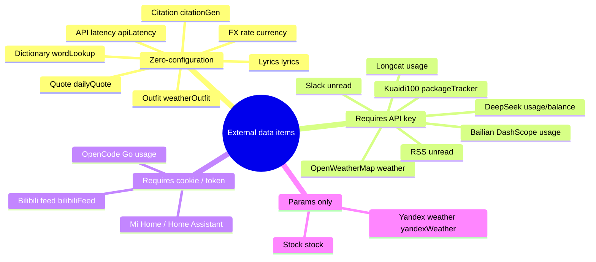
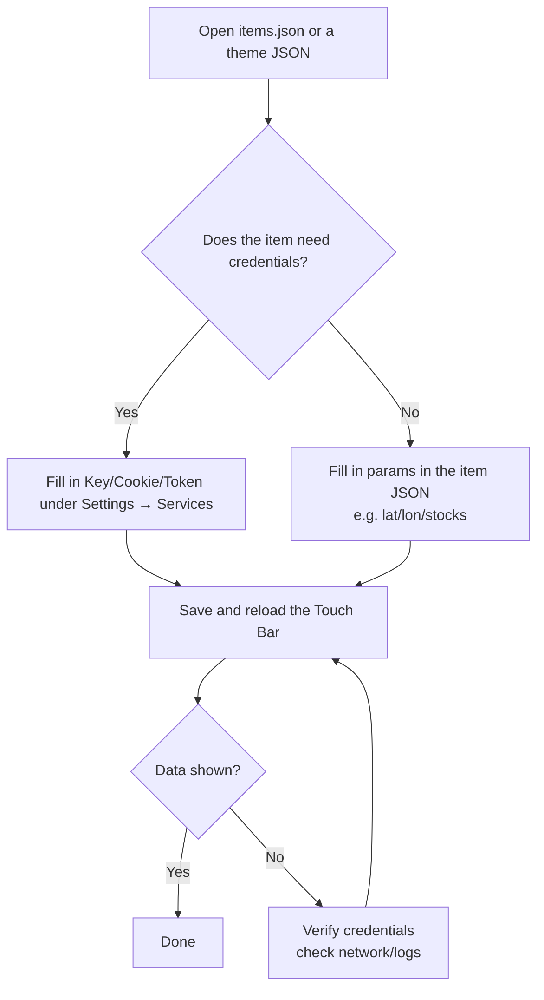

# External Data API Guide (User Guide · English)

> This guide is for **end users**: how to configure Touch Bar items that rely on external data (lyrics, stocks, weather, package tracking, AI usage, etc.).
> Developers should refer to the [Developer Guide · External API Reference](../developer-guide/external-apis.en.md) for request parameters, response structures, and source locations.
>
> Scope: compiled from `MTMR/Widgets/` and `MTMR/LyricsIntegration/`. All third-party endpoints are **unofficial APIs** for learning purposes only and may stop working at any time.

---

## 1. Overview (Mind Map)



---

## 2. Common Configuration Flow



> Item config JSON goes into the `items` array of `items.json` (or a theme preset file). Save, then reload via the theme switcher.
> Many items can read credentials from **Settings → Services**, so the item JSON can leave them empty.

---

## 3. Configuration Overview

| Item `type` | Data source | Credentials needed | Required params | Default refresh |
|:---|:---|:---|:---|:---:|
| `lyrics` | NetEase / QQ / Kugou / Migu / Subtitles | none | appearance params | on playback |
| `stock` | Tencent / EastMoney | none | `stocks` (symbols) | 10s |
| `weather` | OpenWeatherMap | OpenWeatherMap API key | none (auto location) | 1800s |
| `yandexWeather` | Yandex Weather | none | none | 1800s |
| `weatherOutfit` | open-meteo | none | `lat` / `lon` | 1800s |
| `bilibiliFeed` | Bilibili API | Bilibili cookie | none | 300s |
| `packageTracker` | Kuaidi100 | Kuaidi100 key + customer | `company` / `trackingNumber` | 300s |
| `usage` | DeepSeek / Longcat / Bailian | per-provider API key | `providers` | 300s |
| `deepseekBalance` | DeepSeek | DeepSeek API key | none | 3600s |
| `opencodeGoUsage` | opencode.ai | auth cookie | `workspaceID` | 300s |
| `rssUnread` | Feedly / Inoreader / Miniflux / GReader | provider token | `provider` | 300s |
| `slackUnread` | Slack | Slack bot token | `channels` (optional) | 120s |
| `dailyQuote` | Hitokoto | none | none | 600s |
| `currency` | Coinbase | none | `from` / `to` | 600s |
| `apiLatency` | any URL | none | `endpoint` (optional) | 15s |
| `wordLookup` | dictionaryapi.dev | none | none | — |
| `citationGen` | Crossref | none | none | — |
| `homekitScene` | Mi Home / Home Assistant | Mi token / HA URL + token | `scenes` | — |

> Credentials are managed centrally in **Settings → Services** (Keychain or UserDefaults); item JSON can leave them blank.

---

## 4. Per-Item Configuration

### 4.1 Lyrics `lyrics` (zero config)

Lyrics are searched automatically while music plays. No key needed. You can adjust the candidate count per provider in Settings (default 3).

```json
{
  "type": "lyrics",
  "width": 530,
  "displayMode": "karaoke",
  "karaokeStyle": "progressive",
  "showArtwork": true,
  "clickAction": "original",
  "marqueeEnabled": true
}
```

- `displayMode`: `karaoke` (word-level) / `scroll` / `static`.
- `karaokeStyle`: `progressive` (gradient fill) / `sliding` (sliding block).
- Provider priority: **provider with word timing > provider of the playing app > fixed order (NetEase → QQ → Kugou → Migu)**.

### 4.2 Stocks `stock` (zero config)

```json
{
  "type": "stock",
  "stocks": ["sh600519", "sz000858", "bk0432"],
  "apiSource": "eastmoney",
  "displayMode": "compact",
  "refreshInterval": 10,
  "showChart": true,
  "chartMode": "fenzhong"
}
```

- `stocks`: `sh600519` (Shanghai), `sz000858` (Shenzhen), `bkxxxx` (sector index).
- `apiSource`: `tencent` / `eastmoney` (individual stocks and sectors).
- `chartMode`: `fenzhong` (minute line) / `fenshi` (time-share line with lunch break gap).
- EastMoney mode checks the A-share trading session (9:30–15:00 CST).

### 4.3 Weather `weather` / `yandexWeather` / `weatherOutfit`

**OpenWeatherMap** (needs key, auto location):

```json
{
  "type": "weather",
  "refreshInterval": 1800,
  "units": "metric",
  "icon_type": "text"
}
```

- Key in Settings → Services → OpenWeatherMap API Key; `units`: `metric` (°C) / `imperial` (°F).
- First use requires location permission.

**Outfit advice** (open-meteo, no key, fixed coordinates):

```json
{
  "type": "weatherOutfit",
  "lat": 31.23,
  "lon": 121.47,
  "refreshInterval": 1800
}
```

**Yandex Weather**: `{"type": "yandexWeather", "refreshInterval": 1800}`, auto location, no key.

### 4.4 AI Usage `usage` / `deepseekBalance` / `opencodeGoUsage`

**Multi-provider usage** (DeepSeek / Longcat / Bailian):

```json
{
  "type": "usage",
  "providers": [
    { "provider": "deepseek", "api_key": "", "base_url": "" },
    { "provider": "longcat", "api_key": "", "base_url": "" },
    { "provider": "bailian", "api_key": "", "base_url": "" }
  ],
  "displayMode": "compact",
  "refreshInterval": 300
}
```

- Empty `api_key` falls back to Settings → Services.
- Endpoints: DeepSeek `GET /user/balance`, Longcat `GET /v1/dashboard/billing/usage`, Bailian `GET /api/v1/runners/quota`.

**DeepSeek balance**: `{"type": "deepseekBalance", "displayMode": "both", "showRemaining": true, "refreshInterval": 3600}`.

**OpenCode Go usage** (needs auth cookie copied from the browser):

```json
{
  "type": "opencodeGoUsage",
  "workspaceID": "your workspace id",
  "cookie": "auth=...",
  "displayMode": "worst",
  "refreshInterval": 300
}
```

- `cookie` can also be set in Settings → Services → OpenCode Go auth Cookie; the server refreshes the cookie on every response and the item keeps it fresh automatically.

### 4.5 News & Community `bilibiliFeed` / `rssUnread` / `slackUnread`

**Bilibili feed** (needs a logged-in cookie):

```json
{ "type": "bilibiliFeed", "refreshInterval": 300 }
```

- Paste the login cookie (including `SESSDATA`) into Settings → Services → Bilibili Cookie. Shows the unread dynamic count and the latest title from followed UP hosts.

**RSS unread**:

```json
{ "type": "rssUnread", "provider": "feedly", "refreshInterval": 300 }
```

- `provider`: `feedly` / `inoreader` / `miniflux` / `googleReader`; token and self-hosted server URL are configured in Settings → Services (Miniflux / GReader).

**Slack unread**:

```json
{ "type": "slackUnread", "channels": "general,dev", "refreshInterval": 120 }
```

- Needs a Slack bot token (`xoxb-...`); counts unread messages in public channels the bot can access.

### 4.6 Life Services `packageTracker` / `dailyQuote` / `currency` / `homekitScene`

**Kuaidi100** (key + customer from kuaidi100.com):

```json
{
  "type": "packageTracker",
  "company": "shunfeng",
  "trackingNumber": "SF1234567890",
  "refreshInterval": 300
}
```

- `company`: Kuaidi100 company code (e.g. `shunfeng`, `yuantong`, `zhongtong`).
- Requests are signed with MD5 (`param + key + customer`) per the official spec.

**Daily quote / FX rate** (zero config):

```json
{ "type": "dailyQuote", "refreshInterval": 600 }
{ "type": "currency", "from": "CNY", "to": "USD", "full": false, "refreshInterval": 600 }
```

**Smart-home scenes** (Mi Home / Home Assistant):

```json
{ "type": "homekitScene", "scenes": "回家,睡觉" }
```

- Mi Home needs Settings → Services → MiJia Token; Home Assistant needs URL + long-lived access token.

### 4.7 Dev Tools `apiLatency` / `wordLookup` / `citationGen`

```json
{ "type": "apiLatency", "endpoint": "https://www.apple.com/library/test/success.html", "refreshInterval": 15 }
{ "type": "wordLookup", "provider": "dictionary" }
{ "type": "citationGen", "style": "both" }
```

- `apiLatency`: default Apple test URL; any HTTPS URL works. "Bypass proxy" forces a direct connection.
- `wordLookup` uses dictionaryapi.dev; `citationGen` uses Crossref (DOI citation).

---

## 5. Credential Management

All third-party credentials are managed in **Settings → Services**:

| Service | Type | Storage |
|:---|:---|:---|
| DeepSeek API Key / Model / Base URL | API key | Keychain / UserDefaults |
| OpenWeatherMap API Key | API key | Keychain |
| Kuaidi100 Key / Customer | API key | Keychain |
| Slack Bot Token | Token | Keychain |
| GitHub Token / RSS Provider / RSS API Key | Token | Keychain |
| MiJia Token / Home Assistant URL + Token | Token | Keychain |
| Bilibili Cookie / OpenCode Go Cookie + Workspace ID | Cookie | Keychain |

> Security note: defaults to UserDefaults (not encrypted at rest). For stronger security, set `useKeychain = true` in `SecretsManager.swift`.

---

## 6. FAQ

| Symptom | Cause & fix |
|:---|:---|
| Lyrics keep showing "not found" | Try another song; check the player is not archived; raise the candidate count in Settings |
| Stock shows "暂无数据" | Check symbol format (`sh`/`sz`/`bk` prefix); normal outside trading hours |
| Weather does not refresh | Check location permission; confirm the key in Settings → Services |
| Bilibili shows "未配置" | Cookie expired; copy a fresh login cookie from the browser |
| Package shows "未配置·mock" | Kuaidi100 key/customer missing or out of quota |
| Item shows "⚠️" | A polling cycle threw; check the app log for details |

---

## 7. Related Docs

- [Scripting & Automation Guide](scripting.en.md) — custom item content with AppleScript / Shell
- [Developer Guide · External API Reference](../developer-guide/external-apis.en.md) — request params & responses
- [ITEMS Reference](../ITEMS_REFERENCE.md) — all item types
- [Third-party data files](../第三方接入.md) — local JSON file interfaces
