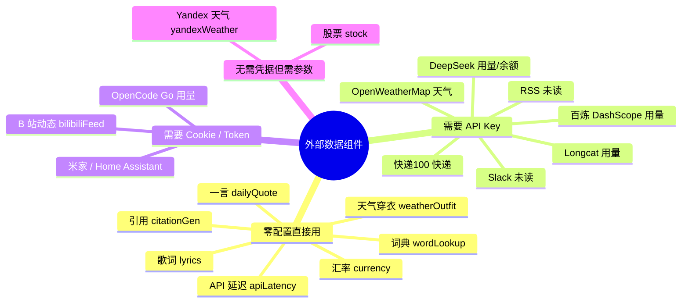
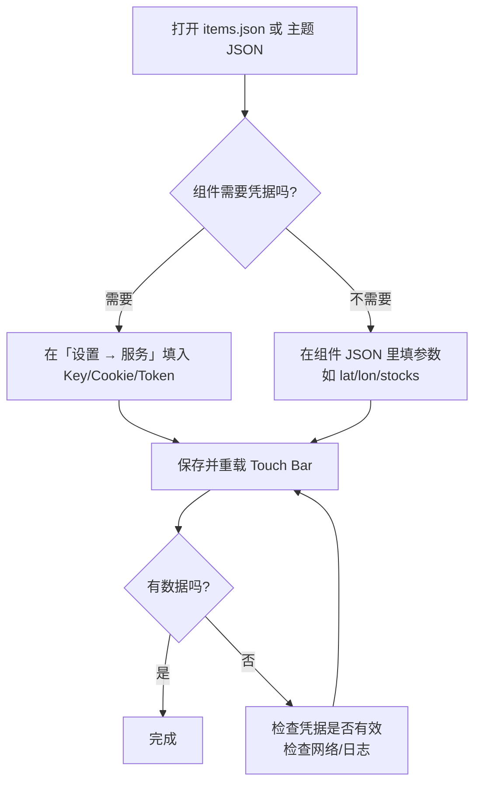

# 外部数据 API 使用指南（普通用户册 · 中文）

> 本文面向**普通用户**：如何为 Touch Bar 上依赖外部数据的组件（歌词、股票、天气、快递、AI 用量等）完成配置。
> 开发者如需请求参数、响应结构与源码位置，请参阅 [开发者册 · 外部 API 参考](../developer-guide/external-apis.zh.md)。
>
> 适用范围：本文基于源码 `MTMR/Widgets/` 与 `MTMR/LyricsIntegration/` 整理，外部接口均为**非官方接口**，仅供学习使用，可能随时失效。

---

## 一、总览（思维导图）



---

## 二、通用配置流程



> 组件配置 JSON 放入 `items.json` 的 `items` 数组（或主题预设文件），保存后通过「主题切换」或重新载入预设生效。
> 部分组件可直接在「设置 → 服务」填入凭据，此时组件 JSON 中可留空。

---

## 三、配置总览表

| 组件 type | 数据源 | 需要的凭据 | 必填参数 | 默认刷新间隔 |
|:---|:---|:---|:---|:---:|
| `lyrics` | 网易云 / QQ / 酷狗 / 咪咕 / 字幕 | 无 | `style` 等外观参数 | 随播放 |
| `stock` | 腾讯 / 东方财富 | 无 | `stocks`（股票代码） | 10s |
| `weather` | OpenWeatherMap | OpenWeatherMap API Key | 无（自动定位） | 1800s |
| `yandexWeather` | Yandex 天气 | 无 | 无 | 1800s |
| `weatherOutfit` | open-meteo | 无 | `lat` / `lon` | 1800s |
| `bilibiliFeed` | B 站 API | B 站 Cookie | 无 | 300s |
| `packageTracker` | 快递100 | 快递100 key + customer | `company` / `trackingNumber` | 300s |
| `usage` | DeepSeek / Longcat / 百炼 | 各平台 API Key | `providers` | 300s |
| `deepseekBalance` | DeepSeek | DeepSeek API Key | 无 | 3600s |
| `opencodeGoUsage` | opencode.ai | auth Cookie | `workspaceID` | 300s |
| `rssUnread` | Feedly / Inoreader / Miniflux / GReader | 各平台 Token | `provider` | 300s |
| `slackUnread` | Slack | Slack Bot Token | `channels`（可选） | 120s |
| `dailyQuote` | Hitokoto | 无 | 无 | 600s |
| `currency` | Coinbase | 无 | `from` / `to` | 600s |
| `apiLatency` | 任意 URL | 无 | `endpoint`（可选） | 15s |
| `wordLookup` | dictionaryapi.dev | 无 | 无 | — |
| `citationGen` | Crossref | 无 | 无 | — |
| `homekitScene` | 米家 / Home Assistant | 米家 Token / HA Token + URL | `scenes` | — |

> 凭据统一在 **「设置 → 服务」** 标签页管理（存入 Keychain 或 UserDefaults），所有组件读取同一份凭据，组件 JSON 中无需重复填写。

---

## 四、分组件配置详解

### 4.1 歌词 `lyrics`（零配置）

Touch Bar 播放歌曲时自动搜索歌词，无需任何 Key。可在「设置」中调整搜索候选数量（默认每源 3 条）。

```json
{
  "type": "lyrics",
  "width": 530,
  "displayMode": "karaoke",
  "karaokeStyle": "progressive",
  "showArtwork": true,
  "clickAction": "original",
  "marqueeEnabled": true
}
```

- `displayMode`：`karaoke`（逐字卡拉 OK）/ `scroll`（滚动）/ `static`。
- `karaokeStyle`：`progressive`（渐变填充）/ `sliding`（滑动色块）。
- 歌词源优先级：**有逐字时间轴的源 > 正在播放 App 对应源 > 源顺序（网易云 → QQ → 酷狗 → 咪咕）**。

### 4.2 股票 `stock`（零配置）

```json
{
  "type": "stock",
  "stocks": ["sh600519", "sz000858", "bk0432"],
  "apiSource": "eastmoney",
  "displayMode": "compact",
  "refreshInterval": 10,
  "showChart": true,
  "chartMode": "fenzhong"
}
```

- `stocks`：股票代码格式 `sh600519`（上海）、`sz000858`（深圳）、`bkxxxx`（板块）。
- `apiSource`：`tencent`（腾讯分时）/ `eastmoney`（东方财富，个股+板块）。
- `chartMode`：`fenzhong`（分钟线）/ `fenshi`（分时线，含午间断开）。
- 东方财富端自动按 A 股交易时间（9:30–15:00，CST）判断行情有效性。

### 4.3 天气 `weather` / `yandexWeather` / `weatherOutfit`

**OpenWeatherMap 天气**（需要 Key，自动定位）：

```json
{
  "type": "weather",
  "refreshInterval": 1800,
  "units": "metric",
  "icon_type": "text"
}
```

- Key 填在「设置 → 服务 → OpenWeatherMap API Key」；`units`：`metric`（°C）/ `imperial`（°F）。
- 首次使用需授予定位权限。

**天气穿衣建议**（open-meteo，无需 Key，固定坐标）：

```json
{
  "type": "weatherOutfit",
  "lat": 31.23,
  "lon": 121.47,
  "refreshInterval": 1800
}
```

**Yandex 天气**：`{"type": "yandexWeather", "refreshInterval": 1800}`，自动定位，无需 Key。

### 4.4 AI 用量 `usage` / `deepseekBalance` / `opencodeGoUsage`

**多平台用量**（DeepSeek / Longcat / 百炼）：

```json
{
  "type": "usage",
  "providers": [
    { "provider": "deepseek", "api_key": "", "base_url": "" },
    { "provider": "longcat", "api_key": "", "base_url": "" },
    { "provider": "bailian", "api_key": "", "base_url": "" }
  ],
  "displayMode": "compact",
  "refreshInterval": 300
}
```

- `api_key` 留空时回退到「设置 → 服务」中的 Key。
- 对应端点：DeepSeek `GET /user/balance`、Longcat `GET /v1/dashboard/billing/usage`、百炼 `GET /api/v1/runners/quota`。

**DeepSeek 余额**：`{"type": "deepseekBalance", "displayMode": "both", "showRemaining": true, "refreshInterval": 3600}`。

**OpenCode Go 用量**（需要从浏览器复制 auth Cookie）：

```json
{
  "type": "opencodeGoUsage",
  "workspaceID": "你的工作区 ID",
  "cookie": "auth=...",
  "displayMode": "worst",
  "refreshInterval": 300
}
```

- `cookie` 也可填入「设置 → 服务 → OpenCode Go auth Cookie」；服务端每次响应都会刷新 Cookie，组件会自动回写保持新鲜。

### 4.5 资讯与社区 `bilibiliFeed` / `rssUnread` / `slackUnread`

**B 站动态**（需要浏览器登录后的 Cookie）：

```json
{ "type": "bilibiliFeed", "refreshInterval": 300 }
```

- 在「设置 → 服务 → Bilibili Cookie」粘贴登录 Cookie（含 `SESSDATA` 等），显示关注 UP 主最新动态数与标题。

**RSS 未读**：

```json
{ "type": "rssUnread", "provider": "feedly", "refreshInterval": 300 }
```

- `provider` 支持 `feedly` / `inoreader` / `miniflux` / `googleReader`；Token 与服务器地址在「设置 → 服务」中配置（Miniflux / GReader 还需自建服务器 URL）。

**Slack 未读**：

```json
{ "type": "slackUnread", "channels": "general,dev", "refreshInterval": 120 }
```

- 需要 Slack Bot Token（`xoxb-...`），仅统计 Bot 可访问的公开频道未读数。

### 4.6 生活服务 `packageTracker` / `dailyQuote` / `currency` / `homekitScene`

**快递100**（需要 key + customer，快递100 官网申请）：

```json
{
  "type": "packageTracker",
  "company": "shunfeng",
  "trackingNumber": "SF1234567890",
  "refreshInterval": 300
}
```

- `company` 使用快递100 公司编码（如 `shunfeng`、`yuantong`、`zhongtong`）。
- 请求会按官方规则生成 MD5 签名（`param + key + customer`）。

**每日一言 / 汇率**（零配置）：

```json
{ "type": "dailyQuote", "refreshInterval": 600 }
{ "type": "currency", "from": "CNY", "to": "USD", "full": false, "refreshInterval": 600 }
```

**智能家居场景**（米家 / Home Assistant）：

```json
{ "type": "homekitScene", "scenes": "回家,睡觉" }
```

- 米家需要「设置 → 服务 → MiJia Token」；Home Assistant 需要 URL + 长期访问 Token。

### 4.7 开发工具 `apiLatency` / `wordLookup` / `citationGen`

```json
{ "type": "apiLatency", "endpoint": "https://www.apple.com/library/test/success.html", "refreshInterval": 15 }
{ "type": "wordLookup", "provider": "dictionary" }
{ "type": "citationGen", "style": "both" }
```

- `apiLatency`：默认 Apple 测试地址，可换成任意 HTTPS 地址测延迟；勾选「绕过代理」时走直连。
- `wordLookup` 使用 free dictionary API（dictionaryapi.dev）；`citationGen` 使用 Crossref（DOI 引用）。

---

## 五、凭据管理

所有第三方凭据在 **设置 → 服务** 中统一维护，支持以下服务：

| 服务 | 类型 | 存储 |
|:---|:---|:---|
| DeepSeek API Key / Model / Base URL | API Key | Keychain / UserDefaults |
| OpenWeatherMap API Key | API Key | Keychain |
| 快递100 Key / Customer | API Key | Keychain |
| Slack Bot Token | Token | Keychain |
| GitHub Token / RSS Provider / RSS API Key | Token | Keychain |
| MiJia Token / Home Assistant URL + Token | Token | Keychain |
| Bilibili Cookie / OpenCode Go Cookie + Workspace ID | Cookie | Keychain |

> 安全提示：默认使用 UserDefaults 存储，磁盘上不加密；如需更高安全性，可在 `SecretsManager.swift` 中开启 `useKeychain = true`。

---

## 六、常见问题

| 现象 | 原因与解决 |
|:---|:---|
| 歌词一直「未找到」 | 换歌重试；检查播放器是否被归档；在「设置」提高候选数量 |
| 股票显示「暂无数据」 | 检查 `stocks` 代码格式（`sh`/`sz`/`bk` 前缀）；非交易时段属正常 |
| 天气不刷新 | 检查定位权限；确认 Key 在「设置 → 服务」中已填且未过期 |
| B 站显示「未配置」 | Cookie 过期，重新从浏览器复制登录 Cookie |
| 快递显示「未配置·mock」 | 快递100 key/customer 未填或已欠费 |
| 组件显示「⚠️」 | 该组件某次轮询抛错，查看 App 日志定位具体原因 |

---

## 七、相关文档

- [脚本与自动化指南](scripting.zh.md) — 用 AppleScript / Shell 脚本自定义组件内容
- [开发者册 · 外部 API 参考](../developer-guide/external-apis.zh.md) — 请求参数与响应结构
- [Items 完整参考手册](../../../ITEMS_REFERENCE.md) — 全部组件类型
- [第三方接入](../第三方接入.md) — 本地 JSON 数据文件接口
