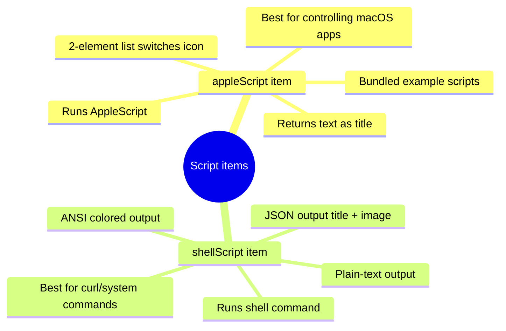

# Scripting & Automation Guide (User Guide · English)

> This guide is for **end users**: use AppleScript / Shell scripts to show custom content on the Touch Bar (system info, music, weather, web data, etc.) without writing a full app.
> Developers should refer to the [Developer Guide · Scripting API Reference](../developer-guide/scripting-api.en.md) for return protocols and source details.

---

## 1. The Two Script Items (Mind Map)



| Comparison | `appleScript` | `shellScript` |
|:---|:---|:---|
| Runtime | AppleScript engine | `$SHELL -c` (default `/bin/bash`) |
| Default interval | 1800 s | 1800 s |
| Icon support | 2-element list + `alternativeImages` | JSON `image` field |
| Color support | none | ANSI escape sequences |
| Typical use | Control/read apps (Music, Finder, Battery) | Run commands, scrape web data |

---

## 2. The `appleScript` Item

### Basic Configuration

```json
{
  "type": "appleScript",
  "source": {
    "inline": "return \"Hello Touch Bar\""
  },
  "refreshInterval": 30
}
```

- `source` forms:
  - `inline`: the script text directly in JSON;
  - `filePath`: path to a `.scpt` file, e.g. `"filePath": "/path/to/script.scpt"`;
  - either one; `inline` wins if both are present.
- `refreshInterval`: refresh interval in seconds (default 1800).

### Return Values

| Return form | Effect |
|:---|:---|
| Single value / 1-element list | Used directly as the item title |
| 2-element list `{title, iconLabel}` | Title + icon looked up in `alternativeImages` |
| Empty string | Item auto-hides (width collapses to 0) |

### Icon Switching Example

```json
{
  "type": "appleScript",
  "source": {
    "inline": "return {\"Now Playing\", \"music\"}"
  },
  "alternativeImages": {
    "music": { "base64": "..." },
    "pause": { "filePath": "/path/to/pause.png" }
  },
  "refreshInterval": 10
}
```

- `alternativeImages`: map of label → image (`base64` / `filePath` / `inline`).
- With a 2-element list, element 1 is the title and element 2 selects the icon; unknown labels print `Cannot find icon`.

### Bundled Scripts

Ready-to-use scripts ship in `MTMR/AppleScripts/` (Battery, Finder, Music, Spotify, Vox, Weather, etc.):

```json
{
  "type": "appleScript",
  "source": { "filePath": "/absolute/path/to/MTMR/AppleScripts/Battery.scpt" },
  "refreshInterval": 60
}
```

---

## 3. The `shellScript` Item

### Basic Configuration

```json
{
  "type": "shellScript",
  "source": {
    "inline": "echo \"$(date +%H:%M)\""
  },
  "refreshInterval": 5
}
```

### Three Output Modes

**1. Plain text** (most common)

```bash
# Show CPU usage
top -l 1 -n 3 | grep "CPU usage" | sed 's/.*: //'
```

**2. ANSI colors** (rendered directly in the title)

```bash
printf '\033[32m●\033[0m OK'
```

**3. JSON** (title + image)

```json
{
  "type": "shellScript",
  "source": {
    "inline": "echo '{\"title\": \"42%\", \"image\": {\"inline\": \"🔋\"}}'"
  },
  "refreshInterval": 60
}
```

- `title`: title text (ANSI colors supported).
- `image`: a `Source` object — `inline` (text/emoji), `filePath` (image file), or `base64` (image data).
- If the output is not valid JSON it is treated as plain/ANSI text; empty output hides the item.

### Example: Bilibili Follower Count

```bash
curl -s "https://api.bilibili.com/x/relation/stat?vmid=YOUR_UID" \
  | python3 -c "import sys,json;print('followers', json.load(sys.stdin)['data']['follower'])"
```

```json
{
  "type": "shellScript",
  "source": {
    "inline": "curl -s \"https://api.bilibili.com/x/relation/stat?vmid=2\" | python3 -c \"import sys,json;print('followers', json.load(sys.stdin)['data']['follower'])\""
  },
  "refreshInterval": 600
}
```

---

## 4. Execution Details & Limits

- Each item runs on its own serial queue; a script process is killed if it runs past the refresh interval.
- Trailing newlines in output are stripped.
- Non-zero exit with empty output shows `error`; one failing script never breaks other items.
- AppleScript may require an Automation permission prompt on first run (System Settings → Privacy & Security → Automation).
- `.scpt` files referenced by `filePath` need an absolute path and readable permissions.

---

## 5. FAQ

| Symptom | Cause & fix |
|:---|:---|
| Stuck at `⏳` | Script failed to compile/run; check `source` |
| Shows `error` | Non-zero exit with no output; run the script in Terminal first |
| Item disappears | Script returned an empty string (force-hide logic); ensure non-empty output |
| JSON mode ignored | Output must be a **single-line valid JSON**; validate with `echo '...' | python3 -m json.tool` |
| Icon missing | `image` `base64`/`filePath` invalid; check the image format |

---

## 6. Related Docs

- [External Data API Guide](external-data.en.md) — common data item configuration
- [Developer Guide · Scripting API Reference](../developer-guide/scripting-api.en.md) — protocols & source
- [ITEMS Reference](../../../ITEMS_REFERENCE.md) — all item types
