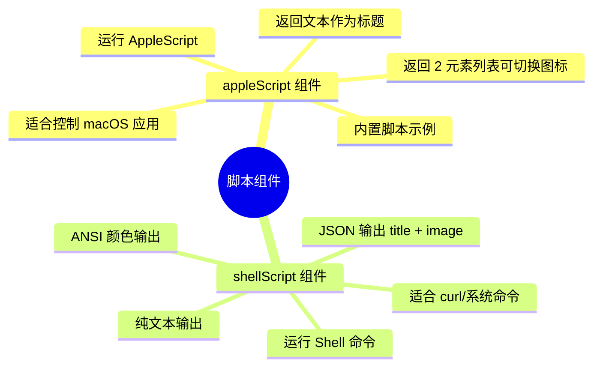

# 脚本与自动化指南（普通用户册 · 中文）

> 本文面向**普通用户**：不写代码也能用 AppleScript / Shell 脚本让 Touch Bar 显示自定义内容（系统信息、音乐、天气、网页数据等）。
> 开发者如需返回协议与源码细节，请参阅 [开发者册 · 脚本 API 参考](../developer-guide/scripting-api.zh.md)。

---

## 一、两种脚本组件（思维导图）



| 对比项 | `appleScript` | `shellScript` |
|:---|:---|:---|
| 执行环境 | AppleScript 引擎 | `$SHELL -c`（默认 `/bin/bash`） |
| 默认刷新间隔 | 1800 秒 | 1800 秒 |
| 图标支持 | 返回 2 元素列表切换 | JSON 返回 `image` 字段 |
| 颜色支持 | 无 | ANSI 转义序列 |
| 典型用途 | 控制/读取应用（音乐、Finder、电池） | 执行命令、抓取网页数据 |

---

## 二、`appleScript` 组件

### 基本配置

```json
{
  "type": "appleScript",
  "source": {
    "inline": "return \"Hello Touch Bar\""
  },
  "refreshInterval": 30
}
```

- `source` 三种写法：
  - `inline`：脚本内容直接写在 JSON 里；
  - `filePath`：指向一个 `.scpt` 文件，如 `"filePath": "/path/to/script.scpt"`；
  - 二选一，`inline` 优先。
- `refreshInterval`：刷新间隔（秒），默认 1800。

### 返回两种结果

| 返回形式 | 效果 |
|:---|:---|
| 单值 / 1 元素列表 | 直接作为组件标题 |
| 2 元素列表 `{标题, 图标标签}` | 标题 + 按标签切换 `alternativeImages` 中对应的图标 |
| 空字符串 | 组件自动隐藏（宽度收缩为 0） |

### 图标切换示例

```json
{
  "type": "appleScript",
  "source": {
    "inline": "return {\"播放中\", \"music\"}"
  },
  "alternativeImages": {
    "music": { "base64": "..." },
    "pause": { "filePath": "/path/to/pause.png" }
  },
  "refreshInterval": 10
}
```

- `alternativeImages`：键值表，键为脚本返回的图标标签，值为图片（`base64` / `filePath` / `inline`）。
- 脚本返回 2 元素列表时，第 1 个元素是标题，第 2 个元素用于在表中查图标；找不到时打印 `Cannot find icon`。

### 内置脚本示例

仓库 `MTMR/AppleScripts/` 自带可直接引用的脚本（Battery、Finder、Music、Spotify、Vox、Weather 等）：

```json
{
  "type": "appleScript",
  "source": { "filePath": "/absolute/path/to/MTMR/AppleScripts/Battery.scpt" },
  "refreshInterval": 60
}
```

---

## 三、`shellScript` 组件

### 基本配置

```json
{
  "type": "shellScript",
  "source": {
    "inline": "echo \"$(date +%H:%M)\""
  },
  "refreshInterval": 5
}
```

### 三种输出方式

**1. 纯文本**（最常用）

```bash
# 显示 CPU 使用率
top -l 1 -n 3 | grep "CPU usage" | sed 's/.*: //'
```

**2. ANSI 颜色**（颜色会直接渲染到标题）

```bash
printf '\033[32m●\033[0m 正常'
```

**3. JSON**（标题 + 图片）

```json
{
  "type": "shellScript",
  "source": {
    "inline": "echo '{\"title\": \"42%\", \"image\": {\"inline\": \"🔋\"}}'"
  },
  "refreshInterval": 60
}
```

- `title`：标题文本（同样支持 ANSI 颜色）。
- `image`：`Source` 结构，`inline`（文本/Emoji）、`filePath`（图片文件）、`base64`（图片数据）三选一。
- 输出无法解析为 JSON 时自动按纯文本/ANSI 处理；空输出时组件隐藏。

### 实用示例：B 站粉丝数

```bash
curl -s "https://api.bilibili.com/x/relation/stat?vmid=你的UID" \
  | python3 -c "import sys,json;print('粉丝', json.load(sys.stdin)['data']['follower'])"
```

```json
{
  "type": "shellScript",
  "source": {
    "inline": "curl -s \"https://api.bilibili.com/x/relation/stat?vmid=2\" | python3 -c \"import sys,json;print('粉丝', json.load(sys.stdin)['data']['follower'])\""
  },
  "refreshInterval": 600
}
```

---

## 四、执行细节与限制

- 每个组件在独立串行队列中执行，脚本进程超过刷新间隔会被强制终止（防卡死）。
- 输出末尾的换行会被自动去除。
- 脚本非零退出且无输出时显示 `error`；脚本出错不影响其他组件。
- AppleScript 需要「系统设置 → 隐私与安全性 → 自动化」中授权（首次运行会弹窗）。
- 给脚本加 `.scpt` 文件时注意文件权限与路径（`filePath` 使用绝对路径）。

---

## 五、常见问题

| 现象 | 原因与解决 |
|:---|:---|
| 一直显示 `⏳` | 脚本编译/执行失败；检查 `source` 是否为空 |
| 显示 `error` | 脚本退出码非 0 且无输出；在终端先跑一遍脚本 |
| 组件突然消失 | 脚本返回空字符串（`forceHide` 逻辑）；确认输出非空 |
| JSON 模式不生效 | 输出必须是**单行合法 JSON**；先 `echo '...' | python3 -m json.tool` 校验 |
| 图标不显示 | `image` 的 `base64`/`filePath` 无效；确认图片格式 |

---

## 六、相关文档

- [外部数据 API 使用指南](external-data.zh.md) — 常见数据组件配置
- [开发者册 · 脚本 API 参考](../developer-guide/scripting-api.zh.md) — 协议与源码
- [Items 完整参考手册](../ITEMS_REFERENCE.md) — 全部组件类型
