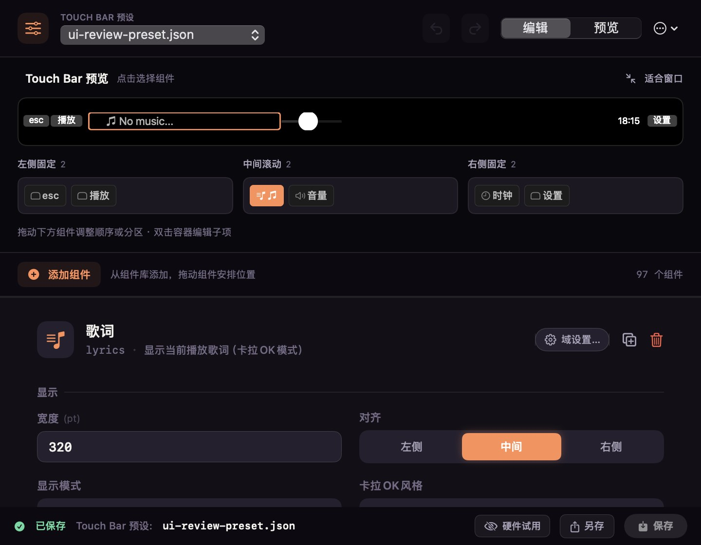

# LyricsMTMR

> 在 MacBook Pro Touch Bar 上实时显示歌词 —— 将 [LyricsX](https://github.com/ddddxxx/LyricsX) 的歌词能力与 [MTMR](https://github.com/Toxblh/MTMR) 的 Touch Bar 组件体系合二为一的实验项目。

[](https://github.com/Tangzishun-Li/LyricsMTMR/releases/tag/v0.1) [](https://github.com/Tangzishun-Li/LyricsMTMR/releases/tag/v0.2) [](https://github.com/Tangzishun-Li/LyricsMTMR/releases/tag/v0.3.4) [](https://github.com/Tangzishun-Li/LyricsMTMR/releases/tag/v0.3.5-preview) [](https://github.com/Tangzishun-Li/LyricsMTMR/actions/workflows/build-test.yml)

[**📥 下载最新版本 (v0.3.4)**](https://github.com/Tangzishun-Li/LyricsMTMR/releases/latest) · [**v0.3.5-preview 预览版**](https://github.com/Tangzishun-Li/LyricsMTMR/releases/tag/v0.3.5-preview) · [**v0.2 预发布**](https://github.com/Tangzishun-Li/LyricsMTMR/releases/tag/v0.2) · [**v0.1 正式**](https://github.com/Tangzishun-Li/LyricsMTMR/releases/tag/v0.1)

---

## 截图速览

| 主设置窗口（通用 · 含 Mirror 配置） | Ribbon 编辑器（预览模式） |
|---|---|
|  |  |

> 截图取自实际 SwiftUI / AppKit 视图；编辑器为示例布局，不代表当前音乐或预设内容。

## ✨ 功能特性

### 🎵 歌词系统
- **多平台歌词源**：QQ 音乐 / 网易云 / 酷狗 / 咪咕 / 本地 `.lrc` / `.lrcx`，自动搜索与匹配
- **逐字卡拉 OK 高亮**：逐字时间线与播放进度精确对齐
- **歌词过滤**：自动过滤制作人员（词/曲/编曲/混音等 credit 行）
- **翻译显示**：外文歌曲可同时显示译文
- **多播放器支持**：Music、Spotify、Vox、Swinsian、Audirvana 等
- _（v0.2 之后）浏览器视频字幕转歌词：YouTube / Bilibili 视频字幕接入（开发版功能，可用性未完全保证）_

### 🧩 Widget 组件库（114 种）
- **系统监控**：CPU / 内存 / 磁盘 / 网络 / 电池 / 风扇
- **音乐与媒体**：专辑封面、播放控制、音量、进度条
- **效率工具**：天气、时钟、日历、节假日倒计时、备忘录、剪贴板
- **数据面板**：股票（A 股 + 分时图）、天气（中国天气网国内数据源）、快递、BeeCount 记账同步
- **开发相关**：Git 状态、Docker、AppleScript、Shell 脚本、API 测试器、二维码、Latex 符号
- **AI 助手**：内置对话组件，API Key / 服务地址 / 模型名完全自由填写（不锁定厂商）
- _（v0.2 之后）健康 / 智能家居（HomeKit）/ 快递 schema 化重构：相关 widget 已存在并接入设置面板，使用体验随实际配置而定_

### 🎨 布局与主题
- **可视化 Ribbon 编辑器**：拖拽排列 Touch Bar 组件、真实原生组件实时预览（编辑 / 预览双模式）、防误删确认、未保存提醒、草稿自动保存
- **屏幕上的第二块 Touch Bar（Mirror）**：把 Touch Bar 搬到桌面上——跟随实体栏或使用独立预设，支持展示 / 操作 / 编辑三种交互，鼠标点按、触控板滚动均可（[使用指南](#屏幕上的第二块-touch-barmirror)）
- **Touch Bar 模拟器 / 镜像窗口**：在设置窗口内实时预览布局效果
- **主题系统**：15 套预设主题（theme1–15）+ 完全自定义，Dock 图标主题联动
- **应用专属主题（Per-app bar switching）**：为指定 App 绑定独立 Touch Bar 布局，切换应用自动换主题（[使用指南](#应用专属主题per-app-bar-switching)）
- **预设导入导出**：JSON 格式，兼容手写注释的 `items.json`

### ⚙️ 设置与集成
- **22 个分类设置 Tab**：通用 / 歌词 / 槽位 / 编辑器 / 键位 / 服务 / 关于 / 股票 / 番茄钟 / 天气 / RSS / 快递 / 日历 / 智能家居 / AI 助手 / 记账 / Dock / 通知 / 系统监控 / 健康 / 生活 / 快捷工具，带全局搜索与目录跳转
- **快捷键集成**：全局快捷键管理与 Music 播放控制
- **AppleScript / Shell / HTTP API**：通过脚本 widget 调用任意外部能力
- **⚠️ macOS 15.4+ 风险说明**：Touch Bar API 在 macOS 15.4+ 有兼容性变化，详见 [使用指南](#macos-154-风险说明)

### 📊 数据来源
- 歌词：QQ 音乐 / 网易云 / 酷狗 / 咪咕 / 本地文件 / 浏览器视频字幕
- 天气：中国天气网（国内数据源，免 Key）
- 节假日：复用法定节假日表
- 股票：A 股分时数据（按主题统计）
- 快递：第三方快递查询接口（具体可用性视 API 提供方）
- 健康 / 智能家居：macOS HealthKit / HomeKit（需用户授权）

## 🚀 快速开始

### 方式一：下载 Release（推荐）
1. 访问 [Releases 页面](https://github.com/Tangzishun-Li/LyricsMTMR/releases/latest)
2. 下载对应 macOS 版本的 `.dmg`
3. 拖入「应用程序」文件夹
4. 首次启动需在「系统设置 → 隐私与安全性 → 辅助功能」中授权 LyricsMTMR

### 方式二：源码构建
```bash
git clone https://github.com/Tangzishun-Li/LyricsMTMR.git
cd LyricsMTMR
open LyricsMTMR/LyricsMTMR.xcodeproj   # 用 Xcode 构建并运行

# 或使用命令行目标（脚本见 LyricsMTMR/Scripts/）：
make build     # 构建
make test      # 回归测试
make archive   # 打发布包
```

## 📖 使用指南

### 应用专属主题（Per-app bar switching）
1. 打开「设置 → 通用」
2. 在「应用专属主题」中点 + 添加 App
3. 选择目标 App，配置独立布局
4. 切换该 App 时 Touch Bar 自动切换主题

### Ribbon 编辑器
1. 打开「设置 → 编辑器」
2. 上方为与 Mirror 共用的真实组件预览，可切换「编辑 / 预览」模式（预览模式可点击试用，不会自动保存）
3. 从组件库浮层（按需展开）拖入组件，在下方编排条调整顺序与分区
4. 调整属性后「保存」生效；「硬件试用」会临时应用到实体栏，结束后恢复原状态

### 屏幕上的第二块 Touch Bar（Mirror）
1. 打开「设置 → 通用 → 屏幕上的第二块 Touch Bar」，开启「显示 Mirror」
2. 选择**预设来源**：「跟随 Touch Bar」与实体栏同布局同状态；「独立预设」使用单独 JSON，互不影响
3. 选择**交互方式**：「展示」只读浏览 ·「操作」点击 / 双击 / 长按 / 滑块 ·「编辑」点击组件直达编辑器
4. 拖动窗口顶部把手移动位置，双击把手回到底部居中；内容过长时左、中、右区域各自横向滚动（触控板横滑 / 鼠标滚轮均可）

> 完整交互与实现说明见 [docs/Mirror与编辑器打磨.md](docs/Mirror与编辑器打磨.md)。

### 快捷键管理
- 「设置 → 键位」中查看和修改全局快捷键
- 支持音乐控制、显示模式切换、组件触发等

### 启动问题排查
- 如果 Touch Bar 不显示：检查「系统设置 → 辅助功能」授权
- 如果歌词不显示：检查对应播放器是否在支持列表中
- 如果组件无响应：尝试「设置 → 通用 → 重置 Touch Bar」

### macOS 15.4+ 风险说明
macOS 15.4+ 对 Touch Bar 系统 API 做了调整，LyricsMTMR 在该系统版本上可能存在：
- 组件渲染延迟
- 主题切换偶发失效
- 部分 widget 数据刷新异常

建议在 macOS 15.4+ 上使用最新版本（v0.3.4+）以获得最佳兼容性。

## 🧩 项目结构

```
MTMR with LyricsX/                  # 仓库根
├── LyricsMTMR/                     # Xcode 工程目录
│   ├── LyricsMTMR.xcodeproj
│   ├── MTMR/                       # 主程序源码
│   │   ├── App/                    # 应用入口与全局设置
│   │   ├── Core/                   # Touch Bar 控制器、BarItemFactory、滚动视图
│   │   ├── Preferences/            # 设置窗口 + Editor（Ribbon 编辑器 / Mirror 模拟器）
│   │   ├── Widgets/                # widget 分类（Media/Productivity/...）
│   │   ├── LyricsIntegration/      # 歌词配置与 Touch Bar 歌词组件
│   │   └── AppleScripts/           # AppleScript 桥接
│   ├── LyricsRendering/            # 歌词渲染视图（来自 LyricsX）
│   ├── MTMRTests/                  # 单元与契约测试（702 项）
│   └── Scripts/                    # build / test / archive 脚本
├── docs/                           # 文档、更新日志、截图
├── examples/                       # 预设与示例
├── scripts/                        # 仓库级开发工具（anchor-patrol 等）
├── appcast.xml                     # Sparkle 更新源
├── Makefile                        # make build / test / archive
└── README.md                       # 本文件
```

## 📝 更新日志

### v0.3.5（2026-09-18 预发布 · 09-22 桌面栏重构，当前）
- **屏幕上的第二块 Touch Bar（Mirror）**：固定 24cm 宽度、边框与把手交互、白底修复；跟随实体栏 / 独立预设，展示 · 操作 · 编辑三态
- **桌面 Touch Bar 重建**：真实原生组件渲染、左中右三区域独立滚动、鼠标点击 / 双击 / 长按与滑块适配、组件复用与歌词稳定宽度
- **编辑器原生预览**：预览区与 Mirror 共用组件渲染器，组件库改为按需展开浮层，草稿串行后台保存，输入合并刷新
- **通知中心**：面板重做 + 菜单栏入口；**Palette 打磨**：分组高度自适应、模拟器 1.25x 缩放 + 总折叠开关
- 详细：见 [docs/Mirror与编辑器打磨.md](docs/Mirror与编辑器打磨.md) 与 [docs/CHANGELOG.md](docs/CHANGELOG.md)

### v0.3.4（2026-09-14）
- 设置界面内置编辑器重构 Phase 1-3：镜像交互三态、Palette 可折叠分组、属性检查器修复、主题重命名
- 详细历史：见 [docs/CHANGELOG.md](docs/CHANGELOG.md#v034编辑器重构-phase-1-3)

### v0.3（2026-08-26）
- 营销版本号降档：v0.63 → 0.3，与新 Release tag 对齐
- 工程 build 号：488 → 489（严格 +1）
- 整体版本语义：v0.1 正式 / v0.2 预发布 / v0.3 当前
- 健康 / 智能家居 / 快递 widget 接入设置面板（功能可用性视实际配置）
- 浏览器视频字幕转歌词接入（开发版功能）
- 详细历史：见 [docs/CHANGELOG.md](docs/CHANGELOG.md#v063当前开发版本)

### v0.2（2026-08-09，预发布）
- 首个对外预发布版本
- 完整支持 114 种 Touch Bar widget
- 多平台歌词源整合（QQ 音乐 / 网易云 / 酷狗 / 咪咕）
- 逐字卡拉 OK 高亮
- 应用专属主题（Per-app bar switching）
- 详细历史：见 [docs/CHANGELOG.md](docs/CHANGELOG.md#v08预发布)

### v0.1（2026-07-29，首个正式发行版）
- 项目首个正式发行版
- 基于上游 MTMR v0.27.0 fork，整合 LyricsX 歌词引擎
- 完整 ribbon 编辑器 + 主题系统
- 详细历史：见 [docs/CHANGELOG.md](docs/CHANGELOG.md#v100首个正式发行版)

### 完整历史
- [docs/CHANGELOG.md](docs/CHANGELOG.md) —— 详细历史（每个迭代轮次的技术细节）
- [GitHub Releases](https://github.com/Tangzishun-Li/LyricsMTMR/releases) —— 所有正式发布

## 📚 文档索引

- [docs/CHANGELOG.md](docs/CHANGELOG.md) —— 完整更新日志
- [docs/Mirror与编辑器打磨.md](docs/Mirror与编辑器打磨.md) —— 屏幕上第二块 Touch Bar（Mirror）与编辑器打磨
- [docs/编辑器重构开发日志.md](docs/编辑器重构开发日志.md) —— 编辑器重构 Phase 0-3 全记录
- [docs/编辑器Schema全量参考.md](docs/编辑器Schema全量参考.md) —— widget 参数（Schema）全量参考
- [docs/轮次速查.md](docs/轮次速查.md) —— 各轮次快速索引
- [docs/设置项对照表_R60.md](docs/设置项对照表_R60.md) —— 设置项权威对照
- [docs/轨道文本_R*.md](docs/) —— 各轮次轨道文本

## 🙏 致谢

本项目基于以下开源项目：

- [LyricsX](https://github.com/ddddxxx/LyricsX) — 多平台歌词引擎
- [MTMR](https://github.com/Toxblh/MTMR) — Touch Bar 组件体系
- [SnapKit](https://github.com/SnapKit/SnapKit) — Auto Layout DSL
- [MASShortcut](https://github.com/shpakovski/MASShortcut) — 全局快捷键管理
- [Sparkle](https://github.com/sparkle-project/sparkle) — 应用更新框架
- [Then](https://github.com/devxoul/Then) — Swift 语法糖

## ⚠️ 重要免责声明

> 这是一个**个人实验项目**，仅用于学习与技术探索，不提供任何形式的保证。

### 版权说明
所有歌词数据的版权归各自所有者所有。本项目仅用于展示技术实现，不用于商业用途。

### 侵权请告知
如果你认为本项目侵犯了你的合法权益，请通过 GitHub Issues 与我联系，我会立即：
- 删除相关内容
- 或关闭整个仓库

## ⚠️ Important Disclaimer

> This is a **personal experimental project** solely for learning and technical exploration. No warranties of any kind are provided.

### Copyright Notice
All lyrics content is the property and copyright of their respective owners. This project is for demonstrating technical implementation only and is not intended for commercial use.

### Takedown Request
If you believe this project infringes upon your legal rights, please contact me via GitHub Issues and I will promptly:
- Remove the relevant content
- Or take down this entire repository
