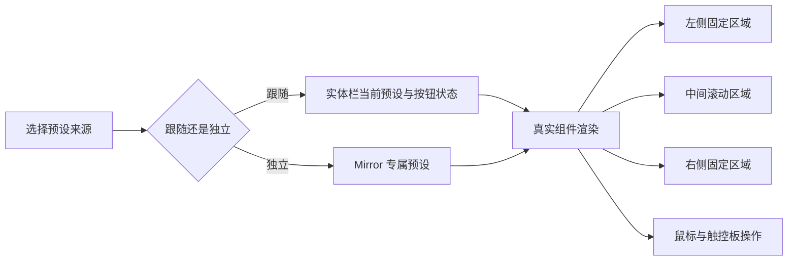
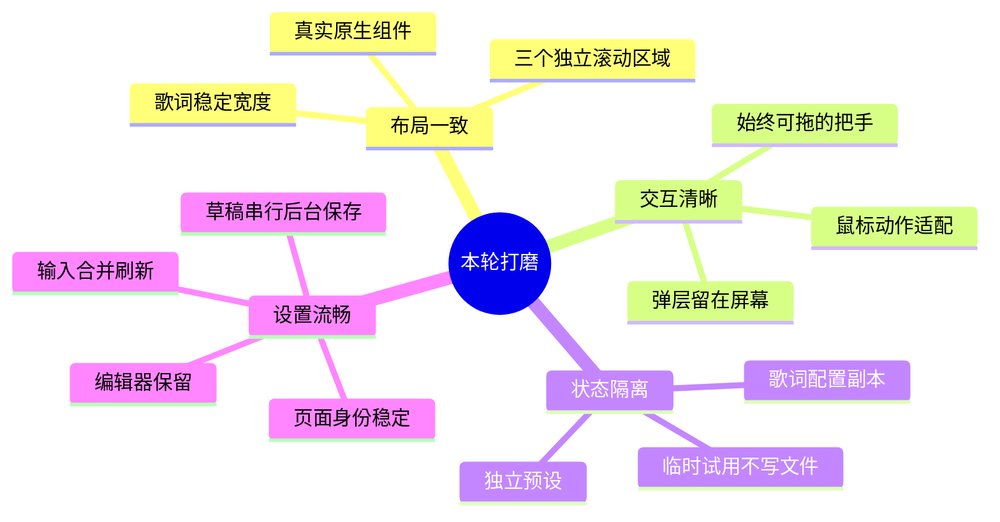

# Mirror 与编辑器打磨

原有修改已完整保存为 `fc457ad`，并上传至 GitHub `main`。本轮改动位于独立分支 `codex/mirror-editor-polish`。

## 使用方式

在「设置 → 通用 → 屏幕上的第二块 Touch Bar」打开 Mirror，并选择预设来源与交互方式。

| 选项 | 行为 |
| --- | --- |
| 跟随 Touch Bar | 跟随实体栏布局与预设；普通按钮操作同一份运行状态 |
| 独立预设 | 使用单独的 JSON 预设，切换与编辑不改变实体栏 |
| 展示 | 展示内容，保留区域滚动，避免误触按钮 |
| 操作 | 鼠标点击、双击、长按以及原生滑块交互 |
| 编辑 | 点击组件，进入编辑器对应预设与组件 |

拖动 Mirror 顶部把手即可移动窗口。靠近时把手和边框高亮；双击把手回到底部居中。内容过长时，在左、中、右区域内分别横向滚动；普通鼠标滚轮也可使用。

## 编辑与预览

编辑器上方使用与 Mirror 共用的原生组件渲染器，显示真实文字、图标、颜色、组件宽度与实时内容。下方编排条用于拖动、选择和分区，不再冒充最终预览。

| 操作 | 影响范围 |
| --- | --- |
| 修改组件属性 | 编辑器内的草稿和预览 |
| 切到预览模式 | 可点击体验组件；不会自动保存预设 |
| Touch Bar 临时试用 | 临时应用到实体栏，结束后恢复原状态；外部切换主题优先 |
| 保存普通预设 | 保存并应用到实体栏 |
| 保存独立 Mirror 预设 | 只保存和刷新 Mirror；必要时另存 `_mirror` 文件 |
| 切换设置页面 | 保留编辑选择、撤销记录及未保存修改 |

组件库改为按需展开的浮层，避免挤占属性编辑区。预览提供适合窗口和原始尺寸两种显示方式。

## 实现要点

- 修复每次加载预设都累加分区标识的问题。
- 把 `theme1.json` 的优先读取限制到启动阶段，常规配置刷新读取正确的 `items.json`。
- Mirror 复用已有组件，避免每次歌词或按钮文字变化都重新创建控件。
- 独立歌词配置保留字体与颜色偏好，但不会回写实体栏全局配置。
- 组件弹出面板在桌面展示，不借用或替换实体 Touch Bar。
- 设置缓存改为导航事件驱动，保留编辑器；内存压力和隐藏窗口回收不会静默丢弃未保存编辑。
- 停止设置背景持续动画，减少页面切换时布局动画和输入时磁盘写入。

## 验证范围

100 项回归测试通过，覆盖实际 AppKit 视图尺寸、固定区可见性、组件复用、鼠标点击、弹层隔离、设置页面缓存和草稿撤销行为。另完成设置页与窄窗口编辑器的直接渲染检查，修正背景漏白、对齐选项默认值显示问题。

实体 Touch Bar 的手指触摸与所有第三方服务组件仍需在日常使用中确认。实体栏的全局多指滑动手势目前没有桌面等价操作；Mirror 的触控板横滑用于浏览内容。

## 界面预览

以下为实际 SwiftUI / AppKit 视图的压缩截图。编辑器使用示例布局进行视觉检查，不代表用户当前音乐或预设内容。

